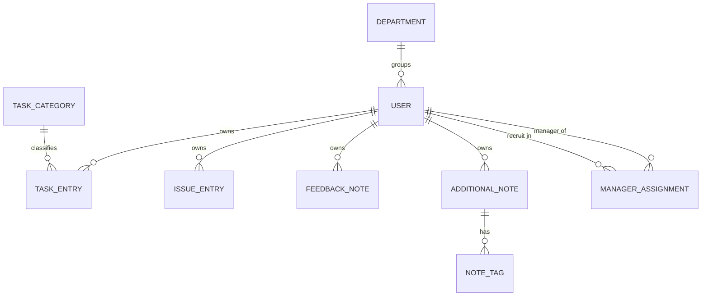
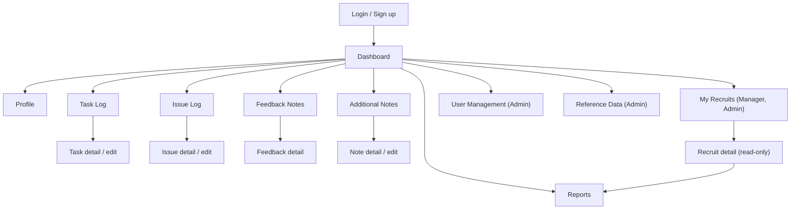

# Onboarding Diary - Elaborated Requirements

Elaboration of [`SOURCE_REQUIREMENTS.md`](./SOURCE_REQUIREMENTS.md), which is the authoritative
scope. Nothing here adds features beyond the source; ideas that go beyond it are listed only in
[Section 8 - Open Questions / Assumptions](#8-open-questions--assumptions).

Roles referenced throughout: **New Recruit**, **Manager**, **Admin**.

## Contents

1. [User Stories](#1-user-stories)
2. [Data Model](#2-data-model)
3. [Implementation Architecture](#3-implementation-architecture)
4. [REST API Endpoints](#4-rest-api-endpoints)
5. [UI Flows](#5-ui-flows)
6. [Validation Rules](#6-validation-rules)
7. [Non-Functional Notes](#7-non-functional-notes)
8. [Open Questions / Assumptions](#8-open-questions--assumptions)

---

## 1. User Stories

### 1.1 New Recruit

**US-R01 - Sign up**
As a New Recruit, I want to sign up with my email and password, so that I can start recording my
onboarding journey.

- Sign-up form collects name, email, password, department, and start date.
- Email must be unique; a duplicate email returns a clear field-level error.
- Password is stored only as a hash, never in plain text.
- Role defaults to New Recruit on self sign-up.
- On success the user is authenticated and lands on the dashboard.

**US-R02 - Log in / log out**
As a New Recruit, I want to log in with my email and password, so that only I can see my entries.

- Valid credentials establish an authenticated session and redirect to the dashboard.
- Invalid credentials show a generic "invalid email or password" message (no user enumeration).
- Logging out ends the session and returns to the login page.
- Unauthenticated access to any diary page redirects to login.

**US-R03 - Manage my profile**
As a New Recruit, I want to view and edit my profile (name, role, department, start date), so that
my diary reflects accurate details about me.

- Profile page shows name, email, role, department, start date.
- Name, department, and start date are editable; email is read-only.
- Role is read-only for New Recruit and Manager; only an Admin can change a role.
- Validation errors are shown inline and no partial update is saved.

**US-R04 - Task Log CRUD**
As a New Recruit, I want to create, view, update, and delete task entries (date, title,
description, category, status, priority), so that I can track what I work on during onboarding.

- Create requires date, title, category, status, priority; description is optional.
- Category is chosen from the Admin-maintained category list (see US-A04).
- The list shows my own tasks only, most recent date first.
- Update preserves the owner and allows editing every field except the owner.
- Delete asks for confirmation and removes the entry permanently.
- Any attempt to read/edit/delete another user's task returns 403.

**US-R05 - Filter tasks**
As a New Recruit, I want to filter my task log by date, category, and status, so that I can find
relevant tasks quickly.

- Filters can be combined (AND semantics) and applied via a date range (from/to), category, status.
- The category filter offers the Admin-maintained category list.
- An empty result set shows an explanatory empty state, not an error.
- Active filters are reflected in the URL query string so a filtered view can be shared/bookmarked.

**US-R06 - Issue Log CRUD**
As a New Recruit, I want to create, view, update, and delete issue entries (date, title,
description, severity, status, resolution notes), so that blockers I hit are documented.

- Create requires date, title, severity, status; description and resolution notes are optional.
- Resolution notes are editable at any time and expected when status becomes Resolved/Closed.
- The list shows my own issues only, most recent date first.
- Update/delete restricted to the owner (and Admin); delete asks for confirmation.

**US-R07 - Filter issues**
As a New Recruit, I want to filter my issue log by status and severity, so that I can focus on
what is still open or most severe.

- Filters can be combined; results respect ownership rules.
- Active filters are reflected in the URL query string.

**US-R08 - Submit feedback notes**
As a New Recruit, I want to submit feedback notes (date, subject, type, details), so that I can
share what is going well and what could improve.

- Type must be one of Positive, Suggestion, Concern.
- Date, subject, type, and details are required.
- Submitted feedback appears in my feedback list and in dashboard counts.
- Feedback is visible to me, my overseeing Manager, and Admins.
- Only recruits author feedback: Managers and Admins can read feedback but cannot create it, and
  neither can comment on or annotate a recruit's entries.

**US-R09 - Additional notes CRUD with tags**
As a New Recruit, I want to create, view, update, and delete additional notes with tags (date,
title, content, tags), so that I can capture anything that does not fit the other logs.

- Create requires date, title, content; tags are optional and entered as a free-form list.
- Tags are normalised (trimmed, lower-cased, de-duplicated) before saving.
- Notes can be filtered/searched by tag.
- Update/delete restricted to the owner (and Admin).

**US-R10 - Dashboard summary**
As a New Recruit, I want a dashboard summarising my onboarding, so that I can see my progress at a
glance.

- Shows summary counts of tasks, issues, feedback notes, and additional notes.
- Shows task completion progress as completed tasks / total tasks over all time, with the
  percentage rounded to a whole number (0% when there are no tasks).
- Shows a list of open issues (status `OPEN` or `IN_PROGRESS`).
- Shows the 10 most recent entries across all four entry types, latest entry date first (ties
  broken by creation timestamp).
- Reflects only my own data.

**US-R11 - Generate and download my reports**
As a New Recruit, I want to generate a report for a date range and download it, so that I can share
my onboarding progress.

- The user selects a from/to date range and a format (PDF or CSV).
- The report contains tasks, issues, feedback, and notes whose entry date falls within the range.
- The file downloads with a descriptive filename including the recruit name and date range.
- An empty range produces a report with a "no entries" indication rather than an error.

### 1.2 Manager

**US-M01 - See my recruits**
As a Manager, I want to see the list of recruits I oversee, so that I know whose onboarding I am
responsible for.

- The list shows each recruit's name, department, start date, and last entry date.
- Recruits I do not oversee are never listed.

**US-M02 - View a recruit's entries**
As a Manager, I want to view the task, issue, feedback, and note entries of the recruits I oversee,
so that I can support them.

- Entry lists for an overseen recruit are read-only and support the same filters as the owner's view.
- Requesting entries of a recruit I do not oversee returns 403.

**US-M03 - View a recruit's dashboard**
As a Manager, I want to see the dashboard summary of a recruit I oversee, so that I can judge
progress without reading every entry.

- Same summary content as the recruit's own dashboard, scoped to that recruit, read-only.

**US-M04 - Generate reports for my recruits**
As a Manager, I want to generate and download date-range reports for the recruits I oversee, so
that I can review or share their progress.

- Report request specifies the recruit, the date range, and PDF or CSV.
- Reporting on a recruit I do not oversee returns 403.

**US-M05 - My own diary and profile**
As a Manager, I want the same profile management as any other user, so that my own details stay
accurate.

- Manager can view/edit own profile fields (name, department, start date) but not own role.

### 1.3 Admin

**US-A00 - Bootstrap Admin account**
As an Admin, I want an initial Admin account to exist on first startup, so that user management is
possible before any Admin can be created through the UI.

- On startup the application creates an Admin from `ADMIN_EMAIL`, `ADMIN_PASSWORD`, `ADMIN_NAME`,
  `ADMIN_DEPARTMENT`, `ADMIN_START_DATE` if no user with that email exists.
- The password is hashed like any other; it is never logged.
- If the variables are absent and no Admin exists, startup logs a clear warning.
- Re-running startup does not duplicate or overwrite the account.

**US-A01 - Manage users**
As an Admin, I want to create, view, edit, and deactivate user accounts, so that the right people
have the right access.

- Admin can set name, email, role, department (chosen from the department list), and start date on
  any user.
- Admin can change a user's role between New Recruit, Manager, and Admin.
- Deactivated users cannot log in; their entries are retained.
- Admin cannot remove their own Admin role if they are the last active Admin.

**US-A02 - Assign recruits to managers**
As an Admin, I want to assign and unassign recruits to managers, so that oversight relationships
are correct.

- A recruit may be overseen by zero or more managers; a manager may oversee zero or more recruits.
- Assignment changes take effect immediately for the manager's access.

**US-A03 - View all data**
As an Admin, I want to view all entries, dashboards, and reports across all users, so that I can
support and audit the onboarding process.

- Admin can list and read entries of any user with the same filters.
- Admin can generate any user's report in PDF or CSV.
- Admin can edit or delete any entry (used for correction/cleanup).

**US-A04 - Maintain task categories and departments**
As an Admin, I want to maintain the list of task categories and the list of departments, so that
recruits and user profiles select from consistent, meaningful values.

- Task categories start as: Development, Documentation, Meetings, Training, Support, Other.
- Departments start as: Engineering, Product, Design, Quality Assurance, IT / Operations, Human
  Resources, Finance, Sales, Marketing, Customer Support, Other.
- Admin can add new categories and departments; both lists are visible to all users as selectable
  options and only editable by Admin.
- A category or department that is already referenced by a task or user cannot be deleted; it can
  be deactivated so it no longer appears in selection lists while existing records keep their
  value.
- Names are unique (case-insensitive) within each list.

---

## 2. Data Model

Conceptual model - field names below are logical, not final column names. Every entity has a
surrogate primary key `id`, plus `created_at` / `updated_at` audit timestamps.

### 2.1 User

| Field | Type | Notes |
|---|---|---|
| `id` | PK | surrogate key |
| `name` | text | required |
| `email` | text | required, unique, login identifier |
| `password_hash` | text | required, hashed (never plain text) |
| `role` | enum | `NEW_RECRUIT` \| `MANAGER` \| `ADMIN` |
| `department_id` | FK -> Department.id | required, from the Admin-maintained list |
| `start_date` | date | onboarding start date |
| `active` | boolean | deactivated users cannot log in |

### 2.2 TaskEntry

| Field | Type | Notes |
|---|---|---|
| `id` | PK | |
| `owner_id` | FK -> User.id | required, the recruit the entry belongs to |
| `entry_date` | date | required ("date" in source) |
| `title` | text | required |
| `description` | text | optional, long text |
| `category_id` | FK -> TaskCategory.id | required, from the Admin-maintained list |
| `status` | enum | `NOT_STARTED` \| `IN_PROGRESS` \| `BLOCKED` \| `COMPLETED` |
| `priority` | enum | `LOW` \| `MEDIUM` \| `HIGH` |

### 2.3 IssueEntry

| Field | Type | Notes |
|---|---|---|
| `id` | PK | |
| `owner_id` | FK -> User.id | required |
| `entry_date` | date | required |
| `title` | text | required |
| `description` | text | optional, long text |
| `severity` | enum | `LOW` \| `MEDIUM` \| `HIGH` \| `CRITICAL` |
| `status` | enum | `OPEN` \| `IN_PROGRESS` \| `RESOLVED` \| `CLOSED` |
| `resolution_notes` | text | optional, expected once resolved/closed |

### 2.4 FeedbackNote

| Field | Type | Notes |
|---|---|---|
| `id` | PK | |
| `owner_id` | FK -> User.id | required, author of the feedback |
| `entry_date` | date | required |
| `subject` | text | required |
| `type` | enum | `POSITIVE` \| `SUGGESTION` \| `CONCERN` |
| `details` | text | required, long text |

### 2.5 AdditionalNote

| Field | Type | Notes |
|---|---|---|
| `id` | PK | |
| `owner_id` | FK -> User.id | required |
| `entry_date` | date | required |
| `title` | text | required |
| `content` | text | required, long text |
| `tags` | set of text | optional; stored in a `note_tag` child table keyed by `note_id` |

**Delivery status (2026-07-28):** delivered in Phase 4. The child table is named `note_tag` (as in
the diagram in Section 2.9) with primary key (`note_id`, `tag`), so a note cannot hold the same
normalised tag twice.

### 2.6 TaskCategory (Admin-maintained lookup)

| Field | Type | Notes |
|---|---|---|
| `id` | PK | |
| `name` | text | required, unique (case-insensitive) |
| `active` | boolean | inactive categories are hidden from selection but keep existing references |

Seeded with: Development, Documentation, Meetings, Training, Support, Other.

### 2.7 Department (Admin-maintained lookup)

| Field | Type | Notes |
|---|---|---|
| `id` | PK | |
| `name` | text | required, unique (case-insensitive) |
| `active` | boolean | inactive departments are hidden from selection but keep existing references |

Seeded with: Engineering, Product, Design, Quality Assurance, IT / Operations, Human Resources,
Finance, Sales, Marketing, Customer Support, Other.

### 2.8 ManagerAssignment (join entity for oversight)

Needed because the Manager-to-Recruit oversight relationship is many-to-many.

| Field | Type | Notes |
|---|---|---|
| `id` | PK | (or composite PK of the two FKs) |
| `manager_id` | FK -> User.id | user with role `MANAGER` |
| `recruit_id` | FK -> User.id | user with role `NEW_RECRUIT` |
| `assigned_at` | timestamp | audit |

Unique constraint on (`manager_id`, `recruit_id`).

**Delivery status:** the table, entity and repository are delivered in Phase 3 as a read-only
dependency of the Manager-overseen read rules in Sections 4.2, 4.3 and 6.2. The Admin endpoints
that create and remove assignments (Section 4.8) are deferred to the admin phase.

### 2.9 Relationships

- `User` 1 - * `TaskEntry`, `IssueEntry`, `FeedbackNote`, `AdditionalNote` (via `owner_id`).
  Deleting a user cascades to their entries; in practice users are deactivated, not deleted.
- `AdditionalNote` 1 - * tag values.
- `TaskCategory` 1 - * `TaskEntry`; `Department` 1 - * `User`. Lookup rows are deactivated, not
  deleted, once referenced.
- `User` (Manager) * - * `User` (New Recruit) through `ManagerAssignment`.

---

## 3. Implementation Architecture

**Recommendation:** a single standard layered Spring Boot monolith exposing a REST API plus a
responsive server-delivered web frontend, backed by PostgreSQL.

- **Runtime/stack:** Java 17, Spring Boot 3.2, Spring Web, Spring Data JPA, Spring Security,
  Maven, PostgreSQL.
- **Layers:** `controller` (HTTP, DTO mapping, validation) -> `service` (business rules,
  authorization decisions, transactions) -> `repository` (Spring Data JPA interfaces) -> `entity`
  (JPA models). DTOs cross the controller boundary; entities never leave the service layer.
- **Frontend:** server-rendered Thymeleaf templates served by the same application, styled
  responsively. Controllers render pages; the REST API under `/api` backs both the pages and
  programmatic clients. No separate JavaScript build pipeline.
- **Authentication:** email/password with BCrypt hashing; login issues a JWT bearer token, and
  Spring Security validates it on every request (see Section 7 for how pages carry the token).
- **Reports:** generated in the service layer and streamed to the client as a file download. The
  libraries are decided (D6, 2026-07-28): PDF via Apache PDFBox (`org.apache.pdfbox:pdfbox`,
  Apache-2.0) and CSV via Apache Commons CSV (`org.apache.commons:commons-csv`, Apache-2.0). Both
  are Apache-2.0, so the licence preference stated here is met directly.
- **Persistence:** PostgreSQL with schema managed by versioned migration scripts so schema changes
  are reviewable and repeatable. Local development runs PostgreSQL via Docker Compose; automated
  tests run against an in-memory database, never the dev instance.
- **Bootstrap Admin:** on startup the application ensures an Admin account exists, created from
  environment variables (`ADMIN_EMAIL`, `ADMIN_PASSWORD`, `ADMIN_NAME`, `ADMIN_DEPARTMENT`,
  `ADMIN_START_DATE`). Existing accounts are left untouched.
- **Rationale:** the domain is a handful of CRUD aggregates with role-based read scopes and a
  reporting endpoint. A layered monolith gives clear separation of concerns with one build, one
  deployment, and one database - no service boundaries, message brokers, caches, or client-side
  build pipeline to justify. Spring Data JPA removes most persistence boilerplate, and Spring
  Security covers email/password auth and role checks out of the box.

---

## 4. REST API Endpoints

All paths are prefixed `/api`. Request/response shapes are described at a high level. Unless noted,
responses are JSON, `401` is returned when unauthenticated and `403` when the role/ownership check
fails.

Authorization shorthand:

- **Owner** - the authenticated user acting on their own data (any role).
- **Manager (overseen)** - a Manager acting on a recruit assigned to them; read-only.
- **Admin** - any user, any data.

### 4.1 Authentication and Profile

| Method | Path | Request | Response | Auth / Role |
|---|---|---|---|---|
| POST | `/api/auth/signup` | name, email, password, department, startDate | created user summary | Public |
| POST | `/api/auth/login` | email, password | user summary + JWT bearer token | Public |
| POST | `/api/auth/logout` | - | 204 (client discards the token; page sessions clear the token cookie) | Any authenticated |
| GET | `/api/me` | - | profile (name, email, role, department, startDate) | Any authenticated |
| PUT | `/api/me` | name, department, startDate | updated profile | Any authenticated (self) |

### 4.2 Task Log

| Method | Path | Request | Response | Auth / Role |
|---|---|---|---|---|
| GET | `/api/tasks` | query: `userId?`, `dateFrom`, `dateTo`, `category`, `status`, paging | list of task summaries | Owner; Manager (overseen) and Admin may pass `userId` |
| POST | `/api/tasks` | date, title, description, category, status, priority | created task | Owner |
| GET | `/api/tasks/{id}` | - | task detail | Owner, Manager (overseen), Admin |
| PUT | `/api/tasks/{id}` | full task fields | updated task | Owner, Admin |
| DELETE | `/api/tasks/{id}` | - | 204 | Owner, Admin |

### 4.3 Issue Log

| Method | Path | Request | Response | Auth / Role |
|---|---|---|---|---|
| GET | `/api/issues` | query: `userId?`, `status`, `severity`, `dateFrom?`, `dateTo?`, paging | list of issue summaries | Owner; Manager (overseen) and Admin may pass `userId` |
| POST | `/api/issues` | date, title, description, severity, status, resolutionNotes | created issue | Owner |
| GET | `/api/issues/{id}` | - | issue detail | Owner, Manager (overseen), Admin |
| PUT | `/api/issues/{id}` | full issue fields | updated issue | Owner, Admin |
| DELETE | `/api/issues/{id}` | - | 204 | Owner, Admin |

### 4.4 Feedback Notes

| Method | Path | Request | Response | Auth / Role |
|---|---|---|---|---|
| GET | `/api/feedback` | query: `userId?`, `type?`, `dateFrom?`, `dateTo?`, paging | list of feedback summaries | Owner; Manager (overseen) and Admin may pass `userId` |
| POST | `/api/feedback` | date, subject, type, details | created feedback note | Owner, and only when the caller's role is New Recruit |
| GET | `/api/feedback/{id}` | - | feedback detail | Owner, Manager (overseen), Admin |
| PUT | `/api/feedback/{id}` | full feedback fields | updated feedback note | Owner, Admin |
| DELETE | `/api/feedback/{id}` | - | 204 | Owner, Admin |

**Delivery status (2026-07-28):** delivered in Phase 4 without paging; `GET /api/feedback` returns
the full filtered list ordered by entry date descending. The recruit-only create rule (Section 6.2)
is enforced in the service layer and returns `403` for Managers and Admins.

### 4.5 Additional Notes

| Method | Path | Request | Response | Auth / Role |
|---|---|---|---|---|
| GET | `/api/notes` | query: `userId?`, `tag?`, `dateFrom?`, `dateTo?`, paging | list of note summaries | Owner; Manager (overseen) and Admin may pass `userId` |
| POST | `/api/notes` | date, title, content, tags[] | created note | Owner |
| GET | `/api/notes/{id}` | - | note detail incl. tags | Owner, Manager (overseen), Admin |
| PUT | `/api/notes/{id}` | full note fields incl. tags[] | updated note | Owner, Admin |
| DELETE | `/api/notes/{id}` | - | 204 | Owner, Admin |

**Delivery status (2026-07-28):** delivered in Phase 4 without paging. Unlike feedback, notes are
not role-restricted on create: any authenticated user may create their own notes. Tag count and tag
length are validated after normalisation and reported as a single `tags` field error, and the `tag`
filter is normalised the same way as stored tags so a search matches whatever case or padding the
caller types. The `/feedback` and `/notes` pages in Section 5.1 are not built yet; both entry types
are API-only so far.

**Correction (2026-07-28, Phase 6 audit):** the tag *count* limit is in fact enforced twice and the
first check runs before de-duplication - `@Size(max = 10)` on `NoteRequest.tags` rejects any request
carrying more than 10 raw tags, so 11 tags that would de-duplicate to 10 distinct values are
rejected with `$.errors.tags` instead of being accepted. The service-level check that counts after
de-duplication is therefore unreachable for lists longer than 10. Section 6.1 counts tags after
de-duplication, so the stricter raw-list check is a known deviation, not the documented rule.

### 4.6 Dashboard

| Method | Path | Request | Response | Auth / Role |
|---|---|---|---|---|
| GET | `/api/dashboard` | query: `userId?` (defaults to self) | summary counts, task completion progress (completed / total tasks overall), open issues, 10 most recent entries (latest first) | Owner; Manager (overseen) and Admin may pass `userId` |

**Delivery status (2026-07-28):** delivered in Phase 5. The response carries `userId`, `counts`
(`tasks`, `issues`, `feedbackNotes`, `additionalNotes`), `taskCompletion` (`completedTasks`,
`totalTasks`, `percentComplete` rounded half-up to a whole number and `0` when there are no tasks),
`openIssues` (the same issue shape as Section 4.3, statuses `OPEN` and `IN_PROGRESS`) and
`recentEntries` (`type` of `TASK`/`ISSUE`/`FEEDBACK`/`NOTE`, `id`, `entryDate`, `title` - the
subject for feedback notes - and `createdAt`). Recent entries are ordered by entry date descending,
then creation timestamp, then id, so the order is stable when both timestamps tie. The `/dashboard`
page in Section 5.1 is still not built; the dashboard is API-only so far.

### 4.7 Reports

| Method | Path | Request | Response | Auth / Role |
|---|---|---|---|---|
| GET | `/api/reports` | query: `userId?`, `dateFrom`, `dateTo`, `format=pdf\|csv` | file download (`application/pdf` or `text/csv`) with `Content-Disposition: attachment` | Owner; Manager (overseen) and Admin may pass `userId` |
| GET | `/api/reports/preview` | query: same as above, no `format` | JSON preview of report contents | Same as above |

**Delivery status (2026-07-28):** delivered in Phase 6. `dateFrom` and `dateTo` are required on both
endpoints and validated in `ReportService` as field errors (`$.errors.dateFrom` / `$.errors.dateTo`)
for a missing, badly formatted, reversed or future-reaching range; `format` is required for
downloads and must be `pdf` or `csv` (case-insensitive), otherwise `400` with `$.errors.format`.
The report covers the recruit's tasks, issues, feedback notes and additional notes whose
`entry_date` falls inside the inclusive range, taken from the same repository `search` methods the
entry lists use, and authorization is the shared `EntryAccessService.resolveListTarget` rule, so an
unknown `userId` is a `403` like everywhere else. Downloads carry
`Content-Disposition: attachment` with a descriptive filename
(`onboarding-report-<recruit-name>-<dateFrom>-to-<dateTo>.<pdf|csv>`). An empty range is a valid
report carrying "No entries in the selected date range" in both formats, never an error or an empty
body. The preview returns the same content as JSON plus a `totalEntries` count. The `/reports` page
in Section 5.1 is not built; reports are API-only.

### 4.8 Admin - User Management

| Method | Path | Request | Response | Auth / Role |
|---|---|---|---|---|
| GET | `/api/users` | query: `role?`, `department?`, `active?`, paging | list of user summaries | Admin (Manager: restricted to overseen recruits via `/api/users/me/recruits`) |
| POST | `/api/users` | name, email, password, role, department, startDate | created user | Admin |
| GET | `/api/users/{id}` | - | user detail | Admin; Manager (overseen) |
| PUT | `/api/users/{id}` | name, role, department, startDate, active | updated user | Admin |
| GET | `/api/users/me/recruits` | - | list of recruits overseen by caller | Manager, Admin |
| POST | `/api/users/{managerId}/recruits` | recruitId | 201 assignment created | Admin |
| DELETE | `/api/users/{managerId}/recruits/{recruitId}` | - | 204 | Admin |

**Delivery status:** none of Section 4.8 is implemented yet. Admin user management and
assignment maintenance are deferred to the admin phase; Phase 3 only reads existing
`ManagerAssignment` rows (see Section 2.8).

### 4.9 Reference Data (task categories and departments)

| Method | Path | Request | Response | Auth / Role |
|---|---|---|---|---|
| GET | `/api/categories` | query: `active?` | list of task categories | Any authenticated |
| POST | `/api/categories` | name | created category | Admin |
| PUT | `/api/categories/{id}` | name, active | updated category | Admin |
| GET | `/api/departments` | query: `active?` | list of departments | Public (needed by signup) |
| POST | `/api/departments` | name | created department | Admin |
| PUT | `/api/departments/{id}` | name, active | updated department | Admin |

---

## 5. UI Flows

### 5.1 Pages and role authorization

| Page | Path | New Recruit | Manager | Admin |
|---|---|---|---|---|
| Login | `/login` | Yes (public) | Yes (public) | Yes (public) |
| Sign up | `/signup` | Yes (public) | Yes (public) | Yes (public) |
| Dashboard (own) | `/dashboard` | Yes | Yes | Yes |
| Profile | `/profile` | Yes | Yes | Yes |
| Task Log (own) | `/tasks` | Yes | Yes | Yes |
| Task detail/edit | `/tasks/{id}` | Own only | Own; read-only for overseen recruits | Any |
| Issue Log (own) | `/issues` | Yes | Yes | Yes |
| Issue detail/edit | `/issues/{id}` | Own only | Own; read-only for overseen recruits | Any |
| Feedback Notes | `/feedback` | Yes (create/edit own) | Read-only (own + overseen recruits) | Read-only (any) |
| Additional Notes | `/notes` | Yes | Yes | Yes |
| Reports | `/reports` | Own data only | Own + overseen recruits | Any user |
| My Recruits | `/recruits` | No | Yes | Yes |
| Recruit detail (read-only entries + dashboard) | `/recruits/{id}` | No | Overseen only | Any |
| User Management | `/admin/users` | No | No | Yes |
| Reference Data (categories, departments) | `/admin/reference-data` | No | No | Yes |

Unauthorized page access redirects to the caller's dashboard with an explanatory message;
unauthenticated access redirects to `/login`.

### 5.2 Navigation

- **Login/Sign up** -> Dashboard on success.
- **Dashboard** is the hub: top navigation links to Task Log, Issue Log, Feedback, Notes, Reports,
  Profile; Managers/Admins also see My Recruits; Admins also see User Management and Reference
  Data.
- **Each log page** lists entries with filters, a "New entry" action opening a create form, and
  row actions for view/edit/delete (delete confirms first). Saving or cancelling returns to the
  list with filters preserved.
- **Reports page** takes a date range plus format and triggers a file download; Manager/Admin
  additionally pick the target user.
- **My Recruits** -> Recruit detail -> that recruit's read-only entry lists and dashboard, with a
  shortcut into Reports pre-filled for that recruit.

---

## 6. Validation Rules

### 6.1 Field-level

**User / profile**

- `name`: required, 1-100 characters.
- `email`: required, valid email format, unique, max 255 characters, stored lower-case.
- `password`: required on signup, minimum 8 characters; never returned by the API.
- `role`: required, one of `NEW_RECRUIT`, `MANAGER`, `ADMIN`.
- `department`: required, must reference an active department from the Admin-maintained list.
- `start_date`: required, valid date.

**TaskEntry**

- `entry_date`: required, valid date.
- `title`: required, 1-150 characters.
- `description`: optional, max 5000 characters.
- `category`: required, must reference an active task category from the Admin-maintained list.
- `status`: required, one of `NOT_STARTED`, `IN_PROGRESS`, `BLOCKED`, `COMPLETED`.
- `priority`: required, one of `LOW`, `MEDIUM`, `HIGH`.

**IssueEntry**

- `entry_date`: required, valid date.
- `title`: required, 1-150 characters.
- `description`: optional, max 5000 characters.
- `severity`: required, one of `LOW`, `MEDIUM`, `HIGH`, `CRITICAL`.
- `status`: required, one of `OPEN`, `IN_PROGRESS`, `RESOLVED`, `CLOSED`.
- `resolution_notes`: optional, max 5000 characters.

**FeedbackNote**

- `entry_date`: required, valid date.
- `subject`: required, 1-150 characters.
- `type`: required, one of `POSITIVE`, `SUGGESTION`, `CONCERN`.
- `details`: required, 1-5000 characters.

**AdditionalNote**

- `entry_date`: required, valid date.
- `title`: required, 1-150 characters.
- `content`: required, 1-10000 characters.
- `tags`: optional, at most 10 tags, each 1-30 characters, trimmed, lower-cased, de-duplicated.

**TaskCategory / Department (reference data)**

- `name`: required, 1-50 characters, unique case-insensitively within its list.
- `active`: required boolean; a referenced row may be deactivated but not deleted.

**Report / filter parameters**

- `dateFrom` and `dateTo`: required for reports, valid dates, `dateFrom <= dateTo`.
- `format`: required for downloads, one of `pdf`, `csv`.
- Enum filters must match the allowed values above; unknown values return `400`.

### 6.2 Business rules

- Only the owner of an entry, or an Admin, may update or delete it. Managers have strictly
  read-only access to their recruits' data and cannot comment on entries.
- Only users with role New Recruit may create feedback notes.
- Only an Admin may create, rename, or deactivate task categories and departments.
- A Manager may read entries, dashboards, and reports only for recruits assigned to them; any other
  target returns `403`.
- A New Recruit may only ever access their own data.
- `userId` on list/dashboard/report endpoints defaults to the caller; supplying another user's id
  requires Manager (overseen) or Admin rights.
- Only an Admin may change a user's role, activate/deactivate accounts, or create/remove
  manager-to-recruit assignments.
- A user cannot be assigned as manager of themselves; assignments must be unique per
  (manager, recruit) pair.
- The last active Admin cannot be deactivated or demoted.
- Deactivated users cannot log in; their existing entries remain readable by Managers/Admins.
- Date sanity: entry dates may not be in the future; entry dates should not precede the owner's
  start date (rejected as a validation error). Report ranges may not exceed the current date.
- Issue status `RESOLVED` or `CLOSED` requires non-empty `resolution_notes`.
- Email is immutable after creation for non-Admin users.

---

## 7. Non-Functional Notes

- **Responsive web:** the UI is responsive and usable on phone, tablet, and desktop widths; all
  pages including tables and forms remain operable on small screens.
- **Authentication mechanism (decided):** email/password authentication with server-side password
  hashing (BCrypt) and a stateless JWT bearer token issued on login. API clients send
  `Authorization: Bearer <token>`; Thymeleaf pages carry the same token in an HttpOnly, SameSite
  cookie set at login and cleared at logout. Tokens are short-lived (assumed 8 hours) and signed
  with a secret supplied by environment variable. Role-based authorization is enforced server-side
  on every endpoint; client-side checks are cosmetic only.
- **Environment:** local development is the deployment target - one Spring Boot process plus a
  PostgreSQL container started with Docker Compose (standard naming: service `db`, database
  `onboarding_diary`, user `onboarding_diary`, port `5432`, credentials from environment
  variables). Configuration lives in `application.yml` plus environment variables, including the
  bootstrap Admin variables (`ADMIN_EMAIL`, `ADMIN_PASSWORD`, `ADMIN_NAME`, `ADMIN_DEPARTMENT`,
  `ADMIN_START_DATE`) and the JWT signing secret. No cloud, container orchestration, or CI/CD
  requirements are assumed.
- **Reporting library:** PDF export uses Apache PDFBox and CSV export uses Apache Commons CSV, both
  Apache-2.0 and licence-verified before they were added (D6, 2026-07-28).
- **Testing expectations:**
  - Unit tests for service-layer business logic: validation rules, authorization decisions
    (ownership and oversight), dashboard aggregation, report content assembly.
  - Integration tests for REST endpoints covering happy paths, validation failures (`400`),
    unauthenticated (`401`) and forbidden (`403`) cases, and report downloads (content type and
    disposition).
  - Tests run against an in-memory database (H2 in PostgreSQL compatibility mode) so the suite
    needs no external setup and never touches the Docker Compose dev database.
- **Observability/performance:** standard application logging; entry lists are paginated and
  filtered in the database. No specific latency or scale targets are stated in the source.

---

## 8. Open Questions / Assumptions

### 8.1 Assumptions made

1. Enum values for task status/priority, issue status/severity are not enumerated in the source;
   the sets in Section 6 are assumed.
2. Task `category` is a fixed, Admin-maintained list seeded with Development, Documentation,
   Meetings, Training, Support, Other (confirmed by the product owner). `department` is likewise
   an Admin-maintained list seeded with a basic set plus Other, and Manager access to recruit data
   is strictly read-only with only New Recruits creating feedback (both confirmed). Reference-data
   rows are deactivated rather than deleted once referenced (assumed).
3. Self sign-up creates a New Recruit; Manager and Admin accounts are created or promoted by an
   Admin.
4. Manager-to-Recruit oversight is many-to-many and maintained by Admins.
5. Authentication is JWT-based (confirmed by the product owner, see Section 7). Token lifetime
   (8 hours) and delivery to Thymeleaf pages via an HttpOnly cookie are assumed.
6. Feedback notes are authored by recruits about their onboarding and are visible to their Manager
   and Admins; the source does not state visibility explicitly.
7. Reports cover all four entry types for one user over a date range; PDF is a formatted document,
   CSV is one section/row set per entry type.
8. Entry dates are not allowed in the future and not before the owner's start date.
9. `resolution_notes` is required once an issue is Resolved/Closed.
10. Admins may edit/delete any entry for correction purposes; the source only states they can view
    all data.
11. Users are deactivated rather than deleted, so historical entries survive.
12. Tags are free-form strings, normalised to lower case; there is no managed tag vocabulary.
13. Timestamps/dates use the server's local date; no multi-timezone handling is assumed.
14. Only `ADMIN_EMAIL` and `ADMIN_PASSWORD` are strictly required to bootstrap the first Admin;
    `ADMIN_NAME`, `ADMIN_DEPARTMENT`, and `ADMIN_START_DATE` fall back to sensible defaults.
15. "Standard naming conventions" for local PostgreSQL are read as database/user
    `onboarding_diary` on port `5432` via Docker Compose service `db`.
16. The in-memory test database is H2 in PostgreSQL compatibility mode; if a feature needs
    PostgreSQL-specific SQL, that test moves to a throwaway container instead.

### 8.2 Open questions

1. Can a recruit have more than one Manager, and does a Manager also have a Manager?
2. Should reports be available for multiple recruits at once (e.g. a whole department), or one
   recruit per report?
3. Is email verification or password reset expected for the email/password flow?
4. Should deleting an entry be a soft delete for auditability?
5. Any data retention rules once onboarding completes?

**Answered (2026-07-28):** former question 6, "Which specific PDF library is licence-approved?", is
resolved and moved out of this list - PDF uses Apache PDFBox and CSV uses Apache Commons CSV, both
Apache-2.0 (decision D6 below). Questions 1-5 above are still open at the end of the project.

### 8.2.1 Resolved blockers (decisions)

All blockers previously listed here are resolved; coding can start.

| ID | Blocker | Decision | Reflected in |
|---|---|---|---|
| D1 | First Admin account | Created on startup from environment variables `ADMIN_EMAIL`, `ADMIN_PASSWORD`, `ADMIN_NAME`, `ADMIN_DEPARTMENT`, `ADMIN_START_DATE`; idempotent, never overwrites an existing account | US-A00, Sections 3, 7 |
| D2 | Local database | PostgreSQL via Docker Compose with standard naming (service `db`, database/user `onboarding_diary`, port `5432`, credentials from environment variables) | Sections 3, 7 |
| D3 | Test database | Automated tests run against an in-memory database (H2 in PostgreSQL compatibility mode), never the Docker Compose dev instance | Section 7 |
| D4 | Auth mechanism | JWT bearer tokens (BCrypt password hashing); API clients use `Authorization: Bearer`, pages use an HttpOnly cookie holding the same token | Sections 3, 4.1, 7 |
| D5 | Frontend technology | Server-rendered Thymeleaf templates styled responsively; no separate JavaScript build | Sections 3, 5 |
| D6 | PDF/CSV library | PDF via Apache PDFBox (`org.apache.pdfbox:pdfbox`, Apache-2.0) and CSV via Apache Commons CSV (`org.apache.commons:commons-csv`, Apache-2.0); both licence-verified on 2026-07-28 and added to `pom.xml` in Phase 6 | Sections 3, 4.7, 7 |
| D7 | Dashboard definitions | Task completion progress = completed tasks / total tasks over all time; recent entries = the 10 most recent entries, latest first | US-R10, Section 4.6 |

### 8.3 Proposed but out of scope

These are ideas that go beyond `SOURCE_REQUIREMENTS.md`. They are recorded here only and are not
part of the scope unless explicitly added to the source requirements.

- Email or in-app notifications (e.g. reminders for overdue tasks, alerts on critical issues).
- Comment threads or manager replies on entries.
- File/screenshot attachments on entries.
- Full-text search across all entry types.
- Onboarding checklist templates auto-generating tasks for new recruits.
- Department- or cohort-level analytics for Admins.
- SSO / OAuth login, password reset by email, and multi-factor authentication.
- Calendar integration or a timeline visualisation of the onboarding journey.
- Bulk import/export of entries beyond the specified PDF/CSV reports.
- Audit log of who viewed a recruit's data.
