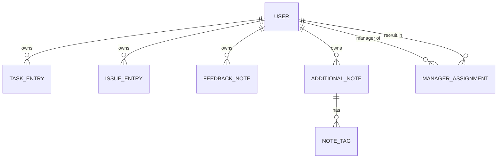
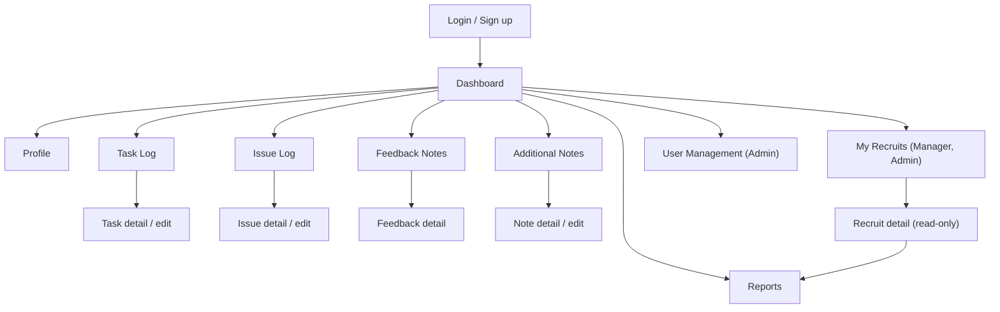

# Onboarding Diary - Elaborated Requirements

Elaboration of [`SOURCE_REQUIREMENTS.md`](./SOURCE_REQUIREMENTS.md), which is the authoritative
scope. Nothing here adds features beyond the source; ideas that go beyond it are listed only in
[Section 8 - Open Questions / Assumptions](#8-open-questions--assumptions).

Roles referenced throughout: **New Recruit**, **Manager**, **Admin**.

## Contents

1. [User Stories](#1-user-stories)
2. [Data Model](#2-data-model)
3. [Implementation Architecture](#3-implementation-architecture)
4. [REST API Endpoints](#4-rest-api-endpoints)
5. [UI Flows](#5-ui-flows)
6. [Validation Rules](#6-validation-rules)
7. [Non-Functional Notes](#7-non-functional-notes)
8. [Open Questions / Assumptions](#8-open-questions--assumptions)

---

## 1. User Stories

### 1.1 New Recruit

**US-R01 - Sign up**
As a New Recruit, I want to sign up with my email and password, so that I can start recording my
onboarding journey.

- Sign-up form collects name, email, password, department, and start date.
- Email must be unique; a duplicate email returns a clear field-level error.
- Password is stored only as a hash, never in plain text.
- Role defaults to New Recruit on self sign-up.
- On success the user is authenticated and lands on the dashboard.

**US-R02 - Log in / log out**
As a New Recruit, I want to log in with my email and password, so that only I can see my entries.

- Valid credentials establish an authenticated session and redirect to the dashboard.
- Invalid credentials show a generic "invalid email or password" message (no user enumeration).
- Logging out ends the session and returns to the login page.
- Unauthenticated access to any diary page redirects to login.

**US-R03 - Manage my profile**
As a New Recruit, I want to view and edit my profile (name, role, department, start date), so that
my diary reflects accurate details about me.

- Profile page shows name, email, role, department, start date.
- Name, department, and start date are editable; email is read-only.
- Role is read-only for New Recruit and Manager; only an Admin can change a role.
- Validation errors are shown inline and no partial update is saved.

**US-R04 - Task Log CRUD**
As a New Recruit, I want to create, view, update, and delete task entries (date, title,
description, category, status, priority), so that I can track what I work on during onboarding.

- Create requires date, title, category, status, priority; description is optional.
- The list shows my own tasks only, most recent date first.
- Update preserves the owner and allows editing every field except the owner.
- Delete asks for confirmation and removes the entry permanently.
- Any attempt to read/edit/delete another user's task returns 403.

**US-R05 - Filter tasks**
As a New Recruit, I want to filter my task log by date, category, and status, so that I can find
relevant tasks quickly.

- Filters can be combined (AND semantics) and applied via a date range (from/to), category, status.
- An empty result set shows an explanatory empty state, not an error.
- Active filters are reflected in the URL query string so a filtered view can be shared/bookmarked.

**US-R06 - Issue Log CRUD**
As a New Recruit, I want to create, view, update, and delete issue entries (date, title,
description, severity, status, resolution notes), so that blockers I hit are documented.

- Create requires date, title, severity, status; description and resolution notes are optional.
- Resolution notes are editable at any time and expected when status becomes Resolved/Closed.
- The list shows my own issues only, most recent date first.
- Update/delete restricted to the owner (and Admin); delete asks for confirmation.

**US-R07 - Filter issues**
As a New Recruit, I want to filter my issue log by status and severity, so that I can focus on
what is still open or most severe.

- Filters can be combined; results respect ownership rules.
- Active filters are reflected in the URL query string.

**US-R08 - Submit feedback notes**
As a New Recruit, I want to submit feedback notes (date, subject, type, details), so that I can
share what is going well and what could improve.

- Type must be one of Positive, Suggestion, Concern.
- Date, subject, type, and details are required.
- Submitted feedback appears in my feedback list and in dashboard counts.
- Feedback is visible to me, my overseeing Manager, and Admins.

**US-R09 - Additional notes CRUD with tags**
As a New Recruit, I want to create, view, update, and delete additional notes with tags (date,
title, content, tags), so that I can capture anything that does not fit the other logs.

- Create requires date, title, content; tags are optional and entered as a free-form list.
- Tags are normalised (trimmed, lower-cased, de-duplicated) before saving.
- Notes can be filtered/searched by tag.
- Update/delete restricted to the owner (and Admin).

**US-R10 - Dashboard summary**
As a New Recruit, I want a dashboard summarising my onboarding, so that I can see my progress at a
glance.

- Shows summary counts of tasks, issues, feedback notes, and additional notes.
- Shows task completion progress (completed vs. total tasks).
- Shows a list of open issues.
- Shows recent entries across all four entry types.
- Reflects only my own data.

**US-R11 - Generate and download my reports**
As a New Recruit, I want to generate a report for a date range and download it, so that I can share
my onboarding progress.

- The user selects a from/to date range and a format (PDF or CSV).
- The report contains tasks, issues, feedback, and notes whose entry date falls within the range.
- The file downloads with a descriptive filename including the recruit name and date range.
- An empty range produces a report with a "no entries" indication rather than an error.

### 1.2 Manager

**US-M01 - See my recruits**
As a Manager, I want to see the list of recruits I oversee, so that I know whose onboarding I am
responsible for.

- The list shows each recruit's name, department, start date, and last entry date.
- Recruits I do not oversee are never listed.

**US-M02 - View a recruit's entries**
As a Manager, I want to view the task, issue, feedback, and note entries of the recruits I oversee,
so that I can support them.

- Entry lists for an overseen recruit are read-only and support the same filters as the owner's view.
- Requesting entries of a recruit I do not oversee returns 403.

**US-M03 - View a recruit's dashboard**
As a Manager, I want to see the dashboard summary of a recruit I oversee, so that I can judge
progress without reading every entry.

- Same summary content as the recruit's own dashboard, scoped to that recruit, read-only.

**US-M04 - Generate reports for my recruits**
As a Manager, I want to generate and download date-range reports for the recruits I oversee, so
that I can review or share their progress.

- Report request specifies the recruit, the date range, and PDF or CSV.
- Reporting on a recruit I do not oversee returns 403.

**US-M05 - My own diary and profile**
As a Manager, I want the same profile management as any other user, so that my own details stay
accurate.

- Manager can view/edit own profile fields (name, department, start date) but not own role.

### 1.3 Admin

**US-A01 - Manage users**
As an Admin, I want to create, view, edit, and deactivate user accounts, so that the right people
have the right access.

- Admin can set name, email, role, department, and start date on any user.
- Admin can change a user's role between New Recruit, Manager, and Admin.
- Deactivated users cannot log in; their entries are retained.
- Admin cannot remove their own Admin role if they are the last active Admin.

**US-A02 - Assign recruits to managers**
As an Admin, I want to assign and unassign recruits to managers, so that oversight relationships
are correct.

- A recruit may be overseen by zero or more managers; a manager may oversee zero or more recruits.
- Assignment changes take effect immediately for the manager's access.

**US-A03 - View all data**
As an Admin, I want to view all entries, dashboards, and reports across all users, so that I can
support and audit the onboarding process.

- Admin can list and read entries of any user with the same filters.
- Admin can generate any user's report in PDF or CSV.
- Admin can edit or delete any entry (used for correction/cleanup).

---

## 2. Data Model

Conceptual model - field names below are logical, not final column names. Every entity has a
surrogate primary key `id`, plus `created_at` / `updated_at` audit timestamps.

### 2.1 User

| Field | Type | Notes |
|---|---|---|
| `id` | PK | surrogate key |
| `name` | text | required |
| `email` | text | required, unique, login identifier |
| `password_hash` | text | required, hashed (never plain text) |
| `role` | enum | `NEW_RECRUIT` \| `MANAGER` \| `ADMIN` |
| `department` | text | required |
| `start_date` | date | onboarding start date |
| `active` | boolean | deactivated users cannot log in |

### 2.2 TaskEntry

| Field | Type | Notes |
|---|---|---|
| `id` | PK | |
| `owner_id` | FK -> User.id | required, the recruit the entry belongs to |
| `entry_date` | date | required ("date" in source) |
| `title` | text | required |
| `description` | text | optional, long text |
| `category` | text/enum | required |
| `status` | enum | `NOT_STARTED` \| `IN_PROGRESS` \| `BLOCKED` \| `COMPLETED` |
| `priority` | enum | `LOW` \| `MEDIUM` \| `HIGH` |

### 2.3 IssueEntry

| Field | Type | Notes |
|---|---|---|
| `id` | PK | |
| `owner_id` | FK -> User.id | required |
| `entry_date` | date | required |
| `title` | text | required |
| `description` | text | optional, long text |
| `severity` | enum | `LOW` \| `MEDIUM` \| `HIGH` \| `CRITICAL` |
| `status` | enum | `OPEN` \| `IN_PROGRESS` \| `RESOLVED` \| `CLOSED` |
| `resolution_notes` | text | optional, expected once resolved/closed |

### 2.4 FeedbackNote

| Field | Type | Notes |
|---|---|---|
| `id` | PK | |
| `owner_id` | FK -> User.id | required, author of the feedback |
| `entry_date` | date | required |
| `subject` | text | required |
| `type` | enum | `POSITIVE` \| `SUGGESTION` \| `CONCERN` |
| `details` | text | required, long text |

### 2.5 AdditionalNote

| Field | Type | Notes |
|---|---|---|
| `id` | PK | |
| `owner_id` | FK -> User.id | required |
| `entry_date` | date | required |
| `title` | text | required |
| `content` | text | required, long text |
| `tags` | set of text | optional; stored in a `note_tags` child table keyed by `note_id` |

### 2.6 ManagerAssignment (join entity for oversight)

Needed because the Manager-to-Recruit oversight relationship is many-to-many.

| Field | Type | Notes |
|---|---|---|
| `id` | PK | (or composite PK of the two FKs) |
| `manager_id` | FK -> User.id | user with role `MANAGER` |
| `recruit_id` | FK -> User.id | user with role `NEW_RECRUIT` |
| `assigned_at` | timestamp | audit |

Unique constraint on (`manager_id`, `recruit_id`).

### 2.7 Relationships

- `User` 1 - * `TaskEntry`, `IssueEntry`, `FeedbackNote`, `AdditionalNote` (via `owner_id`).
  Deleting a user cascades to their entries; in practice users are deactivated, not deleted.
- `AdditionalNote` 1 - * tag values.
- `User` (Manager) * - * `User` (New Recruit) through `ManagerAssignment`.

---

## 3. Implementation Architecture

**Recommendation:** a single standard layered Spring Boot monolith exposing a REST API plus a
responsive server-delivered web frontend, backed by PostgreSQL.

- **Runtime/stack:** Java 17, Spring Boot 3.2, Spring Web, Spring Data JPA, Spring Security,
  Maven, PostgreSQL.
- **Layers:** `controller` (HTTP, DTO mapping, validation) -> `service` (business rules,
  authorization decisions, transactions) -> `repository` (Spring Data JPA interfaces) -> `entity`
  (JPA models). DTOs cross the controller boundary; entities never leave the service layer.
- **Frontend:** one responsive web frontend served by the same application, calling the REST API.
  A single deployable unit keeps local development and configuration simple.
- **Reports:** generated in the service layer - CSV written directly, PDF via a single small
  library - and streamed to the client as a file download.
- **Persistence:** PostgreSQL with schema managed by versioned migration scripts so schema changes
  are reviewable and repeatable.
- **Rationale:** the domain is a handful of CRUD aggregates with role-based read scopes and a
  reporting endpoint. A layered monolith gives clear separation of concerns with one build, one
  deployment, and one database - no service boundaries, message brokers, caches, or client-side
  build pipeline to justify. Spring Data JPA removes most persistence boilerplate, and Spring
  Security covers email/password auth and role checks out of the box.

---

## 4. REST API Endpoints

All paths are prefixed `/api`. Request/response shapes are described at a high level. Unless noted,
responses are JSON, `401` is returned when unauthenticated and `403` when the role/ownership check
fails.

Authorization shorthand:

- **Owner** - the authenticated user acting on their own data (any role).
- **Manager (overseen)** - a Manager acting on a recruit assigned to them; read-only.
- **Admin** - any user, any data.

### 4.1 Authentication and Profile

| Method | Path | Request | Response | Auth / Role |
|---|---|---|---|---|
| POST | `/api/auth/signup` | name, email, password, department, startDate | created user summary | Public |
| POST | `/api/auth/login` | email, password | user summary + session/token | Public |
| POST | `/api/auth/logout` | - | 204 | Any authenticated |
| GET | `/api/me` | - | profile (name, email, role, department, startDate) | Any authenticated |
| PUT | `/api/me` | name, department, startDate | updated profile | Any authenticated (self) |

### 4.2 Task Log

| Method | Path | Request | Response | Auth / Role |
|---|---|---|---|---|
| GET | `/api/tasks` | query: `userId?`, `dateFrom`, `dateTo`, `category`, `status`, paging | list of task summaries | Owner; Manager (overseen) and Admin may pass `userId` |
| POST | `/api/tasks` | date, title, description, category, status, priority | created task | Owner |
| GET | `/api/tasks/{id}` | - | task detail | Owner, Manager (overseen), Admin |
| PUT | `/api/tasks/{id}` | full task fields | updated task | Owner, Admin |
| DELETE | `/api/tasks/{id}` | - | 204 | Owner, Admin |

### 4.3 Issue Log

| Method | Path | Request | Response | Auth / Role |
|---|---|---|---|---|
| GET | `/api/issues` | query: `userId?`, `status`, `severity`, `dateFrom?`, `dateTo?`, paging | list of issue summaries | Owner; Manager (overseen) and Admin may pass `userId` |
| POST | `/api/issues` | date, title, description, severity, status, resolutionNotes | created issue | Owner |
| GET | `/api/issues/{id}` | - | issue detail | Owner, Manager (overseen), Admin |
| PUT | `/api/issues/{id}` | full issue fields | updated issue | Owner, Admin |
| DELETE | `/api/issues/{id}` | - | 204 | Owner, Admin |

### 4.4 Feedback Notes

| Method | Path | Request | Response | Auth / Role |
|---|---|---|---|---|
| GET | `/api/feedback` | query: `userId?`, `type?`, `dateFrom?`, `dateTo?`, paging | list of feedback summaries | Owner; Manager (overseen) and Admin may pass `userId` |
| POST | `/api/feedback` | date, subject, type, details | created feedback note | Owner |
| GET | `/api/feedback/{id}` | - | feedback detail | Owner, Manager (overseen), Admin |
| PUT | `/api/feedback/{id}` | full feedback fields | updated feedback note | Owner, Admin |
| DELETE | `/api/feedback/{id}` | - | 204 | Owner, Admin |

### 4.5 Additional Notes

| Method | Path | Request | Response | Auth / Role |
|---|---|---|---|---|
| GET | `/api/notes` | query: `userId?`, `tag?`, `dateFrom?`, `dateTo?`, paging | list of note summaries | Owner; Manager (overseen) and Admin may pass `userId` |
| POST | `/api/notes` | date, title, content, tags[] | created note | Owner |
| GET | `/api/notes/{id}` | - | note detail incl. tags | Owner, Manager (overseen), Admin |
| PUT | `/api/notes/{id}` | full note fields incl. tags[] | updated note | Owner, Admin |
| DELETE | `/api/notes/{id}` | - | 204 | Owner, Admin |

### 4.6 Dashboard

| Method | Path | Request | Response | Auth / Role |
|---|---|---|---|---|
| GET | `/api/dashboard` | query: `userId?` (defaults to self) | summary counts, task completion progress, open issues, recent entries | Owner; Manager (overseen) and Admin may pass `userId` |

### 4.7 Reports

| Method | Path | Request | Response | Auth / Role |
|---|---|---|---|---|
| GET | `/api/reports` | query: `userId?`, `dateFrom`, `dateTo`, `format=pdf\|csv` | file download (`application/pdf` or `text/csv`) with `Content-Disposition: attachment` | Owner; Manager (overseen) and Admin may pass `userId` |
| GET | `/api/reports/preview` | query: same as above, no `format` | JSON preview of report contents | Same as above |

### 4.8 Admin - User Management

| Method | Path | Request | Response | Auth / Role |
|---|---|---|---|---|
| GET | `/api/users` | query: `role?`, `department?`, `active?`, paging | list of user summaries | Admin (Manager: restricted to overseen recruits via `/api/users/me/recruits`) |
| POST | `/api/users` | name, email, password, role, department, startDate | created user | Admin |
| GET | `/api/users/{id}` | - | user detail | Admin; Manager (overseen) |
| PUT | `/api/users/{id}` | name, role, department, startDate, active | updated user | Admin |
| GET | `/api/users/me/recruits` | - | list of recruits overseen by caller | Manager, Admin |
| POST | `/api/users/{managerId}/recruits` | recruitId | 201 assignment created | Admin |
| DELETE | `/api/users/{managerId}/recruits/{recruitId}` | - | 204 | Admin |

---

## 5. UI Flows

### 5.1 Pages and role authorization

| Page | Path | New Recruit | Manager | Admin |
|---|---|---|---|---|
| Login | `/login` | Yes (public) | Yes (public) | Yes (public) |
| Sign up | `/signup` | Yes (public) | Yes (public) | Yes (public) |
| Dashboard (own) | `/dashboard` | Yes | Yes | Yes |
| Profile | `/profile` | Yes | Yes | Yes |
| Task Log (own) | `/tasks` | Yes | Yes | Yes |
| Task detail/edit | `/tasks/{id}` | Own only | Own; read-only for overseen recruits | Any |
| Issue Log (own) | `/issues` | Yes | Yes | Yes |
| Issue detail/edit | `/issues/{id}` | Own only | Own; read-only for overseen recruits | Any |
| Feedback Notes | `/feedback` | Yes | Yes | Yes |
| Additional Notes | `/notes` | Yes | Yes | Yes |
| Reports | `/reports` | Own data only | Own + overseen recruits | Any user |
| My Recruits | `/recruits` | No | Yes | Yes |
| Recruit detail (read-only entries + dashboard) | `/recruits/{id}` | No | Overseen only | Any |
| User Management | `/admin/users` | No | No | Yes |

Unauthorized page access redirects to the caller's dashboard with an explanatory message;
unauthenticated access redirects to `/login`.

### 5.2 Navigation

- **Login/Sign up** -> Dashboard on success.
- **Dashboard** is the hub: top navigation links to Task Log, Issue Log, Feedback, Notes, Reports,
  Profile; Managers/Admins also see My Recruits; Admins also see User Management.
- **Each log page** lists entries with filters, a "New entry" action opening a create form, and
  row actions for view/edit/delete (delete confirms first). Saving or cancelling returns to the
  list with filters preserved.
- **Reports page** takes a date range plus format and triggers a file download; Manager/Admin
  additionally pick the target user.
- **My Recruits** -> Recruit detail -> that recruit's read-only entry lists and dashboard, with a
  shortcut into Reports pre-filled for that recruit.

---

## 6. Validation Rules

### 6.1 Field-level

**User / profile**

- `name`: required, 1-100 characters.
- `email`: required, valid email format, unique, max 255 characters, stored lower-case.
- `password`: required on signup, minimum 8 characters; never returned by the API.
- `role`: required, one of `NEW_RECRUIT`, `MANAGER`, `ADMIN`.
- `department`: required, 1-100 characters.
- `start_date`: required, valid date.

**TaskEntry**

- `entry_date`: required, valid date.
- `title`: required, 1-150 characters.
- `description`: optional, max 5000 characters.
- `category`: required, 1-50 characters (from a controlled list).
- `status`: required, one of `NOT_STARTED`, `IN_PROGRESS`, `BLOCKED`, `COMPLETED`.
- `priority`: required, one of `LOW`, `MEDIUM`, `HIGH`.

**IssueEntry**

- `entry_date`: required, valid date.
- `title`: required, 1-150 characters.
- `description`: optional, max 5000 characters.
- `severity`: required, one of `LOW`, `MEDIUM`, `HIGH`, `CRITICAL`.
- `status`: required, one of `OPEN`, `IN_PROGRESS`, `RESOLVED`, `CLOSED`.
- `resolution_notes`: optional, max 5000 characters.

**FeedbackNote**

- `entry_date`: required, valid date.
- `subject`: required, 1-150 characters.
- `type`: required, one of `POSITIVE`, `SUGGESTION`, `CONCERN`.
- `details`: required, 1-5000 characters.

**AdditionalNote**

- `entry_date`: required, valid date.
- `title`: required, 1-150 characters.
- `content`: required, 1-10000 characters.
- `tags`: optional, at most 10 tags, each 1-30 characters, trimmed, lower-cased, de-duplicated.

**Report / filter parameters**

- `dateFrom` and `dateTo`: required for reports, valid dates, `dateFrom <= dateTo`.
- `format`: required for downloads, one of `pdf`, `csv`.
- Enum filters must match the allowed values above; unknown values return `400`.

### 6.2 Business rules

- Only the owner of an entry, or an Admin, may update or delete it. Managers have read-only access.
- A Manager may read entries, dashboards, and reports only for recruits assigned to them; any other
  target returns `403`.
- A New Recruit may only ever access their own data.
- `userId` on list/dashboard/report endpoints defaults to the caller; supplying another user's id
  requires Manager (overseen) or Admin rights.
- Only an Admin may change a user's role, activate/deactivate accounts, or create/remove
  manager-to-recruit assignments.
- A user cannot be assigned as manager of themselves; assignments must be unique per
  (manager, recruit) pair.
- The last active Admin cannot be deactivated or demoted.
- Deactivated users cannot log in; their existing entries remain readable by Managers/Admins.
- Date sanity: entry dates may not be in the future; entry dates should not precede the owner's
  start date (rejected as a validation error). Report ranges may not exceed the current date.
- Issue status `RESOLVED` or `CLOSED` requires non-empty `resolution_notes`.
- Email is immutable after creation for non-Admin users.

---

## 7. Non-Functional Notes

- **Responsive web:** the UI is responsive and usable on phone, tablet, and desktop widths; all
  pages including tables and forms remain operable on small screens.
- **Authentication mechanism (assumption):** email/password authentication with server-side
  password hashing (BCrypt), using a stateless JWT bearer token issued on login. Role-based
  authorization enforced server-side on every endpoint; client-side checks are cosmetic only.
- **Environment:** local development is the deployment target - one Spring Boot process plus a
  local PostgreSQL instance, configured through `application.yml` and environment variables. No
  cloud, container orchestration, or CI/CD requirements are assumed.
- **Testing expectations:**
  - Unit tests for service-layer business logic: validation rules, authorization decisions
    (ownership and oversight), dashboard aggregation, report content assembly.
  - Integration tests for REST endpoints covering happy paths, validation failures (`400`),
    unauthenticated (`401`) and forbidden (`403`) cases, and report downloads (content type and
    disposition).
  - Tests run against an in-memory or throwaway database so the suite needs no external setup.
- **Observability/performance:** standard application logging; entry lists are paginated and
  filtered in the database. No specific latency or scale targets are stated in the source.

---

## 8. Open Questions / Assumptions

### 8.1 Assumptions made

1. Enum values for task status/priority, issue status/severity are not enumerated in the source;
   the sets in Section 6 are assumed.
2. Task `category` is assumed to be a short controlled list rather than free text; the actual list
   is unknown.
3. Self sign-up creates a New Recruit; Manager and Admin accounts are created or promoted by an
   Admin.
4. Manager-to-Recruit oversight is many-to-many and maintained by Admins.
5. Authentication is JWT-based (see Section 7); session-cookie auth would be an equally valid
   reading of the source.
6. Feedback notes are authored by recruits about their onboarding and are visible to their Manager
   and Admins; the source does not state visibility explicitly.
7. Reports cover all four entry types for one user over a date range; PDF is a formatted document,
   CSV is one section/row set per entry type.
8. Entry dates are not allowed in the future and not before the owner's start date.
9. `resolution_notes` is required once an issue is Resolved/Closed.
10. Admins may edit/delete any entry for correction purposes; the source only states they can view
    all data.
11. Users are deactivated rather than deleted, so historical entries survive.
12. Tags are free-form strings, normalised to lower case; there is no managed tag vocabulary.
13. Timestamps/dates use the server's local date; no multi-timezone handling is assumed.

### 8.2 Open questions

1. Should Managers be able to add feedback or comments on a recruit's entries, or is their access
   strictly read-only?
2. Is there a fixed category list for tasks, and who maintains it?
3. Are there fixed departments, or is department free text?
4. Can a recruit have more than one Manager, and does a Manager also have a Manager?
5. Should reports be available for multiple recruits at once (e.g. a whole department), or one
   recruit per report?
6. What exactly counts towards "task completion progress" - completed/total tasks overall, or
   within a period?
7. How many "recent entries" should the dashboard show, and over what window?
8. Is email verification or password reset expected for the email/password flow?
9. Should deleting an entry be a soft delete for auditability?
10. Any data retention rules once onboarding completes?

### 8.3 Proposed but out of scope

These are ideas that go beyond `SOURCE_REQUIREMENTS.md`. They are recorded here only and are not
part of the scope unless explicitly added to the source requirements.

- Email or in-app notifications (e.g. reminders for overdue tasks, alerts on critical issues).
- Comment threads or manager replies on entries.
- File/screenshot attachments on entries.
- Full-text search across all entry types.
- Onboarding checklist templates auto-generating tasks for new recruits.
- Department- or cohort-level analytics for Admins.
- SSO / OAuth login, password reset by email, and multi-factor authentication.
- Calendar integration or a timeline visualisation of the onboarding journey.
- Bulk import/export of entries beyond the specified PDF/CSV reports.
- Audit log of who viewed a recruit's data.
