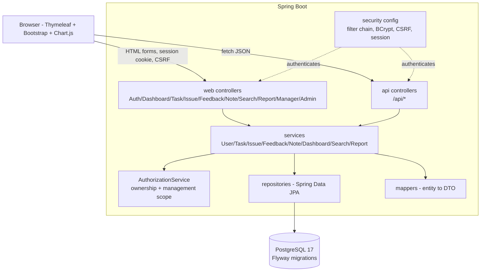
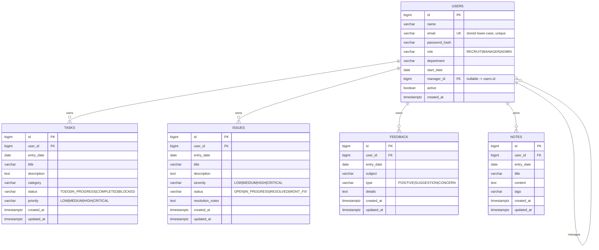

# Architecture

## Stack

Java 21 · Spring Boot 3.5.x · Spring MVC + Thymeleaf · Spring Security 6 (session auth) ·
Spring Data JPA/Hibernate · PostgreSQL 17 · Flyway · Bootstrap 5 · Chart.js · PDFBox · Maven ·
JUnit 5 + MockMvc + Spring Security Test · Docker Compose for the database.

Server-rendered MVC is sufficient: the app is form and report driven with modest interactivity
(charts fed by a JSON endpoint), so no SPA framework is introduced.

## Component view



Package layout under `com.codev.onboardingdiary`:

```
config/        SecurityConfig, WebConfig, DataSeeder
domain/        User, Task, Issue, Feedback, Note, enums
repository/    *Repository (Spring Data JPA)
service/       UserService, TaskService, IssueService, FeedbackService, NoteService,
               DashboardService, SearchService, ReportService, AuthorizationService,
               CsvReportWriter, PdfReportWriter
web/           AuthController, DashboardController, TaskController, IssueController,
               FeedbackController, NoteController, SearchController, ReportController,
               ProfileController, ManagerController, AdminController, GlobalErrorHandler
web/api/       MeApiController, DashboardApiController, TaskApiController, IssueApiController,
               FeedbackApiController, NoteApiController, SearchApiController, ApiExceptionHandler
web/dto/       request + response records, form backing objects
security/      AppUserDetails, AppUserDetailsService, CurrentUser resolution
```

Rules: controllers do no business logic and never touch repositories directly; all authorization
decisions live in `AuthorizationService` and are invoked from services, so a new controller cannot
bypass them; DTO mapping happens in the service/mapper layer, so entities never leave the service
boundary.

## ERD



Indexes: `users(lower(email))` unique, `users(manager_id)`, and `(user_id, entry_date)` on each diary
table; foreign keys cascade-delete a user's diary rows.

## Security design

- Session-based form login (`/login`), `SecurityContext` in the HTTP session, `HttpOnly` `SameSite=Lax`
  cookie, session fixation protection (`changeSessionId`), one concurrent-session registry entry per user.
- `DaoAuthenticationProvider` with `BCryptPasswordEncoder(12)`; `AppUserDetails` exposes the user id and
  role and is `disabled` when `active = false`.
- URL rules: `/`, `/login`, `/signup`, `/css/**`, `/js/**`, `/webjars/**`, `/actuator/health` permitted;
  `/manager/**` requires `MANAGER` or `ADMIN`; `/admin/**` requires `ADMIN`; everything else authenticated.
- Method/service-level scope checks via `AuthorizationService`:
  `requireOwnRecord(principal, ownerId)`, `requireReadAccess(principal, targetUser)` (self, managed
  recruit, or admin), `requireAdmin(principal)`.
- CSRF enabled everywhere (Thymeleaf emits the token automatically; the dashboard `fetch` calls are GETs).
- Security headers: default Spring Security set plus a strict `Content-Security-Policy` allowing only
  self-hosted scripts (Bootstrap and Chart.js are served locally via WebJars, no CDN).
- Errors: `AccessDeniedException` → 403 page/JSON, no record existence leakage beyond the status code.

## Persistence & transactions

- Flyway owns the schema (`spring.jpa.hibernate.ddl-auto=validate`); migrations in
  `src/main/resources/db/migration` (`V1__init.sql`, `V2__seed_demo_data.sql`).
- Services are `@Transactional(readOnly = true)` by default with write methods annotated
  `@Transactional`; entities are updated inside the transaction (no detached merges of client data).
- Demo/seed data is applied by a Flyway migration guarded to insert only when the table is empty, so a
  clean database is immediately usable and re-running the app does not duplicate rows.

## Reporting

`ReportService` resolves the target user (scope-checked), loads entries in range, and delegates to
`CsvReportWriter` (RFC4180 quoting, per-category sections) or `PdfReportWriter` (PDFBox, A4, header
block, table rows with wrapping and `Page n of m`). Streaming is done into the response output stream
with an explicit `Content-Disposition` filename.

## Testing strategy

See `docs/TEST_STRATEGY.md`. Unit tests for services (percentages, filters, CSV content, search),
`@WebMvcTest`/`@SpringBootTest` + MockMvc + `@WithUserDetails` for controllers, authorization matrix
tests for every cross-user path, and a Flyway-on-empty-database check.
