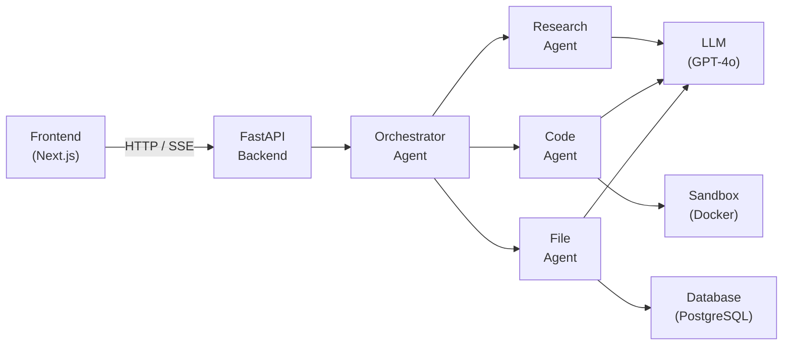

# Agent Orchestration Platform — Project Plan

## 1. Project Overview

A full-stack **agent orchestration** application designed as a hands-on learning project. Users interact with a web frontend to submit tasks, which are routed to a Python backend powered by **FastAPI** and **LangGraph**. An orchestrator agent breaks each task into sub-tasks and delegates them to specialised sub-agents (Research, Code, File), each equipped with its own set of tools (LLM calls, sandbox execution, database access). The system streams intermediate results back to the frontend in real time.

---

## 2. Tech Stack

| Layer | Technology |
|---|---|
| **Frontend** | Next.js 14 (App Router) · Tailwind CSS · shadcn/ui |
| **Backend** | Python 3.12 · FastAPI · LangGraph · LangChain |
| **LLM** | OpenAI GPT-4o |
| **Database** | PostgreSQL · SQLAlchemy |
| **Task Queue** | Redis *(optional — for long-running tasks)* |
| **Sandbox** | Docker SDK for Python *(Phase 2)* |
| **Observability** | LangSmith or Langfuse |
| **DevOps** | Docker Compose for local development |

---

## 3. Architecture



**Data flow:**

1. The **Frontend** sends a task description to the **FastAPI** backend over HTTP.
2. The backend forwards the task to the **Orchestrator Agent**.
3. The orchestrator decomposes the task and delegates sub-tasks to the appropriate **Sub-Agents**.
4. Each sub-agent uses its assigned **Tools** (LLM, Sandbox, DB) to complete work.
5. Results stream back through the orchestrator → API → frontend via **Server-Sent Events (SSE)**.

---

## 4. Phased Roadmap

### Phase 1 — Single Agent with Tool-Calling

**Goal:** End-to-end request → agent → response with streaming output.

| Milestone | Description |
|---|---|
| FastAPI skeleton | Create the backend project, health-check endpoint, CORS config. |
| Single agent | Implement one LangChain agent with a basic tool (e.g. web search). |
| Streaming | Wire SSE from FastAPI so the frontend can display tokens as they arrive. |
| Basic frontend | Next.js 14 App Router page with a text input and a streaming response panel. |
| Database | PostgreSQL + SQLAlchemy models for persisting tasks and results. |

### Phase 2 — Multi-Agent Orchestration with LangGraph

**Goal:** Multiple specialised agents coordinated by a graph-based orchestrator.

| Milestone | Description |
|---|---|
| LangGraph integration | Define a `StateGraph` with nodes for the orchestrator and each sub-agent. |
| Shared state | Pass a common state dict through the graph so agents can read each other's outputs. |
| Research agent | Sub-agent equipped with search/summarisation tools. |
| Code agent | Sub-agent that generates and optionally runs code. |
| File agent | Sub-agent for reading/writing files and database records. |

### Phase 3 — Docker Sandbox for Autonomous Code Execution

**Goal:** Safe, isolated execution of agent-generated code.

| Milestone | Description |
|---|---|
| Docker SDK setup | Use the Docker SDK for Python to spin up ephemeral containers. |
| Sandbox tool | Wrap container lifecycle (create → run → collect output → destroy) as a LangChain tool. |
| Security | Limit CPU, memory, network; run as non-root; enforce execution timeouts. |
| Frontend UX | Display sandbox stdout/stderr in a collapsible terminal panel. |

### Phase 4 — Observability, Memory & Production Hardening

**Goal:** Make the system observable, persistent, and production-ready.

| Milestone | Description |
|---|---|
| Tracing | Integrate LangSmith or Langfuse for full trace visibility. |
| Memory | Add conversation memory (buffer / summary) so agents retain context across turns. |
| Redis queue | Offload long-running agent tasks to a background worker via Redis. |
| Auth | Add basic authentication (e.g. NextAuth.js) to protect the frontend. |
| CI/CD | GitHub Actions for linting, testing, and Docker image builds. |

---

## 5. Folder Structure

```
/frontend             — Next.js 14 app (App Router + Tailwind + shadcn/ui)
/backend              — FastAPI application
/backend/agents       — Agent definitions (orchestrator, sub-agents)
/backend/tools        — Tool implementations (search, sandbox, file I/O)
/backend/models       — SQLAlchemy database models
/docs                 — Documentation and planning artifacts
/sandbox              — Dockerfile for the sandboxed execution environment
docker-compose.yml    — Local development (API, frontend, Postgres, Redis)
```

---

## 6. Key Learning Objectives

### Phase 1 — Foundations

- Understand **tool-calling** in LangChain: how an LLM decides to invoke a tool and processes its output.
- Learn **Server-Sent Events** for streaming LLM tokens to a web client.
- Set up a **FastAPI** project with async endpoints.

> 📖 [LangChain Tool Calling](https://python.langchain.com/docs/concepts/tool_calling/)
> 📖 [LangChain Tools](https://python.langchain.com/docs/how_to/#tools)

### Phase 2 — Graph-Based Orchestration

- Model multi-agent workflows as **state graphs** using LangGraph.
- Understand **nodes, edges, and conditional routing** in a `StateGraph`.
- Design a **shared state schema** that flows between agents.

> 📖 [LangGraph Quick Start](https://langchain-ai.github.io/langgraph/tutorials/introduction/)
> 📖 [LangGraph Multi-Agent](https://langchain-ai.github.io/langgraph/concepts/multi_agent/)
> 📖 [LangGraph How-To: Sub-Graphs](https://langchain-ai.github.io/langgraph/how-tos/subgraph/)

### Phase 3 — Sandboxed Execution

- Use the **Docker SDK for Python** to manage container lifecycles programmatically.
- Apply security best-practices for running untrusted code (resource limits, network isolation).

> 📖 [Docker SDK for Python](https://docker-py.readthedocs.io/en/stable/)

### Phase 4 — Observability & Production

- Instrument agents with **LangSmith** or **Langfuse** tracing for debugging and evaluation.
- Add **conversation memory** to maintain context across user turns.
- Harden the system with authentication, rate limiting, and background task processing.

> 📖 [LangSmith Docs](https://docs.smith.langchain.com/)
> 📖 [Langfuse Docs](https://langfuse.com/docs)
> 📖 [LangGraph Persistence & Memory](https://langchain-ai.github.io/langgraph/concepts/persistence/)
