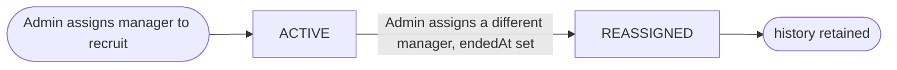
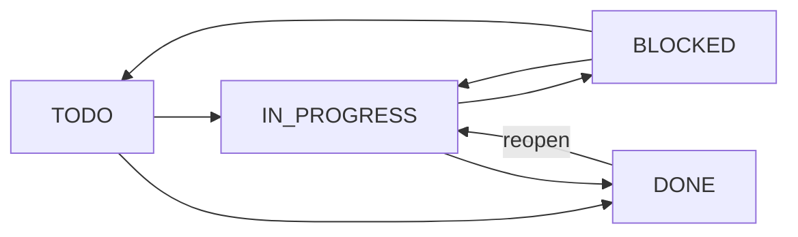
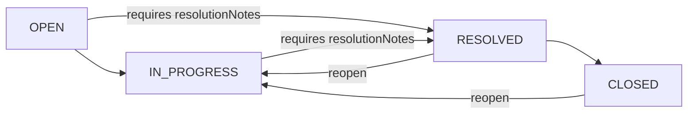
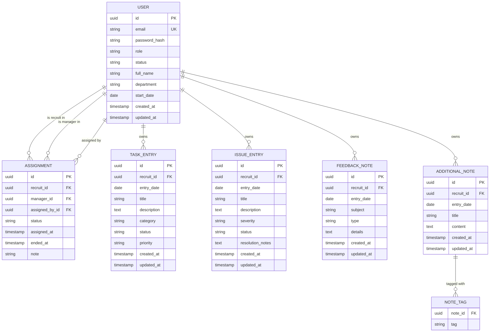
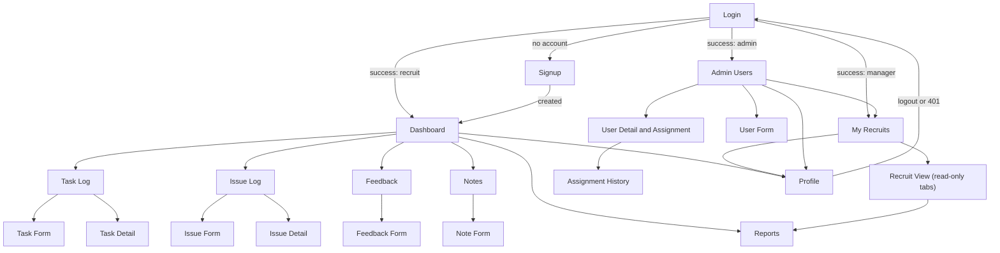

# Onboarding Diary — Detailed Requirements

Source of record: [`docs/requirements.md`](./requirements.md) (transcription of
`Onboarding_Diary_App_Requirements.pdf`). This document elaborates that source
into a domain model, granular functional requirements, permissions, user
stories, an API contract ([`docs/openapi.yaml`](./openapi.yaml)), auth rules,
validations, mock UIs and a list of out-of-scope enhancements. The delivery
order is in [`docs/implementation-plan.md`](./implementation-plan.md).

Conventions referenced: root `AGENTS.md`, `backend/AGENTS.md` (Kotlin, Spring
Boot 4.x, WebFlux + coroutines, PostgreSQL, JUnit 5 + Testcontainers),
`frontend/AGENTS.md` (Next.js + MobX, single typed API client, token held in
`AuthStore`).

---

## Table of contents

0. [Resolved Decisions & Assumptions](#0-resolved-decisions--assumptions)
1. [Domain model](#1-domain-model)
2. [Functional requirements](#2-functional-requirements)
3. [Actors and permissions](#3-actors-and-permissions)
4. [User stories and acceptance criteria](#4-user-stories-and-acceptance-criteria)
5. [API specification](#5-api-specification)
6. [Authentication & authorization](#6-authentication--authorization)
7. [Validations](#7-validations)
8. [Mock UIs](#8-mock-uis)
9. [Additional / Out-of-Scope Enhancements](#9-additional--out-of-scope-enhancements)

---

## 0. Resolved Decisions & Assumptions

The following decisions are **settled** and are applied throughout this
document, the OpenAPI spec and the implementation plan. They are not open
questions.

| # | Decision | Rationale |
|---|----------|-----------|
| D1 | **Authentication uses email + password.** Email is the login identifier and is treated as a restricted username: RFC-5322-style format validation, uniqueness, and normalization (trim + lowercase) are required. Password hashing is backend-only (BCrypt or Argon2 via Spring Security `PasswordEncoder`). Any "username / password" wording in the `AGENTS.md` files is to be read as "email / password". | `docs/requirements.md` explicitly states "Sign up / login with email and password". Email is already unique per person and doubles as a contact channel; normalization prevents duplicate accounts differing only by case/whitespace. |
| D2 | **Recruit ↔ Manager relationship is admin-assigned** and modelled as a first-class `Assignment` entity linking one New Recruit to one primary Manager, created by an Admin, with lifecycle `ACTIVE` → `REASSIGNED`. A Manager's "recruits they oversee" = the set of recruits with an `ACTIVE` assignment to that manager. | Makes "managers can generate reports for recruits they oversee" enforceable and auditable. History is preserved rather than overwritten. |
| D3 | **Feedback visibility is restricted.** A Feedback Note is readable only by (a) the authoring recruit, (b) Admin, (c) the Manager *currently* assigned to that recruit. No other manager may read it. | Feedback about the onboarding process can be sensitive (e.g. concerns about a team). Limiting to the current mentor and admins keeps trust while still enabling oversight. |
| D4 | **Scope follows `docs/requirements.md` exactly.** The "milestones, questions, reflections" wording in root `AGENTS.md` is ignored. In scope: Authentication/Profile, Task Log, Issue Log, Feedback Notes, Additional Notes, Dashboard, Reports. | The PDF/markdown requirements are the source of record; `AGENTS.md` project blurb is descriptive prose, not a requirement. |
| D5 | **Transport is plain REST.** SSE/WebSockets are not enforced. Any real-time transport is an *optional enhancement* (see §9), never core. | None of the in-scope flows is a live feed; REST keeps the API client, error handling and tests simple. |

### Minor new assumptions (marked as assumptions)

| # | Assumption |
|---|------------|
| A1 | Public self-signup always creates a **New Recruit**. Manager and Admin accounts are created by an Admin. The very first Admin is seeded by a DB migration / bootstrap configuration (env-provided email + password). |
| A2 | Tokens are **stateless JWT bearer tokens** (signed, short-lived, e.g. 60 min). Logout is client-side discard of the token (`AuthStore.clear()`); server-side revocation / refresh tokens are enhancements (§9). |
| A3 | Users are **deactivated**, never hard-deleted, so that authored entries and assignment history remain intact. A deactivated user cannot log in and their token is rejected. |
| A4 | Recruit entries (tasks, issues, feedback, notes) are **hard-deleted** by their owner. Managers and Admins have read-only access to entries; only Admin may delete an entry for data-management purposes. |
| A5 | Dates for entries are calendar dates (`date`, ISO-8601 `YYYY-MM-DD`) in the recruit's local sense; timestamps (`createdAt`, `updatedAt`) are UTC `date-time`. |
| A6 | Enumerations for `category`, `status`, `priority`, `severity`, `type` are fixed server-side enums (listed in §1); a "custom category" feature is out of scope. |
| A7 | All list endpoints are paginated with `page` (0-based) and `size` (default 20, max 100) and return a common `Page` envelope. |
| A8 | Report generation is **synchronous** (request → file). Reports are limited to a date range of at most 366 days. Asynchronous/queued reports are an enhancement (§9). |
| A9 | The API is versioned under `/api/v1`. |

---

## 1. Domain model

### 1.1 Bounded contexts

| Context | Responsibility | Aggregates (roots in bold) |
|---------|----------------|----------------------------|
| **Identity & Access** | Accounts, credentials, roles, profile, recruit↔manager assignment | **User** (Profile, Credential), **Assignment** |
| **Diary / Journaling** | Recruit-authored entries | **TaskEntry**, **IssueEntry**, **FeedbackNote**, **AdditionalNote** (each an independent aggregate owned by one recruit) |
| **Dashboard** | Read-model over Diary for a single recruit | `DashboardSummary` (read model, not persisted) |
| **Reporting** | Date-range extraction of Diary data into PDF/CSV | `ReportRequest` (value object), `ReportDocument` (transient) |

Dashboard and Reporting are **read-only contexts** that query Diary and
Identity & Access; they own no persistent entities.

### 1.2 Entities and value objects

#### Identity & Access

| Entity / VO | Kind | Attributes | Notes |
|-------------|------|------------|-------|
| `User` | Entity (aggregate root) | `id: UUID`, `email: Email`, `passwordHash`, `role: Role`, `status: UserStatus`, `profile: Profile`, `createdAt`, `updatedAt` | `email` is unique (normalized). `passwordHash` never leaves the backend. |
| `Email` | Value object | normalized string (trimmed, lowercase), RFC-5322-style validated, max 254 chars | Equality on normalized value. |
| `Profile` | Value object (embedded in `User`) | `fullName`, `department?`, `startDate?` | `role` is exposed in the profile view but owned by `User` and only Admin-editable. |
| `Role` | Enum | `NEW_RECRUIT`, `MANAGER`, `ADMIN` | Exactly one role per user. |
| `UserStatus` | Enum | `ACTIVE`, `DEACTIVATED` | |
| `Assignment` | Entity (aggregate root) | `id: UUID`, `recruitId`, `managerId`, `assignedById`, `status: AssignmentStatus`, `assignedAt`, `endedAt?`, `note?` | See lifecycle §1.4. |
| `AssignmentStatus` | Enum | `ACTIVE`, `REASSIGNED` | |

#### Diary / Journaling

All entries share `id: UUID`, `recruitId` (owner), `entryDate: date`,
`createdAt`, `updatedAt`.

| Entity | Attributes | Enums |
|--------|------------|-------|
| `TaskEntry` | `title`, `description?`, `category: TaskCategory`, `status: TaskStatus`, `priority: TaskPriority` | `TaskCategory`: `TRAINING`, `SETUP`, `DEVELOPMENT`, `MEETING`, `DOCUMENTATION`, `OTHER` · `TaskStatus`: `TODO`, `IN_PROGRESS`, `BLOCKED`, `DONE` · `TaskPriority`: `LOW`, `MEDIUM`, `HIGH` |
| `IssueEntry` | `title`, `description?`, `severity: IssueSeverity`, `status: IssueStatus`, `resolutionNotes?` | `IssueSeverity`: `LOW`, `MEDIUM`, `HIGH`, `CRITICAL` · `IssueStatus`: `OPEN`, `IN_PROGRESS`, `RESOLVED`, `CLOSED` |
| `FeedbackNote` | `subject`, `type: FeedbackType`, `details` | `FeedbackType`: `POSITIVE`, `SUGGESTION`, `CONCERN` |
| `AdditionalNote` | `title`, `content`, `tags: Set<Tag>` | |
| `Tag` | Value object: lowercase, trimmed, `^[a-z0-9][a-z0-9-]{0,29}$`, max 10 per note | |

#### Dashboard (read model)

`DashboardSummary { recruitId, taskCounts{byStatus}, taskCompletionPercent,
openIssueCount, issueCounts{bySeverity, byStatus}, feedbackCount, noteCount,
recentEntries[ {kind, id, entryDate, title, createdAt} ] }`

#### Reporting (value objects)

`ReportRequest { recruitId, from: date, to: date, type: ReportType, format:
ReportFormat }` · `ReportType`: `TASKS`, `ISSUES`, `FEEDBACK`, `COMBINED` ·
`ReportFormat`: `PDF`, `CSV`.

### 1.3 Relationships and aggregate ownership

- `User(NEW_RECRUIT)` 1 — * `TaskEntry | IssueEntry | FeedbackNote | AdditionalNote` (owner). Each entry references exactly one recruit; entries are separate aggregates so they can be listed/paginated independently.
- `User(NEW_RECRUIT)` 1 — * `Assignment` (as recruit); `User(MANAGER)` 1 — * `Assignment` (as manager); `User(ADMIN)` 1 — * `Assignment` (as assigner).
- Reporting and Dashboard reference `User` and entries by id only.

### 1.4 Lifecycles

**Assignment**



Reassignment is atomic: in one transaction the current `ACTIVE` assignment
becomes `REASSIGNED` (with `endedAt = now`) and a new `ACTIVE` assignment is
inserted. There is no "unassigned" terminal state in core scope; a recruit is
either never assigned or has exactly one active assignment. (Explicit
unassignment is listed in §9.)

**TaskEntry.status**



**IssueEntry.status**



**User.status**: `ACTIVE` → `DEACTIVATED` → `ACTIVE` (Admin only, both ways).

Feedback notes and additional notes have no status lifecycle.

### 1.5 Business invariants

| ID | Invariant |
|----|-----------|
| INV-01 | `User.email` is unique after normalization (trim + lowercase). |
| INV-02 | A user has exactly one `Role`. |
| INV-03 | Every diary entry belongs to exactly one recruit (`recruitId` not null, references a user with role `NEW_RECRUIT`). |
| INV-04 | A recruit has **at most one** `ACTIVE` assignment at any time (partial unique index on `(recruit_id) WHERE status = 'ACTIVE'`). |
| INV-05 | `Assignment.recruitId` must reference an `ACTIVE` user with role `NEW_RECRUIT`; `Assignment.managerId` an `ACTIVE` user with role `MANAGER`; `assignedById` a user with role `ADMIN`. `recruitId ≠ managerId`. |
| INV-06 | Reassigning to the currently active manager is a no-op error (`409 ASSIGNMENT_UNCHANGED`). |
| INV-07 | `IssueEntry.status ∈ {RESOLVED, CLOSED}` ⇒ `resolutionNotes` is non-blank. |
| INV-08 | Status transitions follow the diagrams in §1.4; invalid transitions are rejected (`422 INVALID_STATE_TRANSITION`). |
| INV-09 | `entryDate` may not be in the future (server date, UTC + 1 day tolerance for time zones). |
| INV-10 | A report's `from ≤ to` and `(to − from) ≤ 366 days`. |
| INV-11 | Changing a user's role is rejected while they are party to an `ACTIVE` assignment in the role being removed (Admin must reassign first). |
| INV-12 | `passwordHash` is never serialized in any API response or log. |

### 1.6 Entity-relationship diagram



---

## 2. Functional requirements

IDs are stable and referenced from `openapi.yaml` (via `x-requirements`) and
`implementation-plan.md`.

### 2.1 Identity & Access — Authentication (email + password)

| ID | Requirement |
|----|-------------|
| REQ-FUNC-001 | A visitor can sign up with `email`, `password`, `fullName` (optionally `department`, `startDate`). Signup creates an `ACTIVE` user with role `NEW_RECRUIT`. |
| REQ-FUNC-002 | Email is validated with RFC-5322-style syntax (local part, single `@`, domain with at least one dot, no spaces; max 254 chars). Invalid emails are rejected with `400 VALIDATION_FAILED`. |
| REQ-FUNC-003 | Email is normalized (trim, lowercase) before validation, storage and lookup. Signup with an email that already exists (after normalization) is rejected with `409 EMAIL_ALREADY_EXISTS`. |
| REQ-FUNC-004 | Passwords are 10–128 characters and must contain at least one letter and one digit. Passwords are hashed backend-only with BCrypt (cost ≥ 10) or Argon2id; plaintext is never persisted or logged. |
| REQ-FUNC-005 | A user logs in with `email` + `password` and receives a bearer token plus their profile summary. Invalid credentials, unknown email and deactivated accounts all return the same `401 INVALID_CREDENTIALS`. |
| REQ-FUNC-006 | Every non-public endpoint requires `Authorization: Bearer <token>`. Missing/invalid/expired tokens return `401 UNAUTHENTICATED`. The frontend API client attaches the token from `AuthStore` and, on 401, clears `AuthStore` and redirects to `/login`. |
| REQ-FUNC-007 | A user can log out; the frontend discards the token. `POST /auth/logout` exists for symmetry and returns `204` (stateless server). |
| REQ-FUNC-008 | An authenticated user can view their own profile: `id`, `email`, `fullName`, `role`, `department`, `startDate`, `createdAt`. |
| REQ-FUNC-009 | An authenticated user can update `fullName`, `department`, `startDate` of their own profile. `email` and `role` are not self-editable. |
| REQ-FUNC-010 | An authenticated user can change their own password by supplying the current password and a new password meeting REQ-FUNC-004. |

### 2.2 Identity & Access — Admin user management

| ID | Requirement |
|----|-------------|
| REQ-FUNC-011 | Admin can list users, paginated, filtered by `role`, `status`, and free-text `q` (matches email or fullName, case-insensitive). |
| REQ-FUNC-012 | Admin can create a user of any role with an initial password (same validation as signup). |
| REQ-FUNC-013 | Admin can view any user's detail, including their current active assignment (if any). |
| REQ-FUNC-014 | Admin can update a user's `fullName`, `department`, `startDate`, `role`. Role change is blocked by INV-11. |
| REQ-FUNC-015 | Admin can deactivate and reactivate a user. A deactivated user cannot log in and existing tokens are rejected on the next request. An Admin cannot deactivate their own account. |

### 2.3 Identity & Access — Manager assignment

| ID | Requirement |
|----|-------------|
| REQ-FUNC-016 | Admin can assign a Manager to a Recruit, creating an `ACTIVE` `Assignment` with optional `note`. |
| REQ-FUNC-017 | A recruit has at most one `ACTIVE` assignment (INV-04). Assigning when one exists performs a **reassignment**: the previous becomes `REASSIGNED` (`endedAt` set) and a new `ACTIVE` one is created, atomically. |
| REQ-FUNC-018 | Reassigning to the currently active manager is rejected with `409 ASSIGNMENT_UNCHANGED`. |
| REQ-FUNC-019 | Admin can view assignment history for a recruit (all statuses, newest first) and list all assignments paginated with filters `recruitId`, `managerId`, `status`. |
| REQ-FUNC-020 | A Manager can list the recruits currently assigned to them (recruits with an `ACTIVE` assignment to the manager), with profile summary. |
| REQ-FUNC-021 | A Recruit can view their current manager (name, email, department) or an "unassigned" state. |
| REQ-FUNC-022 | Assignment participants are validated: recruit must be `ACTIVE` `NEW_RECRUIT`, manager must be `ACTIVE` `MANAGER`, otherwise `422 INVALID_ASSIGNMENT_PARTY`. |

### 2.4 Diary — Task Log

| ID | Requirement |
|----|-------------|
| REQ-FUNC-030 | A Recruit can create a task entry with `entryDate`, `title`, `description?`, `category`, `status` (default `TODO`), `priority` (default `MEDIUM`). |
| REQ-FUNC-031 | A Recruit can list their own task entries, paginated, sorted by `entryDate desc, createdAt desc` by default. |
| REQ-FUNC-032 | Task lists can be filtered by `from`/`to` (entryDate range), `category`, `status` (each optional, combinable). |
| REQ-FUNC-033 | A Recruit can view one of their own task entries by id. |
| REQ-FUNC-034 | A Recruit can update any field of their own task entry; status changes must follow the task lifecycle (INV-08). |
| REQ-FUNC-035 | A Recruit can delete their own task entry (hard delete). |
| REQ-FUNC-036 | A Manager can list/view (read-only) task entries of recruits currently assigned to them via `recruitId`. Admin can do so for any recruit. |

### 2.5 Diary — Issue Log

| ID | Requirement |
|----|-------------|
| REQ-FUNC-040 | A Recruit can create an issue entry with `entryDate`, `title`, `description?`, `severity`, `status` (default `OPEN`), `resolutionNotes?`. |
| REQ-FUNC-041 | A Recruit can list their own issue entries, paginated. |
| REQ-FUNC-042 | Issue lists can be filtered by `status`, `severity`, and `from`/`to`. |
| REQ-FUNC-043 | A Recruit can view one of their own issue entries by id. |
| REQ-FUNC-044 | A Recruit can update their own issue entry, including adding `resolutionNotes`; status changes follow the issue lifecycle; `RESOLVED`/`CLOSED` require non-blank `resolutionNotes` (INV-07). |
| REQ-FUNC-045 | A Recruit can delete their own issue entry. |
| REQ-FUNC-046 | A Manager can list/view issues of assigned recruits; Admin for any recruit. |

### 2.6 Diary — Feedback Notes (restricted visibility)

| ID | Requirement |
|----|-------------|
| REQ-FUNC-050 | A Recruit can submit a feedback note with `entryDate`, `subject`, `type` (`POSITIVE`/`SUGGESTION`/`CONCERN`), `details`. |
| REQ-FUNC-051 | A Recruit can list their own feedback notes, paginated, filterable by `type` and `from`/`to`. |
| REQ-FUNC-052 | A Recruit can view, update and delete their own feedback note. |
| REQ-FUNC-053 | A feedback note is readable only by: the authoring recruit, any Admin, and the Manager with the current `ACTIVE` assignment to that recruit (D3). Any other user receives `404 NOT_FOUND` on detail and an empty/forbidden result on list (see §6.4). |
| REQ-FUNC-054 | When a recruit is reassigned, the previous manager immediately loses read access to that recruit's feedback (visibility is evaluated at request time against the active assignment). |

### 2.7 Diary — Additional Notes

| ID | Requirement |
|----|-------------|
| REQ-FUNC-060 | A Recruit can create a free-form note with `entryDate`, `title`, `content`, `tags[]` (0–10 normalized tags). |
| REQ-FUNC-061 | A Recruit can list their own notes, paginated, filterable by `tag` (exact match on one tag) and `from`/`to`. |
| REQ-FUNC-062 | A Recruit can view, update and delete their own note. |
| REQ-FUNC-063 | A Manager can list/view notes of assigned recruits; Admin for any recruit. |

### 2.8 Dashboard

| ID | Requirement |
|----|-------------|
| REQ-FUNC-070 | A Recruit sees a dashboard with summary counts: tasks by status, issues by status and severity, total feedback notes, total notes. |
| REQ-FUNC-071 | The dashboard shows task completion progress: `DONE / total` tasks as a percentage (0 when no tasks). |
| REQ-FUNC-072 | The dashboard shows open issues at a glance: count of issues in `OPEN`/`IN_PROGRESS` and the 5 most recent of them. |
| REQ-FUNC-073 | The dashboard lists the 10 most recent entries across all four categories (by `createdAt desc`), each with kind, title, date and a link to detail. |
| REQ-FUNC-074 | A Manager can view the dashboard of any recruit currently assigned to them (`recruitId` param); Admin for any recruit. Feedback counts obey D3 (only the current manager or Admin sees them). |

### 2.9 Reports

| ID | Requirement |
|----|-------------|
| REQ-FUNC-080 | A user can generate a report for a recruit over a date range `from`–`to` (inclusive, on `entryDate`) of type `TASKS`, `ISSUES`, `FEEDBACK` or `COMBINED`. |
| REQ-FUNC-081 | Reports can be downloaded as PDF (`application/pdf`) with a header (recruit, range, generated-at) and one section/table per included category. |
| REQ-FUNC-082 | Reports can be downloaded as CSV (`text/csv`, UTF-8, RFC-4180); `COMBINED` CSV includes a leading `kind` column. |
| REQ-FUNC-083 | A Recruit can generate reports only for themselves. A Manager can generate reports for recruits currently assigned to them. Admin for any recruit. |
| REQ-FUNC-084 | `FEEDBACK` and `COMBINED` reports include feedback only when the requester is permitted by D3 (recruit, Admin, current manager); otherwise the request is rejected with `403 FORBIDDEN` for `FEEDBACK` and feedback is omitted for `COMBINED` with a `X-Report-Omitted: feedback` response header. |
| REQ-FUNC-085 | A report over a range with no entries still succeeds and produces a document stating "No entries in range". |
| REQ-FUNC-086 | The response carries `Content-Disposition: attachment; filename="onboarding-report-<recruit>-<from>_<to>.<ext>"`. |

### 2.10 Cross-cutting

| ID | Requirement |
|----|-------------|
| REQ-FUNC-090 | All errors use a single JSON error envelope `{ code, message, details[], timestamp, path }` (see §5.2). |
| REQ-FUNC-091 | All list endpoints use `page`/`size`/`sort` query params and return `{ items, page, size, totalItems, totalPages }`. |
| REQ-FUNC-092 | `GET /health` (Spring Boot Actuator) is public and reports DB connectivity. |
| REQ-FUNC-093 | All persisted entities carry `createdAt`/`updatedAt` (UTC) maintained by the backend. |
| REQ-FUNC-094 | The UI is responsive (usable at ≥ 360 px width). |

---

## 3. Actors and permissions

Legend: **C** create · **R** read · **U** update · **D** delete · **–** none ·
*own* = resources where `recruitId == self` · *assigned* = recruits with an
`ACTIVE` assignment to this manager · *any* = all recruits.

### 3.1 API permission matrix

| Resource | New Recruit | Manager | Admin |
|----------|-------------|---------|-------|
| Signup (`POST /auth/signup`) | public | public | public |
| Login / logout | public / self | public / self | public / self |
| Own profile (`/me`) | R U (name, dept, startDate), change password | R U, change password | R U, change password |
| Users (`/users`) | – | R (only recruits *assigned*, via `/me/recruits`) | C R U (incl. role), deactivate/reactivate |
| Assignments | R (own current manager via `/me/manager`) | R (own active assignments via `/me/recruits`) | C R (history, list) |
| Task entries | C R U D *own* | R *assigned* | R *any*, D *any* |
| Issue entries | C R U D *own* | R *assigned* | R *any*, D *any* |
| Feedback notes | C R U D *own* | R *assigned* **and currently active** (D3) | R *any*, D *any* |
| Additional notes | C R U D *own* | R *assigned* | R *any*, D *any* |
| Dashboard | R *own* | R *assigned* | R *any* |
| Reports | generate *own* | generate *assigned* | generate *any* |
| Health | public | public | public |

Managers have **no write access** to recruit entries in core scope.

### 3.2 UI visibility matrix

| Screen / nav item | New Recruit | Manager | Admin |
|-------------------|-------------|---------|-------|
| Login, Signup | visible when logged out | same | same |
| Dashboard (own) | yes | no (sees "My Recruits" instead) | no (sees "Admin" home) |
| My Recruits (list + per-recruit dashboard) | no | yes | yes (all recruits) |
| Task Log / Issue Log / Feedback / Notes (own, editable) | yes | no | no |
| Recruit entries (read-only view) | no | yes, for assigned recruits | yes, any recruit |
| Feedback tab in recruit view | n/a | only if currently assigned | yes |
| Reports | own only; recruit selector hidden | recruit selector limited to assigned | recruit selector shows all |
| Profile | yes | yes | yes |
| Admin → Users, Admin → Assignments | no | no | yes |
| Edit/Delete buttons on entries | own entries | hidden | Delete only |

UI hiding is a convenience; the API is authoritative (§6).

---

## 4. User stories and acceptance criteria

Format: **US-xx** — story · covers REQ ids · Given/When/Then scenarios
including failure/deviation paths.

### US-01 Sign up with email (REQ-FUNC-001..004)

*As a visitor, I want to sign up with my email and a password so that I can start my onboarding diary.*

- **Given** I am on `/signup` **When** I submit a valid email, password (≥10 chars, letter+digit) and full name **Then** an account with role `NEW_RECRUIT` is created, I am logged in (token stored in `AuthStore`) and redirected to `/dashboard`.
- **Given** I enter `  Jane.Doe@Example.COM ` **When** I submit **Then** the account email is stored as `jane.doe@example.com` and the profile shows the normalized value.
- **Given** I enter `jane@` or `jane doe@example.com` **When** I submit **Then** the API returns `400 VALIDATION_FAILED` with `details[{field:"email"}]` and the form shows an inline error on the email field; nothing is created.
- **Given** an account `jane.doe@example.com` exists **When** I sign up as `Jane.Doe@example.com` **Then** the API returns `409 EMAIL_ALREADY_EXISTS` and the UI shows "An account with this email already exists. Log in instead." with a link to `/login`.
- **Given** a password `short1` **When** I submit **Then** `400 VALIDATION_FAILED` on `password` and the UI shows the policy.
- **Given** the backend is unreachable **When** I submit **Then** the UI shows a non-field error "Could not reach the server, try again" and keeps my input.

### US-02 Log in with email (REQ-FUNC-005..007)

- **Given** a valid account **When** I log in with correct email (any casing) and password **Then** I receive a token, `AuthStore.user` is populated and I land on the role-appropriate home (`/dashboard`, `/recruits`, `/admin/users`).
- **Given** a wrong password, unknown email or deactivated account **When** I log in **Then** `401 INVALID_CREDENTIALS` and the UI shows the same generic "Invalid email or password".
- **Given** I am logged in **When** my token expires and I request any page data **Then** the API returns `401 UNAUTHENTICATED`, the API client clears `AuthStore` and redirects to `/login?reason=expired`.
- **Given** I am logged in **When** I click Logout **Then** the token is discarded, `POST /auth/logout` is called best-effort and I am on `/login`.
- **Given** I am not logged in **When** I open any protected route **Then** I am redirected to `/login` with the original path preserved for return.

### US-03 View and edit profile (REQ-FUNC-008..010)

- **Given** I am logged in **When** I open `/profile` **Then** I see email, full name, role, department, start date; email and role are read-only.
- **When** I change full name / department / start date and save **Then** `200` and the header shows the new name.
- **Given** a start date in the future by more than 1 year or malformed **Then** `400 VALIDATION_FAILED` on `startDate`.
- **Given** I change password with a wrong current password **Then** `400 INVALID_CURRENT_PASSWORD`; with a valid one **Then** `204` and I stay logged in.

### US-04 Admin manages users (REQ-FUNC-011..015)

- **Given** I am Admin **When** I open `/admin/users` **Then** I see a paginated table filterable by role, status and search.
- **When** I create a manager with a valid email **Then** the user appears with role `MANAGER`; duplicate email → `409 EMAIL_ALREADY_EXISTS` shown inline.
- **When** I change a recruit's role to `MANAGER` while they have an active assignment **Then** `422 ROLE_CHANGE_BLOCKED_BY_ASSIGNMENT` and the UI suggests reassigning first.
- **When** I deactivate a user **Then** they can no longer log in; their next API call returns `401 UNAUTHENTICATED`. **When** I try to deactivate myself **Then** `422 CANNOT_DEACTIVATE_SELF`.
- **Given** I am a Recruit or Manager **When** I call any `/users` admin endpoint or open `/admin/*` **Then** `403 FORBIDDEN` and the UI shows the "Not authorized" page (nav item is hidden anyway).
- **Given** a filter that matches nobody **Then** the table shows "No users match these filters" with a clear-filters action.

### US-05 Admin assigns / reassigns a manager (REQ-FUNC-016..019, 022)

- **Given** recruit R has no assignment **When** Admin assigns manager M1 **Then** an `ACTIVE` assignment exists; R's profile shows "Manager: M1"; M1's "My Recruits" includes R.
- **Given** R is actively assigned to M1 **When** Admin assigns M2 **Then** the M1 assignment becomes `REASSIGNED` with `endedAt`, a new `ACTIVE` assignment to M2 exists, history shows both, and M1 no longer sees R (including R's feedback).
- **When** Admin assigns M1 again while M1 is already active **Then** `409 ASSIGNMENT_UNCHANGED`.
- **When** the chosen manager is deactivated or not a `MANAGER`, or the recruit is not an `ACTIVE` `NEW_RECRUIT` **Then** `422 INVALID_ASSIGNMENT_PARTY`.
- **When** two admins reassign the same recruit concurrently **Then** exactly one `ACTIVE` row exists afterwards (DB partial unique index; the loser gets `409 CONFLICT` and the UI asks to refresh).
- **Given** a recruit with no history **When** Admin opens their assignment history **Then** "No assignments yet" with an Assign button.

### US-06 Manager sees assigned recruits (REQ-FUNC-020, 021)

- **Given** I am a Manager with active assignments **When** I open `/recruits` **Then** I see only those recruits with name, email, department, start date and links to their dashboard/entries.
- **Given** I have no active assignments **Then** an empty state "No recruits assigned to you yet. Ask an admin to assign recruits."
- **Given** I am a Manager **When** I request `/api/v1/tasks?recruitId=<not assigned to me>` **Then** `403 FORBIDDEN` (`NOT_ASSIGNED`); the UI shows "You are not assigned to this recruit".
- **Given** I am a Recruit **When** I open `/profile` **Then** I see my current manager or "No manager assigned yet".

### US-07 Task CRUD + filter (REQ-FUNC-030..036)

- **When** I create a task with date, title, category (status defaults `TODO`, priority `MEDIUM`) **Then** `201` and it appears at the top of my list.
- **When** I filter by status `IN_PROGRESS` and category `TRAINING` and a date range **Then** only matching tasks are listed and the URL query reflects the filters; **When** nothing matches **Then** "No tasks match" with clear-filters.
- **When** I edit a task from `TODO` to `DONE` **Then** `200` and the dashboard completion % updates on next load. **When** I move `DONE` → `BLOCKED` **Then** `422 INVALID_STATE_TRANSITION`.
- **When** I submit a title > 200 chars, empty title, unknown category, or a future date **Then** `400 VALIDATION_FAILED` with per-field details.
- **When** I delete a task **Then** confirmation dialog → `204` → removed from list. Deleting an already deleted task → `404 NOT_FOUND` and the list refreshes.
- **Given** another recruit's task id **When** I GET/PUT/DELETE it **Then** `404 NOT_FOUND` (ownership is hidden, not revealed).
- **Given** I am a Manager viewing an assigned recruit's tasks **Then** the list is read-only; PUT/DELETE return `403 FORBIDDEN`.

### US-08 Issue CRUD + filter (REQ-FUNC-040..046)

- **When** I log an issue with severity `HIGH` **Then** `201`, status `OPEN`, it shows on dashboard "Open issues".
- **When** I filter by `status=OPEN&severity=CRITICAL` **Then** only matching; empty → "No issues match".
- **When** I set status `RESOLVED` without resolution notes **Then** `422 RESOLUTION_NOTES_REQUIRED` and the UI focuses the notes field; with notes **Then** `200` and it leaves the open-issues list.
- **When** I try `OPEN` → `CLOSED` directly **Then** `422 INVALID_STATE_TRANSITION`.
- Not-found, ownership, manager read-only and validation scenarios as in US-07.

### US-09 Feedback create + restricted view (REQ-FUNC-050..054)

- **When** I submit feedback of type `CONCERN` **Then** `201` and it appears in my feedback list.
- **Given** I am recruit R assigned to M1 **When** M1 lists `/feedback?recruitId=R` **Then** M1 sees my feedback; **When** M2 (not assigned) does so **Then** `403 FORBIDDEN` (`NOT_ASSIGNED`); **When** M2 GETs a feedback id **Then** `404 NOT_FOUND`.
- **Given** R is reassigned from M1 to M2 **When** M1 requests R's feedback **Then** `403 FORBIDDEN`; M2 now succeeds.
- **Given** I am Admin **Then** I can read any feedback.
- **When** I update/delete my feedback **Then** `200`/`204`; a manager attempting PUT/DELETE gets `403 FORBIDDEN`.
- **When** details are empty or subject > 200 chars or type invalid **Then** `400 VALIDATION_FAILED`.
- Empty state: "You haven't submitted feedback yet".

### US-10 Notes CRUD (REQ-FUNC-060..063)

- **When** I create a note with tags `["Kotlin", " setup "]` **Then** tags are stored as `["kotlin","setup"]`.
- **When** I filter by `tag=kotlin` **Then** only notes with that tag; **When** I add an 11th tag or a tag with spaces **Then** `400 VALIDATION_FAILED` on `tags`.
- Update, delete, not-found, ownership, manager read-only as in US-07.

### US-11 Dashboard (REQ-FUNC-070..074)

- **Given** I am a recruit with 4 tasks (2 `DONE`) and 3 issues (1 `RESOLVED`) **When** I open `/dashboard` **Then** completion shows 50 %, open issues shows 2, counts per status are correct and the recent list shows the 10 newest entries across categories.
- **Given** I have no entries **Then** each widget shows an empty state with a "Create your first …" call to action and completion shows 0 %.
- **Given** I am a Manager **When** I open `/recruits/{id}/dashboard` for an assigned recruit **Then** I see their dashboard; for an unassigned recruit **Then** `403` → "You are not assigned to this recruit".
- **Given** the summary request fails (5xx) **Then** the page shows an error banner with Retry, not a blank page.

### US-12 Report generation + download (REQ-FUNC-080..086)

- **Given** I am a recruit **When** I choose `COMBINED`, range 2026-01-01..2026-03-31, PDF, and click Generate **Then** the browser downloads `onboarding-report-<me>-2026-01-01_2026-03-31.pdf` containing tasks, issues and feedback sections.
- **When** I choose CSV **Then** a `text/csv` file with header row downloads; `COMBINED` has a `kind` column.
- **When** `from > to` or the range exceeds 366 days **Then** `400 VALIDATION_FAILED` on `to` and the UI disables Generate until fixed.
- **Given** no entries in range **Then** the download still succeeds and the document says "No entries in range".
- **Given** I am a Manager **When** I generate for an assigned recruit **Then** success; for an unassigned recruit **Then** `403 FORBIDDEN`; the recruit selector only lists assigned recruits.
- **Given** I am a Manager whose assignment ended **When** I request `FEEDBACK` for that recruit **Then** `403 FORBIDDEN`.
- **Given** the download request fails (network, 5xx) **Then** the UI shows "Report could not be generated" with Retry and no partial file is saved; a `401` follows the standard redirect.
- **Given** generation takes long **Then** the button shows a spinner and is disabled until completion or failure.

---

## 5. API specification

The normative contract is [`docs/openapi.yaml`](./openapi.yaml) (OpenAPI 3.1).
Each operation lists the `REQ-FUNC` ids it fulfils under `x-requirements`.

### 5.1 Endpoint summary

Base path `/api/v1`. "(public)" marks unauthenticated endpoints; all others require a Bearer token.

| Method & path | Purpose | Roles |
|---------------|---------|-------|
| `POST /auth/signup` (public) | Create recruit account, returns token | public |
| `POST /auth/login` (public) | Email + password → token | public |
| `POST /auth/logout` | Client-side discard acknowledgement | any |
| `GET /me` · `PATCH /me` | Own profile | any |
| `POST /me/password` | Change own password | any |
| `GET /me/manager` | Current manager | recruit |
| `GET /me/recruits` | Actively assigned recruits | manager |
| `GET /users` · `POST /users` | List / create users | admin |
| `GET /users/{userId}` · `PATCH /users/{userId}` | Detail / update | admin |
| `POST /users/{userId}/deactivate` · `POST /users/{userId}/reactivate` | Status change | admin |
| `GET /assignments` · `POST /assignments` | List / assign (or reassign) | admin |
| `GET /users/{userId}/assignments` | Assignment history for a recruit | admin |
| `GET /tasks` · `POST /tasks` | List (filter `recruitId,from,to,category,status`) / create | recruit C; manager/admin R |
| `GET/PUT/DELETE /tasks/{taskId}` | Detail / update / delete | owner; manager R; admin R+D |
| `GET /issues` · `POST /issues` · `GET/PUT/DELETE /issues/{issueId}` | Issue log (filter `recruitId,from,to,status,severity`) | as tasks |
| `GET /feedback` · `POST /feedback` · `GET/PUT/DELETE /feedback/{feedbackId}` | Feedback (filter `recruitId,from,to,type`) — D3 visibility | as tasks, restricted |
| `GET /notes` · `POST /notes` · `GET/PUT/DELETE /notes/{noteId}` | Notes (filter `recruitId,from,to,tag`) | as tasks |
| `GET /dashboard` | Summary for self or `recruitId` | any (scoped) |
| `GET /reports` | Generate & download (`recruitId?,from,to,type,format`) | any (scoped) |
| `GET /health` (public) | Actuator health (outside `/api/v1`) | public |

Manager/Admin read flows use the **same** entry endpoints with the `recruitId`
query parameter; a recruit omits it (or must pass their own id). This keeps one
handler per resource and one typed client method per resource.

### 5.2 Error envelope (REQ-FUNC-090)

```json
{
  "code": "VALIDATION_FAILED",
  "message": "Request validation failed",
  "details": [
    { "field": "email", "code": "INVALID_FORMAT", "message": "must be a valid email address" }
  ],
  "timestamp": "2026-09-27T06:00:00Z",
  "path": "/api/v1/auth/signup"
}
```

| HTTP | `code` values |
|------|---------------|
| 400 | `VALIDATION_FAILED`, `MALFORMED_REQUEST`, `INVALID_CURRENT_PASSWORD` |
| 401 | `UNAUTHENTICATED` (missing/invalid/expired token or deactivated user), `INVALID_CREDENTIALS` (login only) |
| 403 | `FORBIDDEN` (role), `NOT_ASSIGNED` (manager not actively assigned to recruit) |
| 404 | `NOT_FOUND` (also used for resources owned by others, to avoid leaking existence) |
| 409 | `EMAIL_ALREADY_EXISTS`, `ASSIGNMENT_UNCHANGED`, `CONFLICT` |
| 422 | `INVALID_STATE_TRANSITION`, `RESOLUTION_NOTES_REQUIRED`, `INVALID_ASSIGNMENT_PARTY`, `ROLE_CHANGE_BLOCKED_BY_ASSIGNMENT`, `CANNOT_DEACTIVATE_SELF` |
| 500 | `INTERNAL_ERROR` (no stack traces leaked) |

### 5.3 Pagination & sorting (REQ-FUNC-091)

Query: `page` (int ≥ 0, default 0), `size` (1–100, default 20), `sort`
(`field,asc|desc`, whitelisted per resource). Response:

```json
{ "items": [ ... ], "page": 0, "size": 20, "totalItems": 57, "totalPages": 3 }
```

### 5.4 Security scheme

`bearerAuth` (HTTP bearer, JWT). `POST /auth/login` and `POST /auth/signup`
return `{ token, expiresAt, user }`. Clients send
`Authorization: Bearer <token>`. `401` responses include
`WWW-Authenticate: Bearer`.

### 5.5 Real-time

No SSE/WebSocket endpoints are part of the core contract (D5). An optional
`GET /recruits/{recruitId}/events` SSE feed for managers is described in §9
only.

---

## 6. Authentication & authorization

### 6.1 Mechanism

- **Credentials**: normalized email + password. Passwords hashed **only** in
  the backend using Spring Security `PasswordEncoder` — BCrypt (strength ≥ 10)
  or Argon2id. Frontend sends plaintext over HTTPS; never hashes, never stores
  the password.
- **Token**: signed JWT (HS256 with a ≥256-bit secret from configuration, or
  RS256), TTL 60 minutes, claims: `sub` (user id), `email`, `role`, `iat`,
  `exp`. Stateless: no server session. The `role` claim is informational
  only: on every request the backend loads the user by `sub` and uses the
  **stored** `role` and `status` for authorization (no cross-request caching),
  so a role change or deactivation takes effect on the next request even for
  unexpired tokens.
- **Storage (frontend)**: token lives in `AuthStore` (memory, optionally
  mirrored to `sessionStorage` for reload survival). The single API client
  reads it from the store; components never touch the token. On `401` the
  client calls `authStore.clear()` and routes to `/login`.
- **Logout**: client discards token; `POST /auth/logout` returns `204`.
- **Login failures**: uniform `401 INVALID_CREDENTIALS`; rate-limit login to
  10 attempts / minute / IP (enhancement to make configurable).

### 6.2 Enforcement layers

| Layer | Role |
|-------|------|
| **API (authoritative)** | Spring Security WebFlux filter validates the token and populates the principal (`userId`, `role`). Controllers/services apply role checks, ownership checks and assignment checks. Every rule below is enforced here. |
| **UI (convenience)** | Route guards using `AuthStore.user.role`; hide nav/buttons per §3.2. Never relied upon for security. |
| **DB** | Invariants INV-01, INV-04 enforced by unique / partial-unique indexes; FK constraints for ownership. |

### 6.3 Authorization rules

| Rule | Definition |
|------|------------|
| AUTHZ-ROLE | Endpoint-level allowed roles as in §3.1. Violation → `403 FORBIDDEN`. |
| AUTHZ-OWN | A `NEW_RECRUIT` may read/write an entry only if `entry.recruitId == principal.id`. Violation → `404 NOT_FOUND` (do not reveal existence). A recruit passing `recruitId ≠ self` on a list → `403 FORBIDDEN`. |
| AUTHZ-ASSIGN | A `MANAGER` may read entries/dashboard/reports for `recruitId` only if an `Assignment` with `status = ACTIVE`, `managerId = principal.id`, `recruitId = recruitId` exists **at request time**. Violation → `403 NOT_ASSIGNED`. Managers never write entries → `403 FORBIDDEN`. |
| AUTHZ-ADMIN | `ADMIN` may read any entry, delete any entry, and is the only role that may call `/users*` and `/assignments*`. |
| AUTHZ-FEEDBACK (D3) | Read of a `FeedbackNote` requires: principal is owner, **or** `ADMIN`, **or** `MANAGER` satisfying AUTHZ-ASSIGN for that recruit. Same rule for feedback counts in dashboard and feedback sections in reports (REQ-FUNC-084). |
| AUTHZ-SELF | `/me*` operates on the principal only. Role and email are not self-editable. |

### 6.4 Per-flow matrix

| Flow | Secured | Roles | Enforcement rule(s) |
|------|---------|-------|---------------------|
| Signup, Login | No | public | Input validation only; uniform 401 on bad credentials |
| Logout, Profile read/update, Change password | Yes | all | AUTHZ-SELF |
| Admin user list/create/update/deactivate | Yes | ADMIN | AUTHZ-ROLE, INV-11, self-deactivation guard |
| Assign / reassign manager, assignment history | Yes | ADMIN | AUTHZ-ROLE, INV-04..06 |
| My recruits | Yes | MANAGER | derived from active assignments |
| My manager | Yes | NEW_RECRUIT | AUTHZ-SELF |
| Task/Issue/Note create/update/delete | Yes | NEW_RECRUIT (own) · ADMIN (delete) | AUTHZ-OWN, AUTHZ-ADMIN |
| Task/Issue/Note read | Yes | NEW_RECRUIT own · MANAGER assigned · ADMIN any | AUTHZ-OWN, AUTHZ-ASSIGN, AUTHZ-ADMIN |
| Feedback create/update/delete | Yes | NEW_RECRUIT (own) · ADMIN (delete) | AUTHZ-OWN, AUTHZ-ADMIN |
| Feedback read | Yes | owner · current MANAGER · ADMIN | AUTHZ-FEEDBACK |
| Dashboard | Yes | own · assigned · any | AUTHZ-OWN/ASSIGN/ADMIN + AUTHZ-FEEDBACK for feedback counts |
| Reports | Yes | own · assigned · any | AUTHZ-OWN/ASSIGN/ADMIN + AUTHZ-FEEDBACK |
| Health | No | public | — |

---

## 7. Validations

Tier 1 = field-level (`400 VALIDATION_FAILED`), Tier 2 = business rule
(`409`/`422`), Tier 3 = authorization (`401`/`403`/`404`).

### 7.1 Signup / Login / Profile (REQ-FUNC-001..010)

| Tier | Rule |
|------|------|
| 1 | `email`: required, trimmed+lowercased, RFC-5322-style regex `^[A-Za-z0-9!#$%&'*+/=?^_\`{|}~.-]+@[A-Za-z0-9]([A-Za-z0-9-]*[A-Za-z0-9])?(\.[A-Za-z0-9]([A-Za-z0-9-]*[A-Za-z0-9])?)+$` (domain labels may not start or end with `-`), no consecutive dots, local part not starting/ending with `.`, ≤ 254 chars (REQ-FUNC-002/003). |
| 1 | `password`: required, 10–128 chars, ≥1 letter and ≥1 digit (REQ-FUNC-004). |
| 1 | `fullName`: required, 1–100 chars, trimmed. `department`: optional ≤ 100. `startDate`: optional ISO date, not more than 1 year in the future, not before 1970-01-01. |
| 2 | Email uniqueness after normalization → `409 EMAIL_ALREADY_EXISTS` (INV-01). |
| 2 | Change password: `currentPassword` must verify → else `400 INVALID_CURRENT_PASSWORD`; new ≠ current. |
| 3 | Login of `DEACTIVATED` user → `401 INVALID_CREDENTIALS`. `/me` requires valid token. |

### 7.2 Admin user management (REQ-FUNC-011..015)

| Tier | Rule |
|------|------|
| 1 | `role` ∈ `Role`; `status` ∈ `UserStatus`; `q` ≤ 100 chars; pagination bounds. Create-user body as signup + `role`. |
| 2 | INV-11 role change blocked → `422 ROLE_CHANGE_BLOCKED_BY_ASSIGNMENT`; self-deactivation → `422 CANNOT_DEACTIVATE_SELF`; duplicate email → `409`. |
| 3 | Role `ADMIN` required → else `403 FORBIDDEN`. |

### 7.3 Assignment (REQ-FUNC-016..022)

| Tier | Rule |
|------|------|
| 1 | `recruitId`, `managerId`: required UUIDs, distinct; `note` ≤ 500 chars; list filters `status` ∈ `AssignmentStatus`. |
| 2 | INV-05 parties valid → else `422 INVALID_ASSIGNMENT_PARTY`; INV-06 same manager → `409 ASSIGNMENT_UNCHANGED`; INV-04 enforced by partial unique index; concurrent conflict → `409 CONFLICT`. |
| 3 | `ADMIN` only for create/list/history; `MANAGER` for `/me/recruits`; `NEW_RECRUIT` for `/me/manager`. |

### 7.4 Task Log (REQ-FUNC-030..036)

| Tier | Rule |
|------|------|
| 1 | `entryDate`: required, ISO date, ≤ today+1 (INV-09). `title`: required 1–200. `description` ≤ 4000. `category` ∈ `TaskCategory`, `status` ∈ `TaskStatus`, `priority` ∈ `TaskPriority`. Filters: `from ≤ to`, enums valid, `recruitId` UUID. |
| 2 | Status transition per §1.4 → else `422 INVALID_STATE_TRANSITION` (INV-08). |
| 3 | AUTHZ-OWN (404), AUTHZ-ASSIGN (403 `NOT_ASSIGNED`), managers write → 403. |

### 7.5 Issue Log (REQ-FUNC-040..046)

| Tier | Rule |
|------|------|
| 1 | As tasks, plus `severity` ∈ `IssueSeverity`, `status` ∈ `IssueStatus`, `resolutionNotes` ≤ 4000. |
| 2 | Transition rules; `RESOLVED`/`CLOSED` require non-blank `resolutionNotes` → `422 RESOLUTION_NOTES_REQUIRED` (INV-07). |
| 3 | As tasks. |

### 7.6 Feedback Notes (REQ-FUNC-050..054)

| Tier | Rule |
|------|------|
| 1 | `subject` 1–200; `type` ∈ `FeedbackType`; `details` required 1–4000; `entryDate` as above. |
| 2 | None beyond invariants. |
| 3 | AUTHZ-FEEDBACK: non-owner non-admin non-current-manager → `404` on detail, `403 NOT_ASSIGNED` on list with `recruitId`. |

### 7.7 Additional Notes (REQ-FUNC-060..063)

| Tier | Rule |
|------|------|
| 1 | `title` 1–200; `content` required 1–10000; `tags`: array 0–10, each normalized and matching `^[a-z0-9][a-z0-9-]{0,29}$`, deduplicated. Filter `tag` same pattern. |
| 3 | As tasks. |

### 7.8 Dashboard (REQ-FUNC-070..074)

| Tier | Rule |
|------|------|
| 1 | `recruitId` optional UUID. |
| 3 | Recruit with `recruitId ≠ self` → 403; manager not assigned → 403 `NOT_ASSIGNED`; feedback counts omitted unless AUTHZ-FEEDBACK. |

### 7.9 Reports (REQ-FUNC-080..086)

| Tier | Rule |
|------|------|
| 1 | `from`, `to`: required ISO dates, `from ≤ to`, span ≤ 366 days (INV-10); `type` ∈ `ReportType`; `format` ∈ `ReportFormat`; `recruitId` optional UUID. |
| 3 | Scope rules as dashboard; `type=FEEDBACK` without AUTHZ-FEEDBACK → 403; `COMBINED` omits feedback with `X-Report-Omitted: feedback`. |

---

## 8. Mock UIs

### 8.1 Screen inventory

| Route | Screen | Roles |
|-------|--------|-------|
| `/login` | Login | logged-out |
| `/signup` | Signup | logged-out |
| `/dashboard` | Recruit dashboard | recruit |
| `/tasks`, `/tasks/new`, `/tasks/{id}` | Task log list / form / detail | recruit |
| `/issues`, `/issues/new`, `/issues/{id}` | Issue log | recruit |
| `/feedback`, `/feedback/new`, `/feedback/{id}` | Feedback notes | recruit |
| `/notes`, `/notes/new`, `/notes/{id}` | Additional notes | recruit |
| `/reports` | Report generator | all |
| `/profile` | Profile & password | all |
| `/recruits` | My recruits (manager) / All recruits (admin) | manager, admin |
| `/recruits/{id}` | Recruit view: tabs Dashboard · Tasks · Issues · Feedback* · Notes (read-only) | manager (assigned), admin |
| `/admin/users`, `/admin/users/new`, `/admin/users/{id}` | User management + assignment panel | admin |
| `/admin/assignments` | Assignment list/history | admin |
| `/403`, `/404` | Error pages | all |

\* Feedback tab shown only when AUTHZ-FEEDBACK holds.

### 8.2 Navigation flow



### 8.3 Wireframes

Common shell (all authenticated screens):

```
+------------------------------------------------------------------+
| Onboarding Diary   [Dashboard] [Tasks] [Issues] [Feedback] [Notes]|
|                    [Reports]              Jane Doe (Recruit) ▾   |
+------------------------------------------------------------------+
| <page content>                                                   |
+------------------------------------------------------------------+
Manager nav:  [My Recruits] [Reports]            Admin nav: [Users] [Assignments] [Recruits] [Reports]
```

**Login**

```
+----------------------------------+
|        Onboarding Diary          |
|          Log in                  |
|  Email     [____________________]|
|  Password  [____________________]|
|  ( ) error: Invalid email or     |
|      password                    |
|            [   Log in   ]        |
|  No account? Sign up             |
+----------------------------------+
```

**Signup**

```
+----------------------------------+
|          Create account          |
|  Full name  [___________________]|
|  Email      [___________________]|
|   ! must be a valid email address|
|  Password   [___________________]|
|   10+ chars, letter and digit    |
|  Department [___________________]|
|  Start date [YYYY-MM-DD]         |
|            [ Sign up ]           |
|  Already registered? Log in      |
+----------------------------------+
```

**Dashboard (recruit)**

```
+------------------------------------------------------------------+
| Welcome back, Jane            Manager: Sam Lee (or: none yet)    |
+---------------+---------------+---------------+------------------+
| Tasks   12    | Open issues 2 | Feedback  4   | Notes   7        |
| TODO 3        | HIGH 1        | +Positive 2   |                  |
| IN_PROGRESS 4 | MEDIUM 1      | Suggestion 1  |                  |
| BLOCKED 1     |               | Concern 1     |                  |
| DONE 4        |               |               |                  |
+---------------+---------------+---------------+------------------+
| Task completion  [########..........] 33 %                       |
+------------------------------------------------------------------+
| Open issues                          | Recent entries            |
| ! HIGH  VPN not working     09-25    | [Task] Set up IDE  09-26  |
| ! MED   Missing repo access 09-24    | [Issue] VPN...     09-25  |
| (empty: "No open issues")            | [Note] Team glossary ...  |
|                                      | (empty: "Nothing logged   |
|                                      |  yet — create a task")    |
+------------------------------------------------------------------+
```

**Task Log**

```
+------------------------------------------------------------------+
| Task Log                                          [+ New task]   |
| From [____] To [____] Category [All ▾] Status [All ▾] [Clear]    |
+------------------------------------------------------------------+
| Date       | Title            | Category  | Status      | Prio |⋯|
| 2026-09-26 | Set up IDE       | SETUP     | DONE        | MED  |⋯|
| 2026-09-26 | Security training| TRAINING  | IN_PROGRESS | HIGH |⋯|
| (empty: "No tasks match these filters" [Clear filters])          |
+------------------------------------------------------------------+
|                                   ‹ 1 2 3 ›   20 per page        |
+------------------------------------------------------------------+
Task form (modal/page):
| Date* [YYYY-MM-DD] Title* [__________________________]           |
| Category* [▾] Status [▾ TODO] Priority [▾ MEDIUM]                |
| Description [_____________________________________________]      |
|                                   [Cancel] [Save]                |
| Detail view adds: [Edit] [Delete] (Delete → confirm dialog)      |
```

**Issue Log**

```
+------------------------------------------------------------------+
| Issue Log                                        [+ Log issue]   |
| Status [All ▾] Severity [All ▾] From [____] To [____] [Clear]    |
+------------------------------------------------------------------+
| Date       | Title             | Severity | Status      | ⋯      |
| 2026-09-25 | VPN not working   | HIGH     | OPEN        | ⋯      |
+------------------------------------------------------------------+
Issue form:
| Date* [____] Title* [____________] Severity* [▾] Status [▾ OPEN] |
| Description [__________________________________________________]  |
| Resolution notes [_________________] (* required when RESOLVED)  |
|   ! Resolution notes are required to resolve an issue            |
|                                   [Cancel] [Save]                |
```

**Feedback**

```
+------------------------------------------------------------------+
| Feedback Notes                                [+ Submit feedback]|
| Type [All ▾] From [____] To [____]                               |
| Visible to you, your current manager and admins  (i)             |
+------------------------------------------------------------------+
| Date       | Subject               | Type       | ⋯              |
| 2026-09-24 | Great buddy program   | POSITIVE   | ⋯              |
| (empty: "You haven't submitted feedback yet")                    |
+------------------------------------------------------------------+
Form: Date* [____] Subject* [_______] Type* (o) Positive ( ) Suggestion ( ) Concern
      Details* [________________________________________]  [Cancel] [Submit]
```

**Notes**

```
+------------------------------------------------------------------+
| Additional Notes                                    [+ New note] |
| Tag [_____] From [____] To [____]                                |
+------------------------------------------------------------------+
| 2026-09-26  Team glossary              #kotlin #team             |
| 2026-09-23  Useful links               #setup                    |
+------------------------------------------------------------------+
Form: Date* [____] Title* [__________] Tags [kotlin ×][setup ×][+]
      Content* [__________________________________________________]
```

**Reports**

```
+------------------------------------------------------------------+
| Reports                                                          |
| Recruit  [Jane Doe ▾]  (hidden for recruits; managers: assigned  |
|                         only; admins: all)                       |
| From* [YYYY-MM-DD]  To* [YYYY-MM-DD]   ! To must be after From   |
| Type   (o) Combined ( ) Tasks ( ) Issues ( ) Feedback            |
| Format (o) PDF ( ) CSV                                           |
|                        [ Generate & download ]  (spinner while   |
|                                                  generating)     |
| ! Report could not be generated. [Retry]                         |
+------------------------------------------------------------------+
```

**Profile**

```
+------------------------------------------------------------------+
| Profile                                                          |
| Email       jane.doe@example.com   (read-only)                   |
| Role        New Recruit            (read-only)                   |
| Full name   [Jane Doe__________]                                 |
| Department  [Payments__________]                                 |
| Start date  [2026-09-01]                                         |
| Manager     Sam Lee <sam.lee@example.com>  (or "No manager       |
|             assigned yet")                                       |
|                                                 [Save changes]   |
+------------------------------------------------------------------+
| Change password                                                  |
| Current [________] New [________] Confirm [________] [Update]    |
+------------------------------------------------------------------+
```

**My Recruits (manager) / Recruit view**

```
+------------------------------------------------------------------+
| My Recruits                                                      |
| Name       | Email               | Dept     | Start     | Open   |
| Jane Doe   | jane.doe@example.com| Payments | 2026-09-01| 2 iss. |
| (empty: "No recruits assigned to you yet.")                      |
+------------------------------------------------------------------+
Recruit view /recruits/{id}
| ← Jane Doe   [Dashboard] [Tasks] [Issues] [Feedback] [Notes]     |
|              [Generate report]     (read-only, no edit buttons)  |
| (Feedback tab hidden if not the current manager)                 |
```

**Admin – User management + manager assignment**

```
+------------------------------------------------------------------+
| Users                                             [+ Create user]|
| Search [__________] Role [All ▾] Status [All ▾]                  |
+------------------------------------------------------------------+
| Name     | Email                | Role        | Status | Manager  |
| Jane Doe | jane.doe@example.com | NEW_RECRUIT | ACTIVE | Sam Lee  |
| Sam Lee  | sam.lee@example.com  | MANAGER     | ACTIVE | —        |
| Ann Kim  | ann.kim@example.com  | NEW_RECRUIT | ACTIVE | (none)   |
+------------------------------------------------------------------+
User detail /admin/users/{id}
| Jane Doe   NEW_RECRUIT   ACTIVE          [Edit] [Deactivate]     |
| Email jane.doe@example.com  Dept Payments  Start 2026-09-01      |
+------------------------------------------------------------------+
| Manager assignment                                               |
| Current: Sam Lee (since 2026-09-02)                              |
| Assign / reassign to  [Select manager ▾]  Note [__________]      |
|                                            [Assign]              |
|   ! Already assigned to this manager                             |
| History                                                          |
| 2026-09-02 → now        Sam Lee    ACTIVE     by admin@ex.com    |
| 2026-08-20 → 2026-09-02 Bob Ray    REASSIGNED by admin@ex.com    |
| (empty: "No assignments yet")                                    |
+------------------------------------------------------------------+
Create user form: Full name*, Email*, Password*, Role* [▾], Department, Start date
```

---

## 9. Additional / Out-of-Scope Enhancements

The following are **not** part of the core requirements above. They are
candidates for the "Extend" phase in `docs/requirements.md`.

| # | Enhancement | Notes |
|---|-------------|-------|
| E1 | Full-text search across all entry types | PostgreSQL `tsvector` + `GET /search?q=` |
| E2 | Charts on dashboard (tasks over time, issues by severity) | Client-side charting from existing summary + a `/dashboard/timeseries` endpoint |
| E3 | Manager dashboard aggregating all assigned recruits | Cross-recruit counts, at-risk indicators |
| E4 | Onboarding checklists / templates assigned by managers | New `Checklist` aggregate; would give managers write access |
| E5 | Notifications (email/in-app) e.g. new CONCERN feedback for the current manager | Requires outbox + scheduler |
| E6 | **Optional real-time feed via SSE**: `GET /recruits/{recruitId}/events` (`text/event-stream`) streaming new entries for a manager's recruit view, returned as `Flow<T>` per `backend/AGENTS.md`. Marked optional per D5; polling REST is sufficient for core. | Only if a live-feed use case is confirmed |
| E7 | Refresh tokens / server-side token revocation list | Improves logout semantics |
| E8 | Explicit "unassign" (assignment status `ENDED`) and multiple secondary mentors | Extends `AssignmentStatus` |
| E9 | Comments by managers on recruit entries | Manager write path |
| E10 | Asynchronous report jobs with history and re-download | For large ranges |
| E11 | Password reset via email link | Requires mail provider |
| E12 | Custom categories/tags administration | Replaces fixed enums |
| E13 | Audit log of admin actions | Beyond assignment history |
| E14 | Import/export of a recruit's whole diary (JSON) | Data portability |
