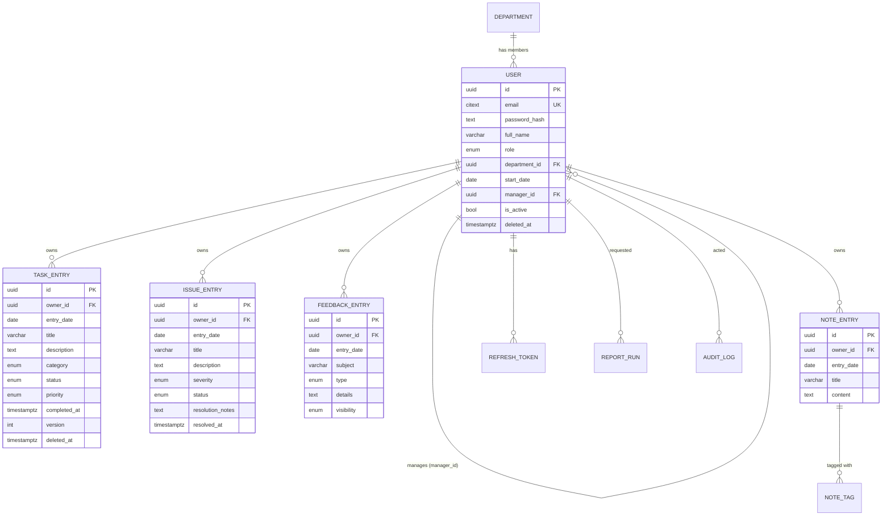

# Onboarding Diary Application — Software Specification

**Version:** 1.0
**Status:** Implementation contract (pre-implementation)
**Audience:** Implementing developer or AI coding agent

---

### Table of contents

1. Product overview
2. Personas and permissions
3. Detailed user stories
4. Functional requirements
5. Non-functional requirements
6. Domain model / entities
7. Entity relationships
8. Enumerations and allowed values
9. Validation rules
10. Authentication model detail
11. Authorization model
12. API endpoint specification
13. Request/response examples
14. UI pages / screens
15. UI flows by role
16. Dashboard requirements
17. Reporting requirements
18. PDF / CSV export requirements
19. Error handling requirements
20. Security requirements
21. Database requirements
22. Audit requirements
23. Pagination, filtering and sorting
24. Empty, loading and error states
25. Responsive design requirements
26. Ambiguities, open questions and assumptions
27. Suggested additional features
28. Recommended technology stack

> **How to read this document.** Sections 1–3 are context. Sections 4–11 are the normative contract — an implementation is correct if and only if it satisfies them. Sections 12–13 define the wire format, 14–18 the experience, 19–25 the cross-cutting quality bars. Section 26 lists every judgement call made where the brief was silent, each with the default applied. Section 28 recommends a stack and a build order.

---

## 1. Product overview

### 1.1 Purpose

The Onboarding Diary Application is a responsive web application that lets **new recruits** document their onboarding journey in a structured diary made up of four record types: **task logs**, **issue logs**, **feedback** and **additional notes**. **Managers** observe the progress of the recruits they oversee and generate reports over that data. **Admins** administer users, roles and departments and have visibility over all data.

### 1.2 Problem statement

Onboarding today is largely undocumented. Recruits have no consistent place to record what they worked on, what blocked them, or how they felt about the process; managers have no reliable signal on progress or friction until a formal review; and HR/admins have no aggregate view of onboarding quality across departments. The result is slow detection of blockers, inconsistent onboarding quality between teams, and no evidence base for improving the programme.

### 1.3 Goals

| #   | Goal                                              | Success measure                                                                                     |
| --- | ------------------------------------------------- | --------------------------------------------------------------------------------------------------- |
| G1  | Give recruits a low-friction daily diary          | A recruit can create a task entry in ≤ 3 interactions from the dashboard                            |
| G2  | Give managers timely visibility of their recruits | Manager dashboard shows open issues across their recruits within one page load                      |
| G3  | Make onboarding data exportable                   | Any permitted report can be downloaded as PDF and CSV                                               |
| G4  | Enforce strict data boundaries                    | No recruit can read another recruit's entries; no manager can read a non-assigned recruit's entries |
| G5  | Be operable by an admin without engineering help  | Admin can create users, change roles, assign managers and manage departments through the UI         |

### 1.4 Non-goals (v1)

- No mobile native application (responsive web only).
- No SSO/SAML/OAuth social login (email + password only; see §27 for future).
- No real-time collaboration or multi-user editing of the same entry.
- No file/image attachments on diary entries (see §27 for future).
- No email/Slack notifications (see §27).
- No multi-tenancy — a single organisation per deployment.
- No i18n/localisation beyond English (dates rendered ISO-8601 / locale-aware display only).

### 1.5 Glossary

| Term              | Meaning                                                                             |
| ----------------- | ----------------------------------------------------------------------------------- |
| **Entry**         | Any one of the four diary record types: Task, Issue, Feedback, Note                 |
| **Recruit**       | A user with role `RECRUIT`; the author/owner of entries                             |
| **Owner**         | The user whose `user_id` is on an entry (`owner_id`)                                |
| **Scope**         | The set of recruits a manager oversees (recruits whose `manager_id` = that manager) |
| **Private entry** | Feedback and Notes — see §6.3 visibility matrix                                     |
| **Report**        | A generated, filtered, date-bounded view of entries, renderable as PDF or CSV       |
| **Soft delete**   | Marking a record `deleted_at` rather than physically removing it                    |

---

## 2. Personas and permissions

### 2.1 Personas

**P1 — Priya, New Recruit (role `RECRUIT`)**
Joined two weeks ago. Opens the app at the end of each day for five minutes. Wants: fast entry creation, a sense of progress, a place to flag blockers so her manager sees them without an awkward conversation. Cares that her _feedback_ is not casually browsable by peers.

**P2 — Marcus, Engineering Manager (role `MANAGER`)**
Oversees 4 recruits. Opens the app weekly and before 1:1s. Wants: a single view of who is blocked, how far along each recruit is, and a PDF he can attach to a probation review. Must never see recruits outside his team.

**P3 — Ana, Onboarding Admin / HR Ops (role `ADMIN`)**
Owns the onboarding programme. Wants: to create user accounts, correct role/department/manager assignments, view all data for programme-quality analysis, and export org-wide reports.

### 2.2 Role capability summary

| Capability                                                           | Recruit |           Manager           |          Admin          |
| -------------------------------------------------------------------- | :-----: | :-------------------------: | :---------------------: |
| Sign up / log in / log out                                           |   ✅    |             ✅              |           ✅            |
| View & edit own profile (name, department, start date)               |   ✅    |             ✅              |           ✅            |
| Change own role                                                      |   ❌    |             ❌              | ❌ (admin only — §11.6) |
| CRUD own Task / Issue / Feedback / Note entries                      |   ✅    |      ✅ (own, if any)       |    ✅ (own, if any)     |
| Read another user's Task entries                                     |   ❌    |      ✅ in-scope only       |         ✅ all          |
| Read another user's Issue entries                                    |   ❌    |      ✅ in-scope only       |         ✅ all          |
| Read another user's Feedback                                         |   ❌    | ✅ in-scope only (see §6.3) |         ✅ all          |
| Read another user's Notes                                            |   ❌    |             ❌              |         ✅ all          |
| Edit/delete another user's entries                                   |   ❌    |             ❌              |      ✅ (audited)       |
| Update Issue `status`/`resolution_notes` on in-scope recruit's issue |   ❌    |             ✅              |           ✅            |
| Own dashboard                                                        |   ✅    |             ✅              |           ✅            |
| Team dashboard                                                       |   ❌    |         ✅ in-scope         |         ✅ all          |
| Generate report for self                                             |   ✅    |             ✅              |           ✅            |
| Generate report for another user                                     |   ❌    |      ✅ in-scope only       |         ✅ all          |
| Generate multi-recruit / department / org report                     |   ❌    |  ✅ in-scope recruits only  |         ✅ all          |
| List users                                                           |   ❌    |  ✅ in-scope recruits only  |         ✅ all          |
| Create / update / deactivate users                                   |   ❌    |             ❌              |           ✅            |
| Assign roles                                                         |   ❌    |             ❌              |           ✅            |
| Assign manager to recruit                                            |   ❌    |             ❌              |           ✅            |
| CRUD departments                                                     |   ❌    |             ❌              |           ✅            |
| View audit log                                                       |   ❌    |             ❌              |           ✅            |

> **Assumption A-01:** Managers and Admins are themselves users who _may_ also author entries (e.g. a manager who is also a recent joiner). The entry APIs are therefore role-agnostic for the _owner_ path; only cross-user access is role-gated.

> **Assumption A-02:** A recruit has **at most one** manager (`users.manager_id`). Multi-manager / matrix reporting is out of scope for v1. Rationale: the requirement says "recruits they oversee", singular ownership is the simplest model that satisfies it; a join table would be the migration path (§27).

---

## 3. Detailed user stories

Format: `ID — As a <role>, I want <capability>, so that <value>.` with acceptance criteria (AC) in Given/When/Then.

### 3.1 Authentication & profile

**US-01 — Sign up**
As a new recruit, I want to sign up with my email and password so that I can start my diary.

- AC1: Given a valid unused email and a password meeting §10.2 policy, when I submit sign-up with name, department and start date, then an account is created with role `RECRUIT` and I am logged in.
- AC2: Given an email already registered, when I submit, then I get `409 EMAIL_ALREADY_REGISTERED` and no account is created.
- AC3: Self sign-up never grants `MANAGER` or `ADMIN`; a supplied `role` field in the request body is ignored.

**US-02 — Log in**
As any user, I want to log in with email and password so that I can access my data.

- AC1: Correct credentials on an active account → session established, `200` with user profile.
- AC2: Wrong password or unknown email → `401 INVALID_CREDENTIALS` with an identical message for both cases (no user enumeration).
- AC3: Deactivated account (`is_active=false`) → `403 ACCOUNT_DEACTIVATED`.
- AC4: 5 failed attempts for the same email within 15 minutes → `429 TOO_MANY_ATTEMPTS`, lockout for 15 minutes.

**US-03 — Log out**
As any logged-in user, I want to log out so that my session cannot be reused.

- AC1: Refresh token is revoked server-side; the auth cookie is cleared; subsequent refresh returns `401`.

**US-04 — View/edit own profile**
As any user, I want to view and update my name, department and start date so that my profile is accurate.

- AC1: I cannot change my own `role`, `manager_id` or `is_active`; such fields in the payload are rejected with `403 FORBIDDEN_FIELD`.
- AC2: Changing `start_date` to a future date more than 365 days ahead is rejected (§9.2).

**US-05 — Change own password**
As any user, I want to change my password by supplying the current one.

- AC1: Wrong current password → `401`. Success → all other sessions revoked, current session preserved.

### 3.2 Task log

**US-10 — Create task entry**
As a recruit, I want to log a task with date, title, description, category, status and priority so that my daily work is recorded.

- AC1: Valid payload → `201` with the created task owned by me.
- AC2: `entry_date` in the future → `422 VALIDATION_ERROR` (§9.3).
- AC3: Omitted `status` defaults to `TODO`; omitted `priority` defaults to `MEDIUM`.

**US-11 — Edit own task** — AC: I may edit any field of a task I own; `owner_id` is immutable; editing a soft-deleted task → `404`.

**US-12 — Delete own task** — AC: soft delete; the task disappears from lists, dashboards and reports; the audit log records the deletion.

**US-13 — Filter tasks** — As a user, I want to filter my tasks by date (single date or range), category and status, combined with pagination and sorting (§23).

- AC1: Filters are ANDed. `status=DONE&category=TRAINING&date_from=2026-01-01&date_to=2026-01-31` returns only tasks matching all.
- AC2: Multi-value filters are supported via repeated or comma-separated values (`status=TODO,IN_PROGRESS`) and are ORed _within_ a field.

**US-14 — Manager views recruit tasks** — As a manager, I want to view the tasks of a recruit I oversee, with the same filters.

- AC1: `GET /api/tasks?owner_id=<in-scope recruit>` → `200`.
- AC2: `owner_id` of a recruit outside my scope → `403 OUT_OF_SCOPE` (see §11.7 on response-shape consistency).

### 3.3 Issue log

**US-20 — Log an issue** — fields date, title, description, severity, status, resolution notes. AC: `status` defaults to `OPEN`; `resolution_notes` optional while open.
**US-21 — Resolve an issue** — AC: setting `status=RESOLVED` or `CLOSED` requires non-empty `resolution_notes` (§9.4); `resolved_at` is set server-side; reopening (`status=OPEN`) clears `resolved_at`.
**US-22 — Filter issues** by status and severity (plus date range, pagination, sorting).
**US-23 — Manager triages an in-scope recruit's issue** — AC: a manager may PATCH only `status` and `resolution_notes` on an in-scope recruit's issue; attempting to change `title`/`description`/`severity` → `403 FIELD_NOT_PERMITTED`. Every such change is audited and shown in the UI as "Updated by <manager name>".

### 3.4 Feedback

**US-30 — Submit feedback** — fields date, subject, type (Positive/Suggestion/Concern), details.
**US-31 — Edit/delete own feedback** — AC: allowed at any time by the owner.
**US-32 — Manager reads in-scope feedback** — AC: a manager can read feedback authored by recruits in scope; a manager can never edit or delete it.

> **Assumption A-03 (needs confirmation, see §26 Q3):** Feedback is visible to the recruit's manager and to admins. It is _not_ anonymous. Default chosen because managers must "view entries for recruits they oversee" and feedback is listed as an entry type. A `visibility` field (`MANAGER_VISIBLE` | `ADMIN_ONLY`) is included in the model so the product can flip this per-entry without a migration; default `MANAGER_VISIBLE`.

### 3.5 Notes

**US-40 — Create note** — fields date, title, content, tags (0–10 tags).
**US-41 — Filter notes by tag and date range**; free-text search over title/content (§23.4).
**US-42 — Notes are private** — AC: notes are visible only to their owner and to admins; managers receive `404 NOT_FOUND` (not `403`) when addressing a note they cannot see, so note existence is not leaked.

> **Assumption A-04:** Notes are the recruit's private scratchpad and are excluded from manager-generated reports. Admins can see them for support/compliance but the UI labels them "private — visible to admins only".

### 3.6 Dashboard

**US-50 — Recruit dashboard** — summary counts, recent entries, task completion progress, open issues (§16).
**US-51 — Manager dashboard** — per-recruit progress rollup, aggregate open issues across scope, recruits with no entries in the last 7 days ("needs attention").
**US-52 — Admin dashboard** — org-wide counts, breakdown by department, recruits with no manager assigned, recent activity.

### 3.7 Reports

**US-60 — Generate a report** for a date range over tasks, issues, feedback or combined data.
**US-61 — Download PDF** — a paginated, branded document with a summary section and detail tables (§18).
**US-62 — Download CSV** — one CSV per section; combined reports produce a ZIP of CSVs or a single CSV with a `record_type` column (§18.3 — default: single CSV with `record_type`).
**US-63 — Manager report scoping** — AC: a manager generating a report may only include recruits in scope; supplying an out-of-scope `user_id` → `403 OUT_OF_SCOPE`; omitting `user_ids` defaults to _all in-scope recruits_.
**US-64 — Admin report** — may target any user, department, or the whole organisation.

### 3.8 Administration

**US-70 — Create user** — admin creates a user with name, email, role, department, start date, optional manager; a temporary password is generated and must be changed at first login (`must_change_password=true`).
**US-71 — Update user** — admin may change name, role, department, start date, manager, active status.
**US-72 — Deactivate user** — AC: soft, reversible; deactivated users cannot log in; their entries remain and remain reportable. Hard delete is not exposed.
**US-73 — Manage departments** — create, rename, deactivate. AC: a department with users assigned cannot be hard-deleted; it can be deactivated (blocks new assignment, keeps existing).
**US-74 — Reassign manager** — AC: changing a recruit's `manager_id` immediately changes report/read scope for both the old and new manager; historical entries move with the recruit (scope is evaluated live, not snapshotted).
**US-75 — View audit log** — admin can list and filter audit events (§22).

---

## 4. Functional requirements

Requirements are normative. **MUST** = mandatory, **SHOULD** = strongly recommended, **MAY** = optional.

### 4.1 Authentication (FR-A)

- **FR-A1** The system MUST support sign-up with email, password, full name, department and start date.
- **FR-A2** Self sign-up MUST always assign role `RECRUIT`.
- **FR-A3** The system MUST support login with email + password returning a short-lived access token and a long-lived refresh token (§10.1).
- **FR-A4** The system MUST support logout with server-side refresh-token revocation.
- **FR-A5** The system MUST hash passwords with bcrypt (cost ≥ 12) or argon2id. Plaintext or reversible storage is prohibited.
- **FR-A6** The system MUST rate-limit authentication endpoints (§10.3).
- **FR-A7** The system MUST expose `GET /api/auth/me` returning the current user's profile and effective permissions.
- **FR-A8** The system SHOULD support "forgot password" via emailed one-time token; if no mail provider is configured, admin-initiated password reset MUST be available as the fallback.

### 4.2 Entries — common (FR-E)

- **FR-E1** All four entry types MUST support create, read, update and soft delete by their owner.
- **FR-E2** Every entry MUST carry `id`, `owner_id`, `entry_date`, `created_at`, `updated_at`, `created_by`, `updated_by`, `deleted_at`.
- **FR-E3** Soft-deleted entries MUST be excluded from all list endpoints, dashboards and reports, and MUST return `404` on direct GET for non-admins.
- **FR-E4** List endpoints MUST support pagination, sorting and filtering per §25.
- **FR-E5** Update endpoints MUST use `PATCH` semantics (partial update) and MUST reject unknown or non-permitted fields.
- **FR-E6** Concurrent-edit protection: update requests SHOULD send `If-Match` with the entry's `version`; a mismatch returns `409 STALE_WRITE` (§4.6).

### 4.3 Task log (FR-T)

- **FR-T1** Fields: `entry_date`, `title`, `description`, `category`, `status`, `priority` (see §8, §9).
- **FR-T2** Filters: `date`/`date_from`/`date_to`, `category`, `status`, plus `priority`, `owner_id`, `q` (text search).
- **FR-T3** Setting `status=DONE` MUST set `completed_at = now()`; changing away from `DONE` MUST clear it.
- **FR-T4** Task completion progress = `count(status=DONE) / count(all non-deleted tasks in scope)`, expressed 0–100 %, `0` when the denominator is 0.

### 4.4 Issue log (FR-I)

- **FR-I1** Fields: `entry_date`, `title`, `description`, `severity`, `status`, `resolution_notes`.
- **FR-I2** Filters: `status`, `severity`, plus date range, `owner_id`, `q`.
- **FR-I3** Transition to `RESOLVED`/`CLOSED` MUST require `resolution_notes` of ≥ 10 characters.
- **FR-I4** Legal transitions: `OPEN → IN_PROGRESS | RESOLVED | CLOSED`; `IN_PROGRESS → OPEN | RESOLVED | CLOSED`; `RESOLVED → CLOSED | OPEN`; `CLOSED → OPEN`. Illegal transitions → `422 INVALID_TRANSITION`.
- **FR-I5** "Open issues" for dashboards/reports means `status IN (OPEN, IN_PROGRESS)`.

### 4.5 Feedback & Notes (FR-F, FR-N)

- **FR-F1** Feedback fields: `entry_date`, `subject`, `type`, `details`, `visibility`.
- **FR-F2** Feedback is read-only to managers; only the owner and admins may modify it.
- **FR-N1** Note fields: `entry_date`, `title`, `content`, `tags[]`.
- **FR-N2** Tags MUST be normalised to lowercase, trimmed, deduplicated, max 10 per note, each 1–30 chars matching `^[a-z0-9][a-z0-9-_ ]{0,29}$`.
- **FR-N3** Notes MUST NOT appear in manager-facing views or manager reports.

### 4.6 Concurrency

- **FR-C1** Each entry row MUST have an integer `version` incremented on every update.
- **FR-C2** Clients SHOULD send `If-Match: "<version>"`; when present and stale → `409 STALE_WRITE` with the current server representation in the error payload so the UI can offer "reload / overwrite".
- **FR-C3** When `If-Match` is absent the server performs last-write-wins (documented, acceptable for v1 single-author entries).

### 4.7 Reporting (FR-R)

- **FR-R1** A report request MUST specify a date range (`date_from`, `date_to`, inclusive, on `entry_date`).
- **FR-R2** A report request MUST specify `sections`: any non-empty subset of `TASKS`, `ISSUES`, `FEEDBACK` (and `NOTES` for admins only), or `COMBINED` (= all sections permitted to the caller).
- **FR-R3** A report MUST be authorised per §17.3 — the effective user set is the intersection of the requested users and the caller's readable-user set.
- **FR-R4** Report output formats: `JSON` (for on-screen preview), `PDF`, `CSV`.
- **FR-R5** Reports MUST be generated from live data at request time. Generated report _metadata_ (who, when, params) MUST be persisted for audit (§22).
- **FR-R6** Report generation MUST be capped (§17.5): max 366-day range, max 50 users, max 10 000 rows per section; exceeding → `422 REPORT_TOO_LARGE` with guidance.

### 4.8 Administration (FR-AD)

- **FR-AD1** Admin CRUD over users, including role and manager assignment.
- **FR-AD2** Admin CRUD over departments.
- **FR-AD3** The system MUST prevent removal of the last active admin (`422 LAST_ADMIN`).
- **FR-AD4** Assigning `manager_id` MUST validate that the target user has role `MANAGER` or `ADMIN` and is active.
- **FR-AD5** A user MUST NOT be their own manager; manager chains MUST NOT form a cycle.
- **FR-AD6** Demoting a `MANAGER` who still has direct reports MUST fail with `422 MANAGER_HAS_REPORTS` unless `reassign_to` is supplied.

---

## 5. Non-functional requirements

| ID     | Category        | Requirement                                                                                                                                 |
| ------ | --------------- | ------------------------------------------------------------------------------------------------------------------------------------------- |
| NFR-01 | Performance     | P95 API latency < 300 ms for list/detail endpoints at 100 concurrent users and 100 k entries                                                |
| NFR-02 | Performance     | Dashboard endpoint P95 < 500 ms; implemented as aggregate SQL, not N+1 queries                                                              |
| NFR-03 | Performance     | PDF generation < 5 s for a 1 000-row report; CSV streamed, < 2 s to first byte                                                              |
| NFR-04 | Scalability     | Target 5 000 users, 1 M entries on a single Postgres instance; all list queries index-backed (§21.4)                                        |
| NFR-05 | Availability    | Stateless API allowing ≥ 2 replicas behind a load balancer; no in-process session state                                                     |
| NFR-06 | Security        | See §20 in full — OWASP ASVS L1 as the baseline                                                                                             |
| NFR-07 | Accessibility   | WCAG 2.1 AA: keyboard-navigable, labelled form controls, visible focus, contrast ≥ 4.5:1, live-region announcements for async results       |
| NFR-08 | Browser support | Latest 2 versions of Chrome, Firefox, Safari, Edge; iOS Safari and Android Chrome                                                           |
| NFR-09 | Responsiveness  | Fully usable 320 px → 1920 px (§25)                                                                                                         |
| NFR-10 | Observability   | Structured JSON logs with `request_id`, `user_id`, `route`, `status`, `duration_ms`; `/health` (liveness) and `/ready` (DB check) endpoints |
| NFR-11 | Maintainability | ≥ 70 % unit-test coverage on service/authorisation layer; 100 % of authorisation rules covered by tests                                     |
| NFR-12 | Portability     | Runs via `docker compose up` with a seeded database and no manual steps                                                                     |
| NFR-13 | Data integrity  | All destructive user actions are soft deletes; DB constraints enforce every invariant that the API enforces                                 |
| NFR-14 | Timezone        | All timestamps stored UTC (`timestamptz`); `entry_date` is a calendar `DATE` with no timezone (§9.3)                                        |
| NFR-15 | Auditability    | Every write to users, roles, departments and every cross-user entry mutation is audited (§22)                                               |
| NFR-16 | Backup/RPO      | Nightly automated DB backup; documented restore procedure; RPO 24 h, RTO 4 h (deployment concern, documented not built)                     |
| NFR-17 | API stability   | All endpoints under `/api/v1`; breaking changes require a version bump                                                                      |
| NFR-18 | Payload limits  | JSON request body ≤ 256 KB; rejected with `413` above                                                                                       |

---

## 6. Domain model / entities

### 6.1 Entity list

| Entity                         | Purpose                                                   |
| ------------------------------ | --------------------------------------------------------- |
| `User`                         | Account + profile + role + manager assignment             |
| `Department`                   | Reference data for grouping users                         |
| `RefreshToken`                 | Server-side session record supporting revocation          |
| `PasswordResetToken`           | One-time token for password recovery                      |
| `TaskEntry`                    | Task log record                                           |
| `IssueEntry`                   | Issue/blocker log record                                  |
| `FeedbackEntry`                | Onboarding feedback record                                |
| `NoteEntry`                    | Free-form note record                                     |
| `NoteTag` _(or `tags text[]`)_ | Tag values attached to notes                              |
| `ReportRun`                    | Metadata for each generated report                        |
| `AuditLog`                     | Immutable record of security- and data-significant events |
| `LoginAttempt`                 | Rate-limiting / lockout support                           |

### 6.2 Attribute detail

**User**

| Field                       | Type                       | Notes                             |
| --------------------------- | -------------------------- | --------------------------------- |
| `id`                        | UUID PK                    | v4, server-generated              |
| `email`                     | citext, unique             | Stored lowercase; unique index    |
| `password_hash`             | text                       | bcrypt/argon2id                   |
| `full_name`                 | varchar(120)               |                                   |
| `role`                      | enum `user_role`           | `RECRUIT` \| `MANAGER` \| `ADMIN` |
| `department_id`             | UUID FK → `departments.id` | nullable (unassigned)             |
| `start_date`                | date                       | onboarding start                  |
| `manager_id`                | UUID FK → `users.id`       | nullable, self-referencing        |
| `is_active`                 | boolean                    | default `true`                    |
| `must_change_password`      | boolean                    | default `false`                   |
| `last_login_at`             | timestamptz                | nullable                          |
| `created_at` / `updated_at` | timestamptz                |                                   |
| `deleted_at`                | timestamptz                | nullable (admin soft delete)      |

**Department**: `id` UUID PK, `name` varchar(80) unique (case-insensitive), `description` varchar(255) nullable, `is_active` boolean default true, timestamps.

**Entry base** (fields shared by Task/Issue/Feedback/Note): `id` UUID PK, `owner_id` UUID FK → `users.id` (NOT NULL, `ON DELETE RESTRICT`), `entry_date` date NOT NULL, `version` int NOT NULL default 1, `created_by` UUID FK → users, `updated_by` UUID FK → users, `created_at`, `updated_at` timestamptz, `deleted_at` timestamptz nullable.

**TaskEntry** adds: `title` varchar(140), `description` text nullable, `category` enum `task_category`, `status` enum `task_status`, `priority` enum `priority`, `completed_at` timestamptz nullable.

**IssueEntry** adds: `title` varchar(140), `description` text, `severity` enum `issue_severity`, `status` enum `issue_status`, `resolution_notes` text nullable, `resolved_at` timestamptz nullable.

**FeedbackEntry** adds: `subject` varchar(140), `type` enum `feedback_type`, `details` text, `visibility` enum `feedback_visibility` default `MANAGER_VISIBLE`.

**NoteEntry** adds: `title` varchar(140), `content` text, `tags` text[] (or `note_tags` child table — see §21.2).

**ReportRun**: `id` UUID PK, `requested_by` UUID FK → users, `scope_type` enum (`SELF`,`USER`,`USERS`,`DEPARTMENT`,`ORG`), `target_user_ids` uuid[] nullable, `target_department_id` uuid nullable, `date_from` date, `date_to` date, `sections` text[], `format` enum (`JSON`,`PDF`,`CSV`), `row_count` int, `status` enum (`SUCCESS`,`FAILED`,`DENIED`), `error_code` text nullable, `duration_ms` int, `created_at` timestamptz.

**AuditLog**: `id` bigserial PK, `actor_user_id` UUID FK nullable (null for system), `actor_role` text, `action` text (e.g. `USER.ROLE_CHANGED`), `entity_type` text, `entity_id` uuid nullable, `target_user_id` uuid nullable, `before` jsonb nullable, `after` jsonb nullable, `ip` inet nullable, `user_agent` text nullable, `request_id` uuid, `created_at` timestamptz default now().

**RefreshToken**: `id` UUID PK, `user_id` FK, `token_hash` text (SHA-256 of the token, never the token itself), `expires_at`, `revoked_at` nullable, `replaced_by_id` nullable, `user_agent`, `ip`, `created_at`.

**LoginAttempt**: `id` bigserial, `email_attempted` citext, `ip` inet, `success` boolean, `created_at`. Retained 30 days.

### 6.3 Entry visibility matrix

| Entry type                   | Owner |            Manager of owner            | Other manager | Other recruit |         Admin         |
| ---------------------------- | :---: | :------------------------------------: | :-----------: | :-----------: | :-------------------: |
| Task                         |  RW   |                   R                    |       ✕       |       ✕       |          RW*          |
| Issue                        |  RW   | R + update `status`/`resolution_notes` |       ✕       |       ✕       |          RW*          |
| Feedback (`MANAGER_VISIBLE`) |  RW   |                   R                    |       ✕       |       ✕       |          RW*          |
| Feedback (`ADMIN_ONLY`)      |  RW   |                   ✕                    |       ✕       |       ✕       |          RW*          |
| Note                         |  RW   |                   ✕                    |       ✕       |       ✕       | R (+ delete, audited) |

`RW*` = admin writes are permitted but always audited and surfaced in the UI as "last edited by <admin>". ✕ = the resource behaves as if it does not exist (`404`) except where an explicit `403 OUT_OF_SCOPE` is specified in §11.7.

---

## 7. Entity relationships

### 7.1 Textual relationships

- `Department 1 — 0..* User` (`users.department_id`), optional; `ON DELETE SET NULL` is **not** used — departments are deactivated, never deleted (§21.2).
- `User (MANAGER|ADMIN) 1 — 0..* User (RECRUIT)` self-referencing via `users.manager_id`; `ON DELETE RESTRICT`.
- `User 1 — 0..* TaskEntry | IssueEntry | FeedbackEntry | NoteEntry` via `owner_id`; `ON DELETE RESTRICT` (users are soft-deleted, so entries are never orphaned).
- `User 1 — 0..* RefreshToken`, `ON DELETE CASCADE`.
- `User 1 — 0..* ReportRun` (`requested_by`), `ON DELETE RESTRICT`.
- `User 1 — 0..* AuditLog` (`actor_user_id`), `ON DELETE SET NULL` (audit survives user removal).
- `NoteEntry 1 — 0..* NoteTag` when the child-table option is chosen.

### 7.2 ER diagram (Mermaid)



### 7.3 Cardinality constraints

- A recruit has 0 or 1 manager. A manager has 0..* recruits.
- `manager_id` must reference a user whose role ∈ {`MANAGER`,`ADMIN`} and `is_active = true` (enforced in the service layer + a DB trigger or check via a helper function; see §21.3).
- No cycles in the manager graph (enforced in the service layer with a walk-up check limited to depth 10).

---

## 8. Enumerations and allowed values

All enums are **stored as uppercase snake-case strings** (Postgres native `ENUM` types or `varchar` + `CHECK`; native enums recommended). The API accepts and returns exactly these values. Display labels are a front-end concern.

| Enum                  | Values                                                                                                                                                                                                                                                                                                                                                                                                                 | Default           | Notes                                                                                                 |
| --------------------- | ---------------------------------------------------------------------------------------------------------------------------------------------------------------------------------------------------------------------------------------------------------------------------------------------------------------------------------------------------------------------------------------------------------------------- | ----------------- | ----------------------------------------------------------------------------------------------------- |
| `user_role`           | `RECRUIT`, `MANAGER`, `ADMIN`                                                                                                                                                                                                                                                                                                                                                                                          | `RECRUIT`         | Set by admin only, except self sign-up which forces `RECRUIT`                                         |
| `task_category`       | `ORIENTATION`, `TRAINING`, `SETUP`, `DOCUMENTATION`, `MEETING`, `PROJECT_WORK`, `SHADOWING`, `COMPLIANCE`, `OTHER`                                                                                                                                                                                                                                                                                                     | `OTHER`           | **Assumption A-05**: categories are a fixed enum in v1, not admin-managed reference data (§26 Q5)     |
| `task_status`         | `TODO`, `IN_PROGRESS`, `BLOCKED`, `DONE`, `CANCELLED`                                                                                                                                                                                                                                                                                                                                                                  | `TODO`            | `DONE` counts toward completion; `CANCELLED` excluded from both numerator and denominator of progress |
| `priority`            | `LOW`, `MEDIUM`, `HIGH`, `URGENT`                                                                                                                                                                                                                                                                                                                                                                                      | `MEDIUM`          |                                                                                                       |
| `issue_severity`      | `LOW`, `MEDIUM`, `HIGH`, `CRITICAL`                                                                                                                                                                                                                                                                                                                                                                                    | `MEDIUM`          |                                                                                                       |
| `issue_status`        | `OPEN`, `IN_PROGRESS`, `RESOLVED`, `CLOSED`                                                                                                                                                                                                                                                                                                                                                                            | `OPEN`            | Open = `OPEN`+`IN_PROGRESS`                                                                           |
| `feedback_type`       | `POSITIVE`, `SUGGESTION`, `CONCERN`                                                                                                                                                                                                                                                                                                                                                                                    | — (required)      |                                                                                                       |
| `feedback_visibility` | `MANAGER_VISIBLE`, `ADMIN_ONLY`                                                                                                                                                                                                                                                                                                                                                                                        | `MANAGER_VISIBLE` | §3.4 A-03                                                                                             |
| `report_scope_type`   | `SELF`, `USER`, `USERS`, `DEPARTMENT`, `ORG`                                                                                                                                                                                                                                                                                                                                                                           | `SELF`            |                                                                                                       |
| `report_section`      | `TASKS`, `ISSUES`, `FEEDBACK`, `NOTES`                                                                                                                                                                                                                                                                                                                                                                                 | —                 | `NOTES` admin-only                                                                                    |
| `report_format`       | `JSON`, `PDF`, `CSV`                                                                                                                                                                                                                                                                                                                                                                                                   | `JSON`            |                                                                                                       |
| `audit_action`        | `AUTH.LOGIN_SUCCESS`, `AUTH.LOGIN_FAILED`, `AUTH.LOGOUT`, `AUTH.PASSWORD_CHANGED`, `AUTH.PASSWORD_RESET`, `USER.CREATED`, `USER.UPDATED`, `USER.ROLE_CHANGED`, `USER.MANAGER_CHANGED`, `USER.DEACTIVATED`, `USER.REACTIVATED`, `DEPARTMENT.CREATED`, `DEPARTMENT.UPDATED`, `DEPARTMENT.DEACTIVATED`, `ENTRY.CREATED`, `ENTRY.UPDATED`, `ENTRY.DELETED`, `ENTRY.CROSS_USER_UPDATED`, `REPORT.GENERATED`, `AUTHZ.DENIED` | —                 | Extensible; unknown actions rejected                                                                  |
| `sort_direction`      | `asc`, `desc`                                                                                                                                                                                                                                                                                                                                                                                                          | `desc`            | Lowercase in query strings                                                                            |

**Cancelled-task rule (explicit):** progress % = `DONE / (total − CANCELLED)`; if the denominator is 0, progress is `0`.
---

## 9. Validation rules

Validation runs in three places and MUST agree: (1) client-side for UX, (2) API schema validation (authoritative, returns `422`), (3) database constraints (last line of defence). All strings are trimmed before validation; empty-after-trim equals absent.

### 9.1 Common conventions

- `id` path parameters MUST be valid UUID v4 → otherwise `400 INVALID_ID`.
- Text fields reject control characters other than `\n` and `\t`.
- Free-text fields are stored raw and escaped on output (§20 SEC-07); no HTML is permitted or rendered.
- All `date` fields use `YYYY-MM-DD`; all timestamps ISO-8601 UTC with `Z`.

### 9.2 User / profile

| Field           | Required           | Rules                                                                                                                                        |
| --------------- | ------------------ | -------------------------------------------------------------------------------------------------------------------------------------------- |
| `email`         | ✅ (create)        | RFC 5322 basic form, ≤ 254 chars, lowercased, unique. Immutable after creation except by admin                                               |
| `password`      | ✅ (create/change) | 10–128 chars; ≥ 1 uppercase, ≥ 1 lowercase, ≥ 1 digit; not in the top-10k common-password list; must not contain the local part of the email |
| `full_name`     | ✅                 | 2–120 chars, at least one non-whitespace character                                                                                           |
| `role`          | admin only         | ∈ `user_role`. Ignored on self sign-up                                                                                                       |
| `department_id` | ❌ (optional)      | Must reference an existing **active** department                                                                                             |
| `start_date`    | ✅                 | Valid date; ≥ `1990-01-01`; ≤ today + 365 days                                                                                               |
| `manager_id`    | ❌                 | Must exist, be active, role ∈ {`MANAGER`,`ADMIN`}, ≠ self, no cycle                                                                          |
| `is_active`     | admin only         | boolean                                                                                                                                      |

### 9.3 Entry-common

| Field        | Required       | Rules                                                                                                                                                    |
| ------------ | -------------- | -------------------------------------------------------------------------------------------------------------------------------------------------------- |
| `entry_date` | ✅             | Valid date; **not in the future** relative to the server's UTC date; ≥ `owner.start_date − 30 days`; ≥ `1990-01-01`. Rejection code `ENTRY_DATE_INVALID` |
| `owner_id`   | server-derived | Never accepted from a recruit. Admins MAY pass `owner_id` on create to backfill on behalf of a user (audited)                                            |

> **Assumption A-06:** Future-dated entries are disallowed because the diary records what _happened_. Planned work belongs in a task with `status=TODO` dated today. Flagged in §26 Q6 in case forward planning is wanted; the rule lives in one validator so it is a one-line change.

### 9.4 Field-level rules by entity

**TaskEntry**

| Field         | Required | Type   | Rules                              |
| ------------- | -------- | ------ | ---------------------------------- |
| `entry_date`  | ✅       | date   | §9.3                               |
| `title`       | ✅       | string | 3–140 chars                        |
| `description` | ❌       | string | ≤ 5 000 chars                      |
| `category`    | ❌       | enum   | ∈ `task_category`, default `OTHER` |
| `status`      | ❌       | enum   | ∈ `task_status`, default `TODO`    |
| `priority`    | ❌       | enum   | ∈ `priority`, default `MEDIUM`     |

**IssueEntry**

| Field              | Required    | Type   | Rules                                                                                                                       |
| ------------------ | ----------- | ------ | --------------------------------------------------------------------------------------------------------------------------- |
| `entry_date`       | ✅          | date   | §9.3                                                                                                                        |
| `title`            | ✅          | string | 3–140 chars                                                                                                                 |
| `description`      | ✅          | string | 10–5 000 chars (an issue without description is not actionable)                                                             |
| `severity`         | ❌          | enum   | ∈ `issue_severity`, default `MEDIUM`                                                                                        |
| `status`           | ❌          | enum   | ∈ `issue_status`, default `OPEN`; transitions per FR-I4                                                                     |
| `resolution_notes` | conditional | string | Required (10–5 000 chars) when `status ∈ {RESOLVED, CLOSED}`; otherwise optional ≤ 5 000. Error `RESOLUTION_NOTES_REQUIRED` |

**FeedbackEntry**

| Field        | Required | Type   | Rules                                              |
| ------------ | -------- | ------ | -------------------------------------------------- |
| `entry_date` | ✅       | date   | §9.3                                               |
| `subject`    | ✅       | string | 3–140 chars                                        |
| `type`       | ✅       | enum   | ∈ `feedback_type`                                  |
| `details`    | ✅       | string | 10–5 000 chars                                     |
| `visibility` | ❌       | enum   | ∈ `feedback_visibility`, default `MANAGER_VISIBLE` |

**NoteEntry**

| Field        | Required | Type     | Rules                                                                                                          |
| ------------ | -------- | -------- | -------------------------------------------------------------------------------------------------------------- |
| `entry_date` | ✅       | date     | §9.3                                                                                                           |
| `title`      | ✅       | string   | 3–140 chars                                                                                                    |
| `content`    | ✅       | string   | 1–20 000 chars                                                                                                 |
| `tags`       | ❌       | string[] | 0–10 items; each 1–30 chars, normalised lowercase, `^[a-z0-9][a-z0-9\-_ ]{0,29}$`; duplicates removed silently |

**Department**: `name` required, 2–80 chars, case-insensitively unique; `description` optional ≤ 255.

**Report request**: `date_from` ≤ `date_to`; range ≤ 366 days; `sections` non-empty subset; `user_ids` ≤ 50 items; `format` ∈ enum.

### 9.5 Date rules summary

1. `entry_date ≤ today (UTC)`.
2. `entry_date ≥ owner.start_date − 30 days` (grace for pre-boarding).
3. `date_from ≤ date_to`, both inclusive, both required together for range filters.
4. `start_date` may be up to 365 days in the future (future joiners) but not before 1990.
5. Filtering by a single `date` is shorthand for `date_from = date_to = date`.

### 9.6 Validation error shape

All validation failures return `422` with a machine-readable list (§19.1), never a bare string, and report **all** failing fields in one response (no fail-fast).

---

## 10. Authentication model detail

### 10.1 Mechanism

- **Access token:** JWT (HS256 with a ≥ 256-bit secret, or RS256 in production), TTL **15 minutes**, claims: `sub` (user id), `role`, `email`, `iat`, `exp`, `jti`, `ver` (token schema version). Sent by the browser automatically as an `HttpOnly`, `Secure`, `SameSite=Lax` cookie named `od_at`.
- **Refresh token:** opaque 256-bit random string, TTL **7 days**, stored hashed (SHA-256) server-side in `refresh_tokens`, delivered as `HttpOnly`, `Secure`, `SameSite=Strict`, `Path=/api/v1/auth` cookie `od_rt`. Rotated on every use; reuse of a rotated token revokes the whole family and forces re-login (token-reuse detection).
- **Why cookies over `localStorage`:** immune to XSS token exfiltration. The cost is CSRF exposure, mitigated per §20 SEC-04 (double-submit CSRF token + `SameSite`).

> **Assumption A-07:** Cookie-based JWT sessions. If the implementer prefers `Authorization: Bearer` with tokens in memory, that is acceptable provided refresh rotation, revocation and XSS mitigations are equivalent. Document whichever is chosen; do not mix.

### 10.2 Password policy

10–128 chars, mixed case, ≥ 1 digit, not a common password, not containing the email local part. Hash: bcrypt cost 12 (or argon2id m=19 MiB, t=2, p=1). Rehash transparently on login if parameters change.

### 10.3 Rate limits and lockout

| Endpoint                          | Limit                                                                                    |
| --------------------------------- | ---------------------------------------------------------------------------------------- |
| `POST /auth/login`                | 5 failures / 15 min per (email) **and** 20 / 15 min per IP → `429`, `Retry-After` header |
| `POST /auth/signup`               | 5 / hour per IP                                                                          |
| `POST /auth/forgot-password`      | 3 / hour per email, always returns `202` regardless of existence                         |
| `POST /reports/*`                 | 10 / min per user (generation is expensive)                                              |
| All other authenticated endpoints | 300 / min per user                                                                       |

### 10.4 Session lifecycle rules

- Password change → revoke all refresh tokens except the current session.
- Role change, deactivation, or manager change → revoke **all** refresh tokens for that user; the access token is additionally validated against `users.is_active` and `users.token_epoch` on every request, so privilege changes take effect within one request, not 15 minutes.
- `users.token_epoch` (int, incremented on role/active change) is embedded in the JWT as `epo`; a mismatch → `401 SESSION_INVALIDATED`.

---

## 11. Authorization model

### 11.1 Principles

1. **Deny by default.** Every endpoint declares its required role(s) and its resource-scope rule; anything undeclared is denied.
2. **Server-side only.** UI hiding is cosmetic; every rule is re-checked in the API.
3. **Single choke point.** All entry reads pass through one `visible_entries(actor)` query builder; all entry writes pass through one `assert_can_write(actor, entry)` function. No endpoint may hand-roll its own check.
4. **Scope evaluated live** from `users.manager_id` at request time.
5. **Object-level checks before field-level checks**, and both before any mutation.

### 11.2 Core predicates

```
is_self(actor, target)        := actor.id == target.id
is_admin(actor)               := actor.role == ADMIN
manages(actor, target)        := actor.role == MANAGER
                                 AND target.manager_id == actor.id
                                 AND target.deleted_at IS NULL

readable_user_ids(actor) :=
    ADMIN    -> all user ids
    MANAGER  -> {actor.id} ∪ {u.id : u.manager_id = actor.id}
    RECRUIT  -> {actor.id}
```

**Every** list query is filtered by `owner_id IN readable_user_ids(actor)` — applied in SQL, not in application code after fetching. This is the single most important implementation instruction in this document: it makes IDOR structurally impossible on list endpoints.

### 11.3 Entry-level rules

| Operation                            | Rule                                                                                                                                                                                                                                                 |
| ------------------------------------ | ---------------------------------------------------------------------------------------------------------------------------------------------------------------------------------------------------------------------------------------------------- |
| `GET /tasks`, `/issues`, `/feedback` | `owner_id ∈ readable_user_ids(actor)`; if the client supplies `owner_id`, it must be a member of that set, else `403 OUT_OF_SCOPE`                                                                                                                   |
| `GET /notes`                         | `owner_id = actor.id` unless `is_admin(actor)`                                                                                                                                                                                                       |
| `GET /{type}/{id}`                   | Load, then: visible per §6.3 → `200`; not visible → `404 NOT_FOUND` (except an explicitly supplied out-of-scope `owner_id` filter, which is `403`)                                                                                                   |
| `POST /{type}`                       | `owner_id = actor.id` always, except admin may pass `owner_id` (audited as `ENTRY.CREATED` with `on_behalf_of`)                                                                                                                                      |
| `PATCH /{type}/{id}`                 | Owner: all mutable fields. Admin: all mutable fields (audited `ENTRY.CROSS_USER_UPDATED`). Manager: **only** on `IssueEntry` of an in-scope recruit, and **only** the fields `status`, `resolution_notes`. Anything else → `403 FIELD_NOT_PERMITTED` |
| `DELETE /{type}/{id}`                | Owner or admin only. Managers never delete                                                                                                                                                                                                           |

### 11.4 Manager scope enforcement (explicit, per the requirement)

Every one of these MUST hold and MUST have a dedicated automated test:

- **AZ-M1** `GET /api/v1/tasks` with no `owner_id` as a manager returns entries for the manager and their direct reports only — verified by asserting that a fixture recruit belonging to another manager never appears.
- **AZ-M2** `GET /api/v1/tasks?owner_id=<other manager's recruit>` → `403 OUT_OF_SCOPE`, zero rows leaked, and an `AUTHZ.DENIED` audit event written.
- **AZ-M3** `GET /api/v1/tasks/{id}` where the task belongs to an out-of-scope recruit → `404 NOT_FOUND` (existence not disclosed).
- **AZ-M4** `GET /api/v1/notes/{id}` for _any_ other user's note (in scope or not) → `404`.
- **AZ-M5** `PATCH /api/v1/issues/{id}` in scope, body `{status, resolution_notes}` → `200`; body containing `title` → `403 FIELD_NOT_PERMITTED` and **no partial write**.
- **AZ-M6** `POST /api/v1/reports` with `user_ids` containing an out-of-scope id → `403 OUT_OF_SCOPE`; the report is not generated and a `REPORT` audit row with `status=DENIED` is written.
- **AZ-M7** `POST /api/v1/reports` with `scope_type=ORG` as a manager → `403`.
- **AZ-M8** Immediately after an admin reassigns a recruit from manager A to manager B: A's next list request excludes that recruit and B's includes them (no caching of scope beyond the request).
- **AZ-M9** `GET /api/v1/users` as a manager returns only in-scope recruits plus self; email addresses of other users are never returned.
- **AZ-M10** A manager cannot create an entry with `owner_id` set to a recruit (`403`), i.e. managers cannot write diary entries on someone's behalf.

### 11.5 Recruit privacy enforcement

- **AZ-R1** A recruit's list endpoints are hard-filtered to `owner_id = self`; supplying any other `owner_id` → `403 OUT_OF_SCOPE`.
- **AZ-R2** A recruit fetching another recruit's entry by id → `404`.
- **AZ-R3** A recruit calling any `/admin/*` route → `403 INSUFFICIENT_ROLE`.
- **AZ-R4** A recruit calling `GET /users` → `403`; they may only call `GET /auth/me` and `GET /users/me`.
- **AZ-R5** A recruit PATCHing `/users/me` with `role`, `manager_id`, `is_active` or `email` → `403 FORBIDDEN_FIELD`, whole request rejected.
- **AZ-R6** Reports: a recruit may only produce `scope_type=SELF`; anything else → `403`.

### 11.6 Admin rules

- Admins bypass scope but never bypass auditing. Every admin read of another user's `NoteEntry` or `ADMIN_ONLY` feedback writes an audit row (`ENTRY.READ_PRIVILEGED`).
- Admins cannot demote or deactivate themselves if they are the last active admin (`422 LAST_ADMIN`).
- Admin actions on entries set `updated_by` to the admin, leaving `owner_id` untouched.

### 11.7 403 vs 404 policy (deliberate and consistent)

| Situation                                                                          | Response                  | Rationale                                                                                        |
| ---------------------------------------------------------------------------------- | ------------------------- | ------------------------------------------------------------------------------------------------ |
| Authenticated, role lacks the capability entirely (recruit hitting an admin route) | `403 INSUFFICIENT_ROLE`   | Route existence is public knowledge                                                              |
| Client explicitly names an out-of-scope subject (`owner_id`, `user_ids`)           | `403 OUT_OF_SCOPE`        | The client asserted a subject; telling them it's out of scope reveals nothing they didn't supply |
| Client addresses an individual resource id they may not see                        | `404 NOT_FOUND`           | Prevents id-probing from confirming existence                                                    |
| Attempt to modify a field the role may not modify                                  | `403 FIELD_NOT_PERMITTED` | Actionable, leaks nothing                                                                        |
| Not authenticated / expired token                                                  | `401 UNAUTHENTICATED`     |                                                                                                  |

### 11.8 Permission matrix by endpoint

| Endpoint                                      | Recruit                     | Manager                        | Admin      |
| --------------------------------------------- | --------------------------- | ------------------------------ | ---------- |
| `POST /auth/signup`                           | public                      | public                         | public     |
| `POST /auth/login`, `/refresh`, `/logout`     | ✅                          | ✅                             | ✅         |
| `GET /auth/me`                                | ✅                          | ✅                             | ✅         |
| `PATCH /users/me`                             | ✅ (safe fields)            | ✅                             | ✅         |
| `POST /users/me/password`                     | ✅                          | ✅                             | ✅         |
| `GET /users`                                  | ❌                          | ✅ (scope)                     | ✅ (all)   |
| `GET /users/{id}`                             | self only                   | self + scope                   | ✅         |
| `POST /users`                                 | ❌                          | ❌                             | ✅         |
| `PATCH /users/{id}`                           | ❌                          | ❌                             | ✅         |
| `POST /users/{id}/deactivate` / `/reactivate` | ❌                          | ❌                             | ✅         |
| `POST /users/{id}/reset-password`             | ❌                          | ❌                             | ✅         |
| `GET /departments`                            | ✅ (read, for profile form) | ✅                             | ✅         |
| `POST                                         | PATCH                       | DELETE /departments*`          | ❌         | ❌   | ✅   |
| `GET /tasks` `/issues` `/feedback`            | self                        | self + scope                   | all        |
| `GET /notes`                                  | self                        | self                           | all        |
| `POST /tasks                                  | issues                      | feedback                       | notes`     | self | self | any owner |
| `PATCH /tasks                                 | feedback                    | notes/{id}`                    | own        | own  | any  |
| `PATCH /issues/{id}`                          | own                         | own + scope (2 fields)         | any        |
| `DELETE /*/{id}`                              | own                         | own                            | any        |
| `GET /dashboard/me`                           | ✅                          | ✅                             | ✅         |
| `GET /dashboard/team`                         | ❌                          | ✅                             | ✅         |
| `GET /dashboard/org`                          | ❌                          | ❌                             | ✅         |
| `POST /reports` (+ `/reports/export`)         | `SELF` only                 | `SELF`,`USER`,`USERS` in scope | all scopes |
| `GET /audit-logs`                             | ❌                          | ❌                             | ✅         |

---

## 12. API endpoint specification

### 12.1 Conventions

- Base path `/api/v1`. JSON in, JSON out, `Content-Type: application/json; charset=utf-8`.
- Auth via the `od_at` cookie (§10.1); unauthenticated → `401`.
- Mutating requests require header `X-CSRF-Token` matching the `od_csrf` cookie (§20 SEC-04).
- Every response carries `X-Request-Id`.
- List responses share the envelope in §12.2.
- Timestamps ISO-8601 UTC; dates `YYYY-MM-DD`.
- `PATCH` = partial update; unknown fields → `422 UNKNOWN_FIELD` (strict schemas, no silent drops).

### 12.2 Standard list envelope

```json
{
  "data": [/* items */],
  "pagination": {
    "page": 1,
    "page_size": 20,
    "total_items": 137,
    "total_pages": 7,
    "has_next": true,
    "has_prev": false
  },
  "meta": { "sort": "entry_date:desc", "filters_applied": { "status": ["TODO"] } }
}
```

### 12.3 Auth endpoints

| Method | Path                    | Purpose                    | Auth           | Request                                                    | Response                           |
| ------ | ----------------------- | -------------------------- | -------------- | ---------------------------------------------------------- | ---------------------------------- |
| POST   | `/auth/signup`          | Self-register as recruit   | Public         | `{email, password, full_name, department_id?, start_date}` | `201 {user, csrf_token}` + cookies |
| POST   | `/auth/login`           | Authenticate               | Public         | `{email, password}`                                        | `200 {user, csrf_token}` + cookies |
| POST   | `/auth/refresh`         | Rotate tokens              | Refresh cookie | —                                                          | `200 {csrf_token}` + new cookies   |
| POST   | `/auth/logout`          | Revoke session             | Authenticated  | —                                                          | `204`                              |
| GET    | `/auth/me`              | Current user + permissions | Authenticated  | —                                                          | `200 {user, permissions}`          |
| POST   | `/auth/forgot-password` | Start reset                | Public         | `{email}`                                                  | `202` always                       |
| POST   | `/auth/reset-password`  | Complete reset             | Public + token | `{token, new_password}`                                    | `204`                              |
| POST   | `/users/me/password`    | Change password            | Authenticated  | `{current_password, new_password}`                         | `204`                              |

### 12.4 User & department endpoints

| Method | Path                         | Purpose             | Auth                          | Params / Body                                                                        | Response                          |
| ------ | ---------------------------- | ------------------- | ----------------------------- | ------------------------------------------------------------------------------------ | --------------------------------- |
| GET    | `/users`                     | List users          | Manager (scope) / Admin (all) | `q`, `role`, `department_id`, `manager_id`, `is_active`, `page`, `page_size`, `sort` | List of `UserSummary`             |
| GET    | `/users/{id}`                | User detail         | Self / manager-of / Admin     | —                                                                                    | `User`                            |
| POST   | `/users`                     | Create user         | Admin                         | `{email, full_name, role, department_id?, start_date, manager_id?, send_invite?}`    | `201 {user, temporary_password?}` |
| PATCH  | `/users/{id}`                | Update user         | Admin                         | any of `{full_name, role, department_id, start_date, manager_id, is_active, email}`  | `200 User`                        |
| PATCH  | `/users/me`                  | Update own profile  | Authenticated                 | `{full_name?, department_id?, start_date?}`                                          | `200 User`                        |
| POST   | `/users/{id}/deactivate`     | Deactivate          | Admin                         | `{reason?}`                                                                          | `200 User`                        |
| POST   | `/users/{id}/reactivate`     | Reactivate          | Admin                         | —                                                                                    | `200 User`                        |
| POST   | `/users/{id}/reset-password` | Admin reset         | Admin                         | —                                                                                    | `200 {temporary_password}`        |
| GET    | `/users/{id}/recruits`       | Direct reports      | Self-manager / Admin          | pagination                                                                           | List of `UserSummary`             |
| GET    | `/departments`               | List departments    | Authenticated                 | `include_inactive`, pagination                                                       | List of `Department`              |
| POST   | `/departments`               | Create              | Admin                         | `{name, description?}`                                                               | `201 Department`                  |
| PATCH  | `/departments/{id}`          | Update / deactivate | Admin                         | `{name?, description?, is_active?}`                                                  | `200 Department`                  |
| DELETE | `/departments/{id}`          | Delete if unused    | Admin                         | —                                                                                    | `204` or `409 DEPARTMENT_IN_USE`  |

### 12.5 Entry endpoints (uniform across the four types)

`{type} ∈ tasks | issues | feedback | notes`

| Method | Path                  | Purpose                | Auth                             | Query / Body                                                                                                                                                                             |
| ------ | --------------------- | ---------------------- | -------------------------------- | ---------------------------------------------------------------------------------------------------------------------------------------------------------------------------------------- |
| GET    | `/{type}`             | List with filters      | §11.3                            | Common: `owner_id`, `date`, `date_from`, `date_to`, `q`, `page`, `page_size`, `sort`. Task: `category`, `status`, `priority`. Issue: `status`, `severity`. Feedback: `type`. Note: `tag` |
| POST   | `/{type}`             | Create                 | Owner (admin may set `owner_id`) | type-specific body (§9.4)                                                                                                                                                                |
| GET    | `/{type}/{id}`        | Detail                 | §11.3                            | —                                                                                                                                                                                        |
| PATCH  | `/{type}/{id}`        | Partial update         | §11.3                            | subset of mutable fields; `If-Match: "<version>"`                                                                                                                                        |
| DELETE | `/{type}/{id}`        | Soft delete            | Owner / Admin                    | — → `204`                                                                                                                                                                                |
| POST   | `/{type}/bulk-delete` | Delete many (optional) | Owner / Admin                    | `{ids: [...] }` → per-id result list                                                                                                                                                     |

Convenience sub-resource:

| Method | Path                  | Purpose                               | Auth                           |
| ------ | --------------------- | ------------------------------------- | ------------------------------ |
| PATCH  | `/issues/{id}/status` | Change status + resolution notes only | Owner, in-scope Manager, Admin |

### 12.6 Dashboard endpoints

| Method | Path              | Purpose                       | Auth            | Query                                                 |
| ------ | ----------------- | ----------------------------- | --------------- | ----------------------------------------------------- |
| GET    | `/dashboard/me`   | Own summary                   | Authenticated   | `days` (default 30)                                   |
| GET    | `/dashboard/team` | Rollup over in-scope recruits | Manager / Admin | `days`, `department_id` (admin), `manager_id` (admin) |
| GET    | `/dashboard/org`  | Org-wide summary              | Admin           | `days`                                                |

### 12.7 Report endpoints

| Method | Path               | Purpose                                    | Auth                            | Body / Query                      |
| ------ | ------------------ | ------------------------------------------ | ------------------------------- | --------------------------------- |
| POST   | `/reports/preview` | Generate report JSON for on-screen preview | §17.3                           | `ReportRequest`                   |
| POST   | `/reports/export`  | Generate and download a file               | §17.3                           | `ReportRequest` with `format: PDF | CSV`; returns the binary with `Content-Disposition: attachment` |
| GET    | `/reports/runs`    | List past report runs (metadata)           | Self's own runs; Admin sees all | pagination                        |

### 12.8 Audit & system

| Method | Path          | Purpose                                                                                                    | Auth          |
| ------ | ------------- | ---------------------------------------------------------------------------------------------------------- | ------------- |
| GET    | `/audit-logs` | Filterable audit list (`actor_user_id`, `action`, `entity_type`, `target_user_id`, `date_from`, `date_to`) | Admin         |
| GET    | `/health`     | Liveness                                                                                                   | Public        |
| GET    | `/ready`      | Readiness incl. DB ping                                                                                    | Public        |
| GET    | `/meta/enums` | All enum values for populating UI selects                                                                  | Authenticated |

---

## 13. Request/response examples

### 13.1 Sign up

`POST /api/v1/auth/signup`

```json
{
  "email": "priya.sharma@example.com",
  "password": "Onboard2026!x",
  "full_name": "Priya Sharma",
  "department_id": "7c9e6679-7425-40de-944b-e07fc1f90ae7",
  "start_date": "2026-08-17"
}
```

`201 Created`

```json
{
  "data": {
    "user": {
      "id": "2a1f0f1e-1c34-4b52-9a53-9f6c1e0b6f10",
      "email": "priya.sharma@example.com",
      "full_name": "Priya Sharma",
      "role": "RECRUIT",
      "department": { "id": "7c9e6679-7425-40de-944b-e07fc1f90ae7", "name": "Engineering" },
      "start_date": "2026-08-17",
      "manager": null,
      "is_active": true,
      "must_change_password": false,
      "created_at": "2026-08-22T09:14:03Z"
    },
    "csrf_token": "8f3a...c1"
  }
}
```

`Set-Cookie: od_at=...; HttpOnly; Secure; SameSite=Lax; Max-Age=900`
`Set-Cookie: od_rt=...; HttpOnly; Secure; SameSite=Strict; Path=/api/v1/auth; Max-Age=604800`

Error `409`:

```json
{
  "error": {
    "code": "EMAIL_ALREADY_REGISTERED",
    "message": "An account with this email already exists.",
    "request_id": "01J...",
    "details": []
  }
}
```

### 13.2 Create a task

`POST /api/v1/tasks`

```json
{
  "entry_date": "2026-08-21",
  "title": "Complete security awareness training",
  "description": "Finished modules 1-3 of the LMS course; module 4 pending access.",
  "category": "TRAINING",
  "status": "IN_PROGRESS",
  "priority": "HIGH"
}
```

`201 Created`

```json
{
  "data": {
    "id": "b3f1c0de-2b9a-4c6f-90f5-1de2f2a9a001",
    "owner": { "id": "2a1f...f10", "full_name": "Priya Sharma" },
    "entry_date": "2026-08-21",
    "title": "Complete security awareness training",
    "description": "Finished modules 1-3 of the LMS course; module 4 pending access.",
    "category": "TRAINING",
    "status": "IN_PROGRESS",
    "priority": "HIGH",
    "completed_at": null,
    "version": 1,
    "created_at": "2026-08-21T17:02:11Z",
    "updated_at": "2026-08-21T17:02:11Z",
    "updated_by": { "id": "2a1f...f10", "full_name": "Priya Sharma" }
  }
}
```

Validation error `422`:

```json
{
  "error": {
    "code": "VALIDATION_ERROR",
    "message": "The request contains invalid fields.",
    "request_id": "01JB2K...",
    "details": [
      {
        "field": "title",
        "code": "TOO_SHORT",
        "message": "Title must be at least 3 characters.",
        "constraint": { "min": 3, "max": 140 }
      },
      {
        "field": "entry_date",
        "code": "ENTRY_DATE_INVALID",
        "message": "Entry date cannot be in the future.",
        "constraint": { "max": "2026-08-22" }
      }
    ]
  }
}
```

### 13.3 List tasks with filters (manager viewing a recruit)

`GET /api/v1/tasks?owner_id=2a1f0f1e-...&status=TODO,IN_PROGRESS&category=TRAINING&date_from=2026-08-01&date_to=2026-08-31&sort=entry_date:desc&page=1&page_size=20`

`200 OK`

```json
{
  "data": [
    {
      "id": "b3f1c0de-...",
      "owner": { "id": "2a1f...f10", "full_name": "Priya Sharma" },
      "entry_date": "2026-08-21",
      "title": "Complete security awareness training",
      "category": "TRAINING",
      "status": "IN_PROGRESS",
      "priority": "HIGH",
      "version": 1
    }
  ],
  "pagination": {
    "page": 1,
    "page_size": 20,
    "total_items": 1,
    "total_pages": 1,
    "has_next": false,
    "has_prev": false
  },
  "meta": {
    "sort": "entry_date:desc",
    "filters_applied": {
      "owner_id": "2a1f...f10",
      "status": ["TODO", "IN_PROGRESS"],
      "category": ["TRAINING"],
      "date_from": "2026-08-01",
      "date_to": "2026-08-31"
    }
  }
}
```

Out-of-scope attempt → `403`:

```json
{
  "error": {
    "code": "OUT_OF_SCOPE",
    "message": "You do not oversee this user.",
    "request_id": "01JB2M...",
    "details": [{ "field": "owner_id", "code": "NOT_IN_SCOPE" }]
  }
}
```

### 13.4 Manager resolves an in-scope recruit's issue

`PATCH /api/v1/issues/9d0c.../status` with `If-Match: "3"`

```json
{
  "status": "RESOLVED",
  "resolution_notes": "Granted VPN access via IT ticket INC-10432; recruit confirmed connectivity."
}
```

`200 OK`

```json
{
  "data": {
    "id": "9d0c...",
    "owner": { "id": "2a1f...f10", "full_name": "Priya Sharma" },
    "entry_date": "2026-08-19",
    "title": "Cannot connect to VPN",
    "severity": "HIGH",
    "status": "RESOLVED",
    "resolution_notes": "Granted VPN access via IT ticket INC-10432; recruit confirmed connectivity.",
    "resolved_at": "2026-08-22T10:41:55Z",
    "version": 4,
    "updated_by": { "id": "5b2e...", "full_name": "Marcus Bell", "role": "MANAGER" }
  }
}
```

Forbidden field → `403`:

```json
{
  "error": {
    "code": "FIELD_NOT_PERMITTED",
    "message": "Managers may only update status and resolution_notes on a recruit's issue.",
    "details": [{ "field": "title", "code": "NOT_PERMITTED" }]
  }
}
```

Stale version → `409`:

```json
{
  "error": {
    "code": "STALE_WRITE",
    "message": "This entry was modified by someone else.",
    "details": [{ "field": "version", "code": "MISMATCH", "expected": 5, "provided": 3 }],
    "current": { "id": "9d0c...", "version": 5, "status": "CLOSED" }
  }
}
```

### 13.5 Admin creates a user

`POST /api/v1/users`

```json
{
  "email": "sam.okafor@example.com",
  "full_name": "Sam Okafor",
  "role": "RECRUIT",
  "department_id": "7c9e...ae7",
  "start_date": "2026-09-01",
  "manager_id": "5b2e...",
  "send_invite": false
}
```

`201 Created`

```json
{
  "data": {
    "user": {
      "id": "c41d...",
      "email": "sam.okafor@example.com",
      "role": "RECRUIT",
      "must_change_password": true,
      "is_active": true,
      "manager": { "id": "5b2e...", "full_name": "Marcus Bell" }
    },
    "temporary_password": "Tmp-7fQ2-ky8W"
  }
}
```

(The temporary password is returned exactly once and never persisted in plaintext or logged.)

### 13.6 Dashboard (recruit)

`GET /api/v1/dashboard/me?days=30` → `200`

```json
{
  "data": {
    "period": { "date_from": "2026-07-24", "date_to": "2026-08-22", "days": 30 },
    "summary": {
      "tasks_total": 42,
      "tasks_done": 27,
      "tasks_in_progress": 8,
      "tasks_blocked": 2,
      "tasks_todo": 5,
      "tasks_cancelled": 0,
      "task_completion_pct": 64.3,
      "issues_total": 9,
      "issues_open": 3,
      "issues_resolved": 6,
      "issues_critical_open": 1,
      "feedback_total": 4,
      "notes_total": 11
    },
    "task_completion": { "done": 27, "eligible_total": 42, "pct": 64.3 },
    "open_issues": [
      {
        "id": "9d0c...",
        "title": "Cannot connect to VPN",
        "severity": "HIGH",
        "status": "IN_PROGRESS",
        "entry_date": "2026-08-19",
        "age_days": 3
      }
    ],
    "recent_entries": [
      {
        "type": "TASK",
        "id": "b3f1...",
        "title": "Complete security awareness training",
        "entry_date": "2026-08-21",
        "status": "IN_PROGRESS"
      },
      {
        "type": "NOTE",
        "id": "77aa...",
        "title": "Glossary of internal acronyms",
        "entry_date": "2026-08-20"
      }
    ],
    "activity_by_day": [{ "date": "2026-08-21", "tasks": 3, "issues": 0, "feedback": 0, "notes": 1 }],
    "streak_days": 4,
    "days_since_start": 5
  }
}
```

### 13.7 Report preview and export

`POST /api/v1/reports/preview`

```json
{
  "scope_type": "USERS",
  "user_ids": ["2a1f0f1e-...", "c41d..."],
  "date_from": "2026-08-01",
  "date_to": "2026-08-31",
  "sections": ["TASKS", "ISSUES", "FEEDBACK"],
  "filters": {
    "tasks": { "status": ["DONE", "IN_PROGRESS"], "category": ["TRAINING"] },
    "issues": { "severity": ["HIGH", "CRITICAL"] }
  },
  "include_summary": true,
  "format": "JSON"
}
```

`200 OK`

```json
{
  "data": {
    "report_id": "e1c2...",
    "generated_at": "2026-08-22T11:05:00Z",
    "generated_by": { "id": "5b2e...", "full_name": "Marcus Bell", "role": "MANAGER" },
    "scope": {
      "type": "USERS",
      "users": [
        {
          "id": "2a1f...",
          "full_name": "Priya Sharma",
          "department": "Engineering",
          "start_date": "2026-08-17"
        }
      ]
    },
    "period": { "date_from": "2026-08-01", "date_to": "2026-08-31" },
    "summary": {
      "per_user": [
        {
          "user_id": "2a1f...",
          "tasks_total": 42,
          "tasks_done": 27,
          "task_completion_pct": 64.3,
          "issues_open": 3,
          "issues_total": 9,
          "feedback_total": 4,
          "avg_issue_resolution_days": 1.8
        }
      ],
      "totals": {
        "tasks_total": 60,
        "tasks_done": 39,
        "task_completion_pct": 65.0,
        "issues_total": 12,
        "issues_open": 4,
        "feedback_total": 6
      }
    },
    "sections": {
      "tasks": {
        "row_count": 60,
        "rows": [
          {
            "user": "Priya Sharma",
            "entry_date": "2026-08-21",
            "title": "...",
            "category": "TRAINING",
            "status": "IN_PROGRESS",
            "priority": "HIGH"
          }
        ]
      },
      "issues": { "row_count": 12, "rows": [] },
      "feedback": { "row_count": 6, "rows": [] }
    },
    "truncated": false
  }
}
```

`POST /api/v1/reports/export` with `"format": "PDF"` → `200`, `Content-Type: application/pdf`, `Content-Disposition: attachment; filename="onboarding-report_priya-sharma_2026-08-01_2026-08-31.pdf"`.

Too large → `422`:

```json
{
  "error": {
    "code": "REPORT_TOO_LARGE",
    "message": "This report would contain 14,320 rows (limit 10,000). Narrow the date range or select fewer users.",
    "details": [{ "field": "date_from", "code": "RANGE_TOO_WIDE" }]
  }
}
```

---

## 14. UI pages / screens

Route table (front-end routes; `:id` = UUID):

| #    | Route                                  | Screen                                                 | Roles                                      | Purpose                                    |
| ---- | -------------------------------------- | ------------------------------------------------------ | ------------------------------------------ | ------------------------------------------ |
| S-01 | `/login`                               | Login                                                  | public                                     | Email + password                           |
| S-02 | `/signup`                              | Sign up                                                | public                                     | Self-registration as recruit               |
| S-03 | `/forgot-password`, `/reset-password`  | Password recovery                                      | public                                     | Request + complete reset                   |
| S-04 | `/onboarding/change-password`          | Forced password change                                 | authenticated w/ `must_change_password`    | Blocks all other routes until done         |
| S-05 | `/` → `/dashboard`                     | Dashboard (role-aware)                                 | all                                        | Recruit / manager / admin variants (§14.2) |
| S-06 | `/tasks`                               | Task list                                              | all                                        | Filter bar, table/cards, pagination        |
| S-07 | `/tasks/new`, `/tasks/:id`             | Task form (modal or page)                              | owner/admin                                | Create/edit                                |
| S-08 | `/issues`                              | Issue list                                             | all                                        | Filters status/severity                    |
| S-09 | `/issues/new`, `/issues/:id`           | Issue form + resolution panel                          | owner/admin/in-scope manager (status only) |                                            |
| S-10 | `/feedback`                            | Feedback list                                          | all                                        |                                            |
| S-11 | `/feedback/new`, `/feedback/:id`       | Feedback form                                          | owner/admin                                |                                            |
| S-12 | `/notes`                               | Notes list w/ tag filter + search                      | owner/admin                                |                                            |
| S-13 | `/notes/new`, `/notes/:id`             | Note editor                                            | owner/admin                                |                                            |
| S-14 | `/history`                             | Unified timeline of all own entries                    | all                                        | Chronological, type-filterable             |
| S-15 | `/team`                                | Manager: recruit roster with progress                  | manager/admin                              |                                            |
| S-16 | `/team/:userId`                        | Recruit detail: profile + tabs (Tasks/Issues/Feedback) | manager (scope)/admin                      | Notes tab hidden for managers              |
| S-17 | `/reports`                             | Report builder + preview + export                      | all (scope-limited)                        |                                            |
| S-18 | `/reports/history`                     | Past report runs                                       | all (own), admin (all)                     |                                            |
| S-19 | `/admin/users`                         | User management list                                   | admin                                      |                                            |
| S-20 | `/admin/users/new`, `/admin/users/:id` | User create/edit drawer                                | admin                                      | Role, department, manager, active          |
| S-21 | `/admin/departments`                   | Department management                                  | admin                                      |                                            |
| S-22 | `/admin/audit`                         | Audit log viewer                                       | admin                                      |                                            |
| S-23 | `/profile`                             | Own profile + change password                          | all                                        |                                            |
| S-24 | `/403`, `/404`, `/500`                 | Error screens                                          | all                                        |                                            |

### 14.1 Global shell

- **Top bar:** app name, global "＋ New entry" split-button (Task/Issue/Feedback/Note), user avatar menu (Profile, Change password, Log out), role badge.
- **Left nav (collapsible):** Dashboard, Tasks, Issues, Feedback, Notes, History, Reports; **Team** (manager/admin); **Admin ▸ Users / Departments / Audit** (admin). Nav items the role cannot access are not rendered.
- **Breadcrumbs** on nested screens; toast region top-right; skeleton loaders on data areas.

### 14.2 Dashboard variants

- **Recruit** (`/dashboard`): stat cards (tasks total/done/%; open issues; feedback; notes; days since start), progress bar, "Open issues" list (severity-sorted), "Recent entries" (last 10 across types), 30-day activity sparkline/heatmap, empty-state CTA when there is no data.
- **Manager** (`/dashboard`): roster table (recruit, department, start date, day N of onboarding, task completion bar, open issues count with severity dot, last activity date), "Needs attention" panel (no entries ≥ 7 days, or ≥ 1 `CRITICAL` open issue, or completion < 40 % after day 14), aggregate cards across scope, quick link to build a report for the whole team.
- **Admin** (`/dashboard`): org totals, per-department breakdown table, recruits without a manager, inactive/never-logged-in accounts, recent audit activity, org report shortcut.

---

## 15. UI flows by role

Notation: `→` = navigation/step.

### 15.1 Recruit

**F-R1 Register & first entry:** `/signup` → fill name/email/password/department/start date → submit → auto-login → `/dashboard` (empty state) → click "Log your first task" → task modal → save → toast "Task created" → dashboard refreshes with counts.

**F-R2 Daily logging:** `/dashboard` → "＋ New entry ▸ Task" → form pre-filled with today's date → save → stay on dashboard with the new item at the top of Recent entries. Repeat for Issue/Feedback/Note.

**F-R3 Find and edit:** `/tasks` → filter (date range + status `IN_PROGRESS`) → click row → edit drawer → change status to `DONE` → save → row updates in place, progress bar animates.

**F-R4 Raise and track a blocker:** `/issues/new` → title/description/severity `HIGH` → save → issue appears in dashboard "Open issues" → later the manager resolves it → recruit sees status `RESOLVED` with the manager's resolution notes and "Updated by Marcus Bell".

**F-R5 Self report:** `/reports` → scope is fixed to "Me" (no user picker) → pick date range preset ("Last 30 days") → tick Tasks + Issues → Preview → Download PDF.

**F-R6 Denied path:** typing `/team` in the URL → `403` screen with "Go to dashboard"; nav never shows the link.

### 15.2 Manager

**F-M1 Morning triage:** `/dashboard` → "Needs attention" shows Priya with a `CRITICAL` open issue → click → `/team/:id` Issues tab → open issue → set `IN_PROGRESS`, add resolution notes → save → audit records the change; recruit sees it.

**F-M2 Review a recruit:** `/team` → roster → click recruit → `/team/:id` → tabs Overview / Tasks / Issues / Feedback (no Notes tab) → filter tasks by date range → export just this recruit's report.

**F-M3 Team report:** `/reports` → scope selector offers only "Me", "A recruit I oversee", "All my recruits" → choose all → date range → sections Tasks+Issues+Feedback → Preview → Download CSV.

**F-M4 Scope violation attempt:** manually navigating to `/team/<other manager's recruit>` → `404` screen ("This page doesn't exist or you don't have access") — no confirmation that the user exists.

### 15.3 Admin

**F-A1 Onboard a new hire:** `/admin/users` → "New user" → fill details, role `RECRUIT`, department, manager → create → temporary password shown once with a copy button and a warning it will not be shown again.

**F-A2 Fix an assignment:** `/admin/users` → search → edit → change manager → confirm dialog explains the visibility change ("Marcus Bell will lose access to this recruit's entries; Dana Lee will gain access") → save → audit row.

**F-A3 Promote:** edit user → role `RECRUIT` → `MANAGER` → confirm ("This user's sessions will be signed out") → save.

**F-A4 Department housekeeping:** `/admin/departments` → rename; deactivating one that has members shows the member count and warns that existing members keep the department but it becomes unselectable for new users.

**F-A5 Investigate:** `/admin/audit` → filter `action = USER.ROLE_CHANGED`, last 30 days → expand a row → before/after JSON diff.

---

## 16. Dashboard requirements

### 16.1 Data contract

Each dashboard is served by exactly one endpoint (§12.6) computing everything in aggregate SQL. The response is cached client-side for 60 s and invalidated on any entry mutation.

### 16.2 Metric definitions (normative — implement exactly)

| Metric                      | Definition                                                                                                                |
| --------------------------- | ------------------------------------------------------------------------------------------------------------------------- |
| `tasks_total`               | non-deleted tasks in period for the scope                                                                                 |
| `task_completion_pct`       | `round(100 * DONE / NULLIF(total − CANCELLED, 0), 1)`, `0` if null                                                        |
| `issues_open`               | `status IN (OPEN, IN_PROGRESS)`                                                                                           |
| `issues_critical_open`      | open AND `severity = CRITICAL`                                                                                            |
| `avg_issue_resolution_days` | mean of `resolved_at::date − entry_date` over issues resolved in the period; `null` if none                               |
| `recent_entries`            | last 10 entries across all permitted types, ordered by `entry_date desc, created_at desc`                                 |
| `activity_by_day`           | counts per type per calendar day across the period, zero-filled for missing days                                          |
| `streak_days`               | consecutive days up to today with ≥ 1 entry                                                                               |
| `days_since_start`          | `today − user.start_date` (0 if the start date is in the future)                                                          |
| `last_activity_at`          | max `created_at` across the user's entries                                                                                |
| `needs_attention`           | `last_activity_at < today − 7d` OR `issues_critical_open > 0` OR (`days_since_start ≥ 14` AND `task_completion_pct < 40`) |

### 16.3 Period selection

Default 30 days ending today; selectable 7 / 30 / 90 / All time / custom range. The period applies to entries by `entry_date`. Lifetime counters (e.g. total notes) are labelled "all time" where used.

### 16.4 Behaviour

- Dashboards never expose data outside `readable_user_ids(actor)`.
- Manager and admin dashboards must not issue one query per recruit (no N+1): a single grouped query per metric family.
- Each widget has independent loading/empty/error states (§26) so one failure does not blank the page.

---

## 17. Reporting requirements

### 17.1 Report request model

```
ReportRequest {
  scope_type: SELF | USER | USERS | DEPARTMENT | ORG
  user_ids?: uuid[]         // required for USER (1) / USERS (1..50)
  department_id?: uuid      // required for DEPARTMENT
  date_from: date           // required
  date_to: date             // required, >= date_from, span <= 366 days
  sections: [TASKS|ISSUES|FEEDBACK|NOTES]   // non-empty; or "COMBINED" expands to all permitted
  filters?: {
     tasks?:   { status?[], category?[], priority?[] }
     issues?:  { status?[], severity?[] }
     feedback?:{ type?[] }
     notes?:   { tags?[] }
  }
  include_summary: boolean = true
  include_details: boolean = true
  group_by?: NONE | USER | DATE | CATEGORY   // default USER for multi-user, NONE otherwise
  sort?: string                              // default "entry_date:asc"
  format: JSON | PDF | CSV
}
```

### 17.2 Date-range semantics

- Filters on `entry_date` inclusive of both endpoints, interpreted as calendar dates (no timezone conversion).
- Presets in the UI: Last 7 days, Last 30 days, This month, Last month, Since start date, Custom.
- "Since start date" resolves per user to that user's `start_date` (so multi-user reports may have per-user ranges — the report header states this explicitly).
- Empty ranges are legal and produce a report with zero rows and a stated "No records in this period" section, not an error.

### 17.3 Authorization (normative)

```
effective_user_ids = requested_user_ids ∩ readable_user_ids(actor)
```

but **without silent narrowing** — if `requested_user_ids ⊄ readable_user_ids(actor)`, the request fails `403 OUT_OF_SCOPE` listing the offending ids' _positions_ (not their identities). Silent narrowing is prohibited because a manager must never be misled about what a report covers.

| Caller  | Allowed `scope_type`    | Notes                                                                                                                                                                                                                                             |
| ------- | ----------------------- | ------------------------------------------------------------------------------------------------------------------------------------------------------------------------------------------------------------------------------------------------- |
| Recruit | `SELF`                  | Any other value → `403`. `NOTES` section allowed (own notes only)                                                                                                                                                                                 |
| Manager | `SELF`, `USER`, `USERS` | Targets must be in scope. `USERS` with no `user_ids` = all in-scope recruits. `NOTES` section → `403 SECTION_NOT_PERMITTED`. Feedback with `visibility=ADMIN_ONLY` is excluded silently but the report footer notes "n feedback entries withheld" |
| Admin   | all                     | `DEPARTMENT` = all users of a department; `ORG` = all users. `NOTES` permitted                                                                                                                                                                    |

Every report request writes a `ReportRun` row including denied attempts (`status=DENIED`) — reporting is the highest-risk data-egress path and must be fully traceable.

### 17.4 Report content

**Header (all formats):** report title, generated timestamp (UTC + local), generated by (name, role), scope description, date range, applied filters, and a confidentiality notice.

**Summary section:** per-user rollup (tasks total/done/%; issues total/open/avg resolution days; feedback counts by type; notes count when permitted) and grand totals. For `include_summary=false`, omitted.

**Detail sections** (in this order): Tasks, Issues, Feedback, Notes.

| Section       | Columns                                                                                          |
| ------------- | ------------------------------------------------------------------------------------------------ |
| Tasks         | User, Date, Title, Category, Status, Priority, Completed at, Description                         |
| Issues        | User, Date, Title, Severity, Status, Resolved at, Days to resolve, Description, Resolution notes |
| Feedback      | User, Date, Subject, Type, Details                                                               |
| Notes (admin) | User, Date, Title, Tags, Content                                                                 |

**Footer:** page x of y, report id, "Generated by Onboarding Diary".

### 17.5 Performance & limits

- Range ≤ 366 days; users ≤ 50; rows per section ≤ 10 000 → else `422 REPORT_TOO_LARGE`.
- CSV is streamed (chunked) so memory is O(1) in row count.
- PDF generation over 3 000 rows switches to an async job (`202 Accepted` + `GET /reports/runs/{id}` polling with `status`, then a download URL). **Assumption A-08:** v1 implements synchronous generation only, with the row cap above; the async path is specified so it can be added without an API change.

---

## 18. PDF / CSV export requirements

### 18.1 Common

- Filename: `onboarding-report_<scope-slug>_<date_from>_<date_to>.<ext>`, e.g. `onboarding-report_priya-sharma_2026-08-01_2026-08-31.pdf`; multi-user scope slug = `team-<manager-slug>` / `dept-<name>` / `org`.
- Headers: `Content-Disposition: attachment; filename="..."; filename*=UTF-8''...`, `Content-Type: application/pdf` or `text/csv; charset=utf-8`, `Cache-Control: no-store`.
- Exports contain only rows the caller may read; the authorisation filter is applied in the same query builder used by list endpoints (§11.2), not re-implemented.

### 18.2 PDF

- A4 portrait, 15 mm margins, page numbers, repeating table headers across pages, generated-at and report-id in the footer of every page.
- Cover/header block with scope and filters; summary tables with light zebra striping; one section per detail type starting on a new page; long text columns wrap (no truncation) except `description`/`content`, truncated at 500 characters with "…" and a footnote that full text is in the CSV export.
- Optional simple charts (bar of task status distribution, bar of issues by severity) — **SHOULD**, not MUST.
- Deterministic rendering: same input → byte-comparable output apart from the timestamp (helps testing).
- Accessibility: tagged PDF with document title metadata where the library supports it.

### 18.3 CSV

- UTF-8 **with BOM** (Excel compatibility), CRLF line endings, RFC 4180 quoting, comma delimiter.
- Header row in `snake_case`.
- **Formula-injection protection (mandatory):** any cell whose value begins with `=`, `+`, `-`, `@`, TAB or CR is prefixed with a single quote `'` before writing.
- Dates as `YYYY-MM-DD`; timestamps as ISO-8601 UTC; enums as their raw uppercase values; booleans `true`/`false`; nulls as empty strings.
- **Combined reports:** a single CSV with a leading `record_type` column (`TASK`,`ISSUE`,`FEEDBACK`,`NOTE`) and the union of columns, empty where not applicable. (Chosen over a ZIP of files for simpler consumption; **Assumption A-09**, §28 Q9.)
- A leading metadata block is _not_ written (it breaks parsers); scope/date-range metadata is instead encoded in the filename and available via `/reports/runs`.

---

## 19. Error handling requirements

### 19.1 Error envelope (all non-2xx)

```json
{
  "error": {
    "code": "MACHINE_READABLE_CODE",
    "message": "Human readable, safe to display.",
    "request_id": "01JB2K7Q...",
    "details": [{ "field": "title", "code": "TOO_SHORT", "message": "...", "constraint": {} }]
  }
}
```

### 19.2 Status code usage

| Code | When                                                                                                                                            |
| ---- | ----------------------------------------------------------------------------------------------------------------------------------------------- |
| 400  | Malformed JSON, bad UUID, unparseable query parameter                                                                                           |
| 401  | Missing/expired/invalid token, `SESSION_INVALIDATED`                                                                                            |
| 403  | `INSUFFICIENT_ROLE`, `OUT_OF_SCOPE`, `FIELD_NOT_PERMITTED`, `FORBIDDEN_FIELD`, `CSRF_FAILED`, `ACCOUNT_DEACTIVATED`                             |
| 404  | Resource absent **or** invisible to the caller                                                                                                  |
| 409  | `EMAIL_ALREADY_REGISTERED`, `DEPARTMENT_IN_USE`, `STALE_WRITE`, `DUPLICATE_DEPARTMENT_NAME`                                                     |
| 413  | Payload too large                                                                                                                               |
| 422  | `VALIDATION_ERROR`, `INVALID_TRANSITION`, `RESOLUTION_NOTES_REQUIRED`, `LAST_ADMIN`, `MANAGER_HAS_REPORTS`, `REPORT_TOO_LARGE`, `MANAGER_CYCLE` |
| 429  | Rate limit / lockout, with `Retry-After`                                                                                                        |
| 500  | Unexpected — generic message only, never a stack trace or SQL                                                                                   |
| 503  | Dependency unavailable (DB down) — `/ready` fails too                                                                                           |

### 19.3 Server behaviour

- One global error handler; no endpoint returns an ad-hoc shape.
- All 5xx log the full exception server-side with `request_id`; the client receives only the code, a generic message and the `request_id`.
- Never leak: SQL, file paths, library versions, other users' identities, or whether an email is registered.
- Mutations are transactional: a request either applies fully or not at all (notably §13.4's rejected multi-field manager PATCH).
- Idempotency: `DELETE` on an already-deleted entry returns `204` (idempotent); `POST` is not idempotent — the UI disables the submit button while in flight and the API MAY honour an `Idempotency-Key` header.

### 19.4 Client behaviour

- Field errors from `details[]` render inline against the corresponding input and focus the first invalid field.
- Non-field errors render as a toast (transient) or an inline alert (persistent, for form-level failures).
- `401` → transparent one-time refresh attempt; if that fails, redirect to `/login?next=<path>` with "Your session expired".
- `403` → `/403` screen for navigations; inline "You don't have access to do that" for actions.
- `429` → "Too many attempts, try again in N seconds" with a countdown.
- Network/5xx → retry-with-backoff for idempotent GETs (max 3, jittered); explicit "Retry" button for mutations; never silent data loss — unsaved form state is preserved.
- Every user-visible error includes the `request_id` in a copyable "Details" disclosure for support.

---

## 20. Security requirements

| ID     | Requirement                                                                                                                                                                                                                                                |
| ------ | ---------------------------------------------------------------------------------------------------------------------------------------------------------------------------------------------------------------------------------------------------------- |
| SEC-01 | Passwords hashed with bcrypt(≥12)/argon2id; never logged, never returned, never in URLs                                                                                                                                                                    |
| SEC-02 | HTTPS enforced in production; HSTS `max-age=31536000; includeSubDomains`                                                                                                                                                                                   |
| SEC-03 | Auth cookies `HttpOnly`, `Secure`, `SameSite` per §10.1; no tokens in `localStorage`                                                                                                                                                                       |
| SEC-04 | CSRF: double-submit token (`od_csrf` cookie + `X-CSRF-Token` header) required on all state-changing requests; mismatch → `403 CSRF_FAILED`                                                                                                                 |
| SEC-05 | All input validated against strict schemas server-side; unknown fields rejected                                                                                                                                                                            |
| SEC-06 | Only parameterised queries / ORM bindings — string-concatenated SQL is prohibited                                                                                                                                                                          |
| SEC-07 | Output encoding by the framework; `dangerouslySetInnerHTML`/`v-html` prohibited; user text rendered as text                                                                                                                                                |
| SEC-08 | CSP: `default-src 'self'; script-src 'self'; object-src 'none'; frame-ancestors 'none'; base-uri 'self'` plus `X-Content-Type-Options: nosniff`, `Referrer-Policy: strict-origin-when-cross-origin`, `X-Frame-Options: DENY`, `Permissions-Policy` minimal |
| SEC-09 | CORS: same-origin by default; if split-origin, an explicit allow-list with `credentials: true`, no wildcard                                                                                                                                                |
| SEC-10 | Rate limiting per §10.3; lockout on repeated auth failure                                                                                                                                                                                                  |
| SEC-11 | Authorization enforced server-side on every request; UI gating is never the control (§11)                                                                                                                                                                  |
| SEC-12 | IDOR prevention: UUIDv4 identifiers (non-enumerable) **and** ownership/scope filters in the SQL WHERE clause on every access path                                                                                                                          |
| SEC-13 | Mass-assignment prevention: explicit allow-lists per role per endpoint (`role`, `owner_id`, `is_active`, `manager_id`, `version`, timestamps never client-writable outside admin routes)                                                                   |
| SEC-14 | CSV formula-injection protection (§18.3); PDF generation must not fetch remote resources (no SSRF via report content)                                                                                                                                      |
| SEC-15 | Secrets from environment variables only; no secrets in the repo; `.env.example` documents required keys                                                                                                                                                    |
| SEC-16 | Dependency scanning in CI (`npm audit` / `pip-audit` / Dependabot); build fails on high/critical                                                                                                                                                           |
| SEC-17 | Structured audit logging of all security events (§24); logs never contain passwords, tokens or full entry bodies                                                                                                                                           |
| SEC-18 | PII minimisation: emails only returned to the user themselves and to admins; manager-facing user objects expose id, name, department, start date, and no email (**Assumption A-10** — flip via config if managers need to email recruits)                  |
| SEC-19 | Account enumeration prevented on login, signup (generic 409 only after CAPTCHA-free rate limiting) and forgot-password (always `202`)                                                                                                                      |
| SEC-20 | Session invalidation on password change, role change and deactivation via `token_epoch` (§10.4)                                                                                                                                                            |
| SEC-21 | Request body size cap 256 KB; JSON depth cap 20                                                                                                                                                                                                            |
| SEC-22 | Error responses never disclose stack traces, SQL, or internal hostnames                                                                                                                                                                                    |
| SEC-23 | Automated tests must cover every rule in §11.4 and §11.5; the build fails if any authorisation test is skipped                                                                                                                                             |

---

## 21. Database requirements

### 21.1 Engine

PostgreSQL 15+. Rationale: native enums, `citext`, `jsonb`, array types, partial indexes, `gen_random_uuid()`, robust migrations, and trivial local containerisation.

### 21.2 Schema (DDL sketch — authoritative for keys, constraints and indexes)

```sql
CREATE EXTENSION IF NOT EXISTS citext;
CREATE EXTENSION IF NOT EXISTS pgcrypto;   -- gen_random_uuid()
CREATE EXTENSION IF NOT EXISTS pg_trgm;    -- text search on title/description

CREATE TYPE user_role           AS ENUM ('RECRUIT','MANAGER','ADMIN');
CREATE TYPE task_category       AS ENUM ('ORIENTATION','TRAINING','SETUP','DOCUMENTATION','MEETING','PROJECT_WORK','SHADOWING','COMPLIANCE','OTHER');
CREATE TYPE task_status         AS ENUM ('TODO','IN_PROGRESS','BLOCKED','DONE','CANCELLED');
CREATE TYPE priority_level      AS ENUM ('LOW','MEDIUM','HIGH','URGENT');
CREATE TYPE issue_severity      AS ENUM ('LOW','MEDIUM','HIGH','CRITICAL');
CREATE TYPE issue_status        AS ENUM ('OPEN','IN_PROGRESS','RESOLVED','CLOSED');
CREATE TYPE feedback_type       AS ENUM ('POSITIVE','SUGGESTION','CONCERN');
CREATE TYPE feedback_visibility AS ENUM ('MANAGER_VISIBLE','ADMIN_ONLY');

CREATE TABLE departments (
  id          uuid PRIMARY KEY DEFAULT gen_random_uuid(),
  name        citext NOT NULL,
  description varchar(255),
  is_active   boolean NOT NULL DEFAULT true,
  created_at  timestamptz NOT NULL DEFAULT now(),
  updated_at  timestamptz NOT NULL DEFAULT now(),
  CONSTRAINT departments_name_len CHECK (char_length(name) BETWEEN 2 AND 80)
);
CREATE UNIQUE INDEX departments_name_uk ON departments (name);

CREATE TABLE users (
  id                   uuid PRIMARY KEY DEFAULT gen_random_uuid(),
  email                citext NOT NULL,
  password_hash        text NOT NULL,
  full_name            varchar(120) NOT NULL,
  role                 user_role NOT NULL DEFAULT 'RECRUIT',
  department_id        uuid REFERENCES departments(id) ON DELETE RESTRICT,
  start_date           date NOT NULL,
  manager_id           uuid REFERENCES users(id) ON DELETE RESTRICT,
  is_active            boolean NOT NULL DEFAULT true,
  must_change_password boolean NOT NULL DEFAULT false,
  token_epoch          integer NOT NULL DEFAULT 1,
  last_login_at        timestamptz,
  created_at           timestamptz NOT NULL DEFAULT now(),
  updated_at           timestamptz NOT NULL DEFAULT now(),
  deleted_at           timestamptz,
  CONSTRAINT users_not_self_manager CHECK (manager_id IS NULL OR manager_id <> id),
  CONSTRAINT users_name_len        CHECK (char_length(full_name) BETWEEN 2 AND 120),
  CONSTRAINT users_start_date_sane CHECK (start_date >= DATE '1990-01-01')
);
CREATE UNIQUE INDEX users_email_uk        ON users (email) WHERE deleted_at IS NULL;
CREATE INDEX        users_manager_idx     ON users (manager_id) WHERE deleted_at IS NULL;
CREATE INDEX        users_department_idx  ON users (department_id);
CREATE INDEX        users_role_active_idx ON users (role, is_active);

CREATE TABLE task_entries (
  id           uuid PRIMARY KEY DEFAULT gen_random_uuid(),
  owner_id     uuid NOT NULL REFERENCES users(id) ON DELETE RESTRICT,
  entry_date   date NOT NULL,
  title        varchar(140) NOT NULL,
  description  text,
  category     task_category NOT NULL DEFAULT 'OTHER',
  status       task_status  NOT NULL DEFAULT 'TODO',
  priority     priority_level NOT NULL DEFAULT 'MEDIUM',
  completed_at timestamptz,
  version      integer NOT NULL DEFAULT 1,
  created_by   uuid NOT NULL REFERENCES users(id),
  updated_by   uuid NOT NULL REFERENCES users(id),
  created_at   timestamptz NOT NULL DEFAULT now(),
  updated_at   timestamptz NOT NULL DEFAULT now(),
  deleted_at   timestamptz,
  CONSTRAINT task_title_len CHECK (char_length(title) BETWEEN 3 AND 140),
  CONSTRAINT task_desc_len  CHECK (description IS NULL OR char_length(description) <= 5000),
  CONSTRAINT task_done_ts   CHECK ((status = 'DONE') = (completed_at IS NOT NULL))
);
CREATE INDEX tasks_owner_date_idx ON task_entries (owner_id, entry_date DESC) WHERE deleted_at IS NULL;
CREATE INDEX tasks_owner_status_idx ON task_entries (owner_id, status)        WHERE deleted_at IS NULL;
CREATE INDEX tasks_owner_cat_idx  ON task_entries (owner_id, category)        WHERE deleted_at IS NULL;
CREATE INDEX tasks_title_trgm_idx ON task_entries USING gin (title gin_trgm_ops);

CREATE TABLE issue_entries (
  id               uuid PRIMARY KEY DEFAULT gen_random_uuid(),
  owner_id         uuid NOT NULL REFERENCES users(id) ON DELETE RESTRICT,
  entry_date       date NOT NULL,
  title            varchar(140) NOT NULL,
  description      text NOT NULL,
  severity         issue_severity NOT NULL DEFAULT 'MEDIUM',
  status           issue_status   NOT NULL DEFAULT 'OPEN',
  resolution_notes text,
  resolved_at      timestamptz,
  version          integer NOT NULL DEFAULT 1,
  created_by       uuid NOT NULL REFERENCES users(id),
  updated_by       uuid NOT NULL REFERENCES users(id),
  created_at       timestamptz NOT NULL DEFAULT now(),
  updated_at       timestamptz NOT NULL DEFAULT now(),
  deleted_at       timestamptz,
  CONSTRAINT issue_title_len CHECK (char_length(title) BETWEEN 3 AND 140),
  CONSTRAINT issue_desc_len  CHECK (char_length(description) BETWEEN 10 AND 5000),
  CONSTRAINT issue_resolution_required
    CHECK (status NOT IN ('RESOLVED','CLOSED')
           OR (resolution_notes IS NOT NULL AND char_length(resolution_notes) >= 10)),
  CONSTRAINT issue_resolved_ts
    CHECK ((status IN ('RESOLVED','CLOSED')) = (resolved_at IS NOT NULL))
);
CREATE INDEX issues_owner_status_idx   ON issue_entries (owner_id, status)   WHERE deleted_at IS NULL;
CREATE INDEX issues_owner_severity_idx ON issue_entries (owner_id, severity) WHERE deleted_at IS NULL;
CREATE INDEX issues_owner_date_idx     ON issue_entries (owner_id, entry_date DESC) WHERE deleted_at IS NULL;
CREATE INDEX issues_open_idx ON issue_entries (owner_id) WHERE deleted_at IS NULL AND status IN ('OPEN','IN_PROGRESS');

CREATE TABLE feedback_entries (
  id          uuid PRIMARY KEY DEFAULT gen_random_uuid(),
  owner_id    uuid NOT NULL REFERENCES users(id) ON DELETE RESTRICT,
  entry_date  date NOT NULL,
  subject     varchar(140) NOT NULL,
  type        feedback_type NOT NULL,
  details     text NOT NULL,
  visibility  feedback_visibility NOT NULL DEFAULT 'MANAGER_VISIBLE',
  version     integer NOT NULL DEFAULT 1,
  created_by  uuid NOT NULL REFERENCES users(id),
  updated_by  uuid NOT NULL REFERENCES users(id),
  created_at  timestamptz NOT NULL DEFAULT now(),
  updated_at  timestamptz NOT NULL DEFAULT now(),
  deleted_at  timestamptz,
  CONSTRAINT fb_subject_len CHECK (char_length(subject) BETWEEN 3 AND 140),
  CONSTRAINT fb_details_len CHECK (char_length(details) BETWEEN 10 AND 5000)
);
CREATE INDEX feedback_owner_date_idx ON feedback_entries (owner_id, entry_date DESC) WHERE deleted_at IS NULL;
CREATE INDEX feedback_owner_type_idx ON feedback_entries (owner_id, type)            WHERE deleted_at IS NULL;

CREATE TABLE note_entries (
  id         uuid PRIMARY KEY DEFAULT gen_random_uuid(),
  owner_id   uuid NOT NULL REFERENCES users(id) ON DELETE RESTRICT,
  entry_date date NOT NULL,
  title      varchar(140) NOT NULL,
  content    text NOT NULL,
  tags       text[] NOT NULL DEFAULT '{}',
  version    integer NOT NULL DEFAULT 1,
  created_by uuid NOT NULL REFERENCES users(id),
  updated_by uuid NOT NULL REFERENCES users(id),
  created_at timestamptz NOT NULL DEFAULT now(),
  updated_at timestamptz NOT NULL DEFAULT now(),
  deleted_at timestamptz,
  CONSTRAINT note_title_len   CHECK (char_length(title) BETWEEN 3 AND 140),
  CONSTRAINT note_content_len CHECK (char_length(content) BETWEEN 1 AND 20000),
  CONSTRAINT note_tag_count   CHECK (array_length(tags, 1) IS NULL OR array_length(tags, 1) <= 10)
);
CREATE INDEX notes_owner_date_idx ON note_entries (owner_id, entry_date DESC) WHERE deleted_at IS NULL;
CREATE INDEX notes_tags_gin       ON note_entries USING gin (tags);

CREATE TABLE refresh_tokens (
  id           uuid PRIMARY KEY DEFAULT gen_random_uuid(),
  user_id      uuid NOT NULL REFERENCES users(id) ON DELETE CASCADE,
  token_hash   text NOT NULL UNIQUE,
  expires_at   timestamptz NOT NULL,
  revoked_at   timestamptz,
  replaced_by  uuid REFERENCES refresh_tokens(id),
  user_agent   text,
  ip           inet,
  created_at   timestamptz NOT NULL DEFAULT now()
);
CREATE INDEX refresh_user_idx ON refresh_tokens (user_id) WHERE revoked_at IS NULL;

CREATE TABLE report_runs (
  id                   uuid PRIMARY KEY DEFAULT gen_random_uuid(),
  requested_by         uuid NOT NULL REFERENCES users(id) ON DELETE RESTRICT,
  scope_type           text NOT NULL,
  target_user_ids      uuid[],
  target_department_id uuid REFERENCES departments(id),
  date_from            date NOT NULL,
  date_to              date NOT NULL,
  sections             text[] NOT NULL,
  format               text NOT NULL,
  row_count            integer,
  status               text NOT NULL,
  error_code           text,
  duration_ms          integer,
  created_at           timestamptz NOT NULL DEFAULT now(),
  CONSTRAINT report_range CHECK (date_from <= date_to)
);
CREATE INDEX report_runs_user_idx ON report_runs (requested_by, created_at DESC);

CREATE TABLE audit_logs (
  id             bigserial PRIMARY KEY,
  actor_user_id  uuid REFERENCES users(id) ON DELETE SET NULL,
  actor_role     text,
  action         text NOT NULL,
  entity_type    text,
  entity_id      uuid,
  target_user_id uuid REFERENCES users(id) ON DELETE SET NULL,
  before         jsonb,
  after          jsonb,
  ip             inet,
  user_agent     text,
  request_id     uuid,
  created_at     timestamptz NOT NULL DEFAULT now()
);
CREATE INDEX audit_created_idx ON audit_logs (created_at DESC);
CREATE INDEX audit_actor_idx   ON audit_logs (actor_user_id, created_at DESC);
CREATE INDEX audit_action_idx  ON audit_logs (action, created_at DESC);
CREATE INDEX audit_target_idx  ON audit_logs (target_user_id, created_at DESC);

CREATE TABLE login_attempts (
  id              bigserial PRIMARY KEY,
  email_attempted citext NOT NULL,
  ip              inet,
  success         boolean NOT NULL,
  created_at      timestamptz NOT NULL DEFAULT now()
);
CREATE INDEX login_attempts_email_idx ON login_attempts (email_attempted, created_at DESC);
```

### 21.3 Key summary

- **Primary keys:** UUID v4 everywhere except `audit_logs` and `login_attempts` (bigserial — append-only, high volume, never externally referenced).
- **Foreign keys:** `users.department_id → departments.id` (RESTRICT); `users.manager_id → users.id` (RESTRICT, self-ref); all `*_entries.owner_id/created_by/updated_by → users.id` (RESTRICT); `refresh_tokens.user_id` (CASCADE); audit FKs (SET NULL, so audit outlives users).
- **Unique constraints:** `users.email` (partial, live rows only); `departments.name` (citext).
- **Important checks:** self-manager prevention, length bounds mirroring §9, `task_done_ts`, `issue_resolution_required`, `issue_resolved_ts`, `report_range`, tag count.
- **Not enforceable in a CHECK** (service-layer + tested): manager-role validity, manager-graph acyclicity, `entry_date ≤ today`, last-admin protection, issue status transitions.

### 21.4 Indexing rationale

Every list endpoint filters by `owner_id` first (authorisation), so every entry index is `owner_id`-leading and partial on `deleted_at IS NULL` — this keeps the authorisation filter and the query plan aligned. `pg_trgm` GIN indexes back `q` search; a GIN index on `tags` backs tag filtering; the partial `issues_open_idx` backs the dashboard's hottest query.

### 21.5 Migrations, seeds, retention

- Versioned, forward-only migrations checked into the repo (Prisma Migrate / Alembic / Flyway); no manual schema edits; every migration reversible or accompanied by a documented rollback.
- Seed script creates: 4 departments; 1 admin; 2 managers; 6 recruits (3 per manager, deliberately across managers to exercise scope tests); ~150 entries spread over 60 days including open/critical issues and all enum values. Credentials printed to stdout in dev only.
- Retention: `login_attempts` 30 days, `refresh_tokens` purged 30 days after expiry, `audit_logs` 24 months, entries retained indefinitely (soft-deleted rows purged only by an explicit admin-run job after 12 months).
- Connection pooling (10–20 connections); statement timeout 10 s (60 s for the report role).
- Nightly `pg_dump` backup; restore procedure documented in the README.

---

## 22. Audit requirements

### 22.1 What MUST be audited

| Category             | Events                                                                                                                                            |
| -------------------- | ------------------------------------------------------------------------------------------------------------------------------------------------- |
| Authentication       | login success, login failure (email + IP, never the password), logout, password change, password reset request/completion, lockout triggered      |
| User administration  | user created, updated (with before/after diff), role changed, manager changed, department changed, deactivated, reactivated, admin password reset |
| Departments          | created, updated, deactivated, deleted                                                                                                            |
| Entries — own        | created, updated, deleted (action + entity id; field diffs optional)                                                                              |
| Entries — cross-user | any create/update/delete performed by someone other than the owner → `ENTRY.CROSS_USER_UPDATED` with full before/after diff (mandatory)           |
| Privileged reads     | admin reading another user's Note or `ADMIN_ONLY` feedback → `ENTRY.READ_PRIVILEGED`                                                              |
| Reports              | every generation attempt, including denied ones, with full parameters                                                                             |
| Authorization        | every `403 OUT_OF_SCOPE` and `403 INSUFFICIENT_ROLE` → `AUTHZ.DENIED` (this is the intrusion-detection signal)                                    |

### 22.2 Record content

`actor_user_id`, `actor_role`, `action`, `entity_type`, `entity_id`, `target_user_id`, `before`/`after` (jsonb, **redacted**: never `password_hash`, tokens, or full note/feedback bodies — store field names changed plus lengths for large text), `ip`, `user_agent`, `request_id`, `created_at`.

### 22.3 Properties

- **Append-only:** no UPDATE or DELETE on `audit_logs` from application code; the app's DB role is granted `INSERT, SELECT` only on that table.
- **Non-blocking correctness:** audit writes participate in the same transaction as the audited mutation for data changes (so an audited change can never be lost); auth/authz events are written best-effort outside the transaction.
- **Retention** 24 months; export to CSV available to admins.
- **Access:** admin-only via `GET /api/v1/audit-logs` with filters (actor, action, entity type, target user, date range) and pagination, sorted `created_at desc`.
- **Clock:** server time in UTC; `created_at` set by the database, never by the client.

---

## 23. Pagination, filtering and sorting

### 23.1 Pagination

- Page-based: `page` (1-based, default 1) and `page_size` (default 20, max 100). Out-of-range `page` returns an empty `data` array with correct `pagination` metadata (not a 404).
- Response metadata per §12.2. `total_items` uses a windowed `COUNT(*) OVER ()` in the same query to avoid a second round trip.
- Cursor pagination is a documented future option for large exports; v1 uses page-based for UI simplicity (**Assumption A-11**).

### 23.2 Filtering

| Parameter              | Applies to      | Semantics                                                                                                   |
| ---------------------- | --------------- | ----------------------------------------------------------------------------------------------------------- |
| `owner_id`             | all entry lists | Single UUID; must be in `readable_user_ids`                                                                 |
| `date`                 | all             | Shorthand for `date_from = date_to`                                                                         |
| `date_from`, `date_to` | all             | Inclusive on `entry_date`; either may be supplied alone                                                     |
| `status`               | tasks, issues   | Comma-separated multi-value, ORed within the field                                                          |
| `category`, `priority` | tasks           | Multi-value                                                                                                 |
| `severity`             | issues          | Multi-value                                                                                                 |
| `type`                 | feedback        | Multi-value                                                                                                 |
| `tag`                  | notes           | Multi-value; matches if the note has **any** of the given tags                                              |
| `q`                    | all             | Case-insensitive substring over title/subject and description/details/content; min 2 chars; trigram-indexed |
| `include_deleted`      | all             | Admin only; default false                                                                                   |

Rules: unknown query parameters → `400 UNKNOWN_QUERY_PARAM` (strict, prevents silent filter typos from returning too much data); invalid enum value → `422` listing the allowed values; multiple different filters are ANDed; all filters compose with pagination and sorting.

### 23.3 Sorting

- `sort=<field>:<asc|desc>`, default `entry_date:desc` (secondary `created_at:desc` for stability — always add a unique tiebreaker so pagination is deterministic).
- Allowed sort fields — Tasks: `entry_date`, `title`, `status`, `priority`, `category`, `created_at`, `updated_at`. Issues: `entry_date`, `title`, `severity`, `status`, `resolved_at`, `created_at`. Feedback: `entry_date`, `subject`, `type`, `created_at`. Notes: `entry_date`, `title`, `created_at`. Users: `full_name`, `start_date`, `role`, `created_at`.
- Anything else → `400 INVALID_SORT` with the allowed list. Sorting by `priority`/`severity` uses enum ordinal order (LOW < MEDIUM < HIGH < URGENT/CRITICAL), not alphabetical.

### 23.4 Search behaviour

`q` is a substring/trigram match, not full-text stemming, in v1. It never widens authorisation scope. Results highlight the matched term in the UI.

### 23.5 URL state

The UI reflects filters, sort and page in the query string so views are shareable and back/forward works; a shared URL still enforces server-side scope, so a link shared to an unauthorised user yields `403`/`404`, never data.

---

## 24. Empty, loading and error states

Every data surface MUST implement all four states: **loading**, **empty**, **error**, **loaded**. Partial-empty (filters yield nothing) is distinct from truly-empty (no data at all).

| Surface                       | Loading                                                          | Empty (no data)                                                     | Empty (filtered)                                 | Error                                                          |
| ----------------------------- | ---------------------------------------------------------------- | ------------------------------------------------------------------- | ------------------------------------------------ | -------------------------------------------------------------- |
| Dashboard cards               | Skeleton blocks, no layout shift                                 | "No entries yet — log your first task" + primary CTA                | n/a                                              | Inline card error + "Retry"; other cards keep rendering        |
| Task/Issue/Feedback/Note list | 5 skeleton rows                                                  | Illustration + "No tasks yet" + "New task" CTA                      | "No tasks match these filters" + "Clear filters" | Alert + Retry, filters preserved                               |
| Entry detail                  | Skeleton                                                         | n/a                                                                 | n/a                                              | `404` screen for missing/forbidden                             |
| Team roster                   | Skeleton rows                                                    | "No recruits assigned to you yet — ask an admin to assign recruits" | "No recruits match"                              | Alert + Retry                                                  |
| Report preview                | Progress indicator + "Generating report…" (with a cancel button) | "No records in this period" (a valid result, not an error)          | n/a                                              | Error alert with the code and `request_id`                     |
| Export download               | Button spinner + disabled state, toast on completion             | n/a                                                                 | n/a                                              | Toast with error; the button re-enables                        |
| Admin users                   | Skeleton                                                         | "No users yet"                                                      | "No users match"                                 | Alert + Retry                                                  |
| Forms                         | Submit button spinner, inputs disabled                           | n/a                                                                 | n/a                                              | Inline field errors + form-level alert; input values preserved |
| Whole app                     | Full-page splash on the initial auth check only                  | n/a                                                                 | n/a                                              | `/500` with the `request_id` and "Reload"                      |

Additional rules: minimum skeleton display 200 ms (avoids flicker); optimistic updates for status toggles with rollback + toast on failure; destructive actions (delete, deactivate, role change) require a confirmation dialog naming the object; every async result is announced to screen readers via an `aria-live="polite"` region.

---

## 25. Responsive design requirements

### 25.1 Breakpoints

| Name | Width     | Layout                                                                 |
| ---- | --------- | ---------------------------------------------------------------------- |
| `xs` | 320–479   | Single column, bottom-sheet dialogs, card list instead of tables       |
| `sm` | 480–767   | Single column, wider cards                                             |
| `md` | 768–1023  | Two-column dashboard, collapsible icon-only sidebar, scrollable tables |
| `lg` | 1024–1439 | Persistent sidebar, 3-column dashboard, full tables                    |
| `xl` | ≥ 1440    | Max content width 1440 px, centred                                     |

### 25.2 Rules

- **Mobile-first CSS**; no horizontal page scroll at 320 px; tables become stacked cards below `md` with the key fields (date, title, status chip) visible without expansion.
- Touch targets ≥ 44 × 44 px; form controls ≥ 16 px font (prevents iOS zoom-on-focus).
- Filter bars collapse into a "Filters (2)" button opening a bottom sheet/drawer on `xs`/`sm`, with an applied-filter count badge.
- Navigation: persistent sidebar ≥ `lg`; hamburger drawer below; a bottom tab bar (Dashboard / Tasks / Issues / More) MAY be used on `xs`.
- Modals become full-screen sheets below `md`; long forms use sticky action bars so Save is always reachable.
- Report preview tables scroll horizontally within a bounded container with a sticky first column; exports are unaffected by viewport.
- Images/icons are SVG; content reflows without loss at 200 % browser zoom (WCAG 1.4.10).
- Test matrix: 320×568 (iPhone SE), 390×844 (iPhone 14), 768×1024 (iPad), 1280×800, 1920×1080; both orientations on mobile.
- Print stylesheet for dashboard and report preview (single-column, no nav).

---

## 26. Ambiguities, open questions and assumptions

### 26.1 Questions that should be clarified with the business

| #   | Question                                                                                                | Why it matters                                                           | Default applied if unanswered                                                                                                                                                            |
| --- | ------------------------------------------------------------------------------------------------------- | ------------------------------------------------------------------------ | ---------------------------------------------------------------------------------------------------------------------------------------------------------------------------------------- |
| Q1  | Should self sign-up be open to anyone with an email, or invite-only by admin?                           | Open sign-up on a real deployment lets outsiders create accounts         | Open self sign-up, always role `RECRUIT`; admin can also create users. Recommend adding a domain allow-list (`ALLOWED_SIGNUP_DOMAINS`) — implemented as config, empty = allow all (A-12) |
| Q2  | Can a recruit be assigned to more than one manager?                                                     | Determines `manager_id` vs a join table                                  | Single manager (A-02)                                                                                                                                                                    |
| Q3  | Is onboarding feedback visible to the recruit's manager, or HR/admin only? Should it support anonymity? | Recruits may self-censor if their manager reads criticism                | Manager-visible by default with a per-entry `ADMIN_ONLY` option (A-03)                                                                                                                   |
| Q4  | Are notes ever visible to managers?                                                                     | The brief lists notes as an entry type but calls them "additional notes" | Private to owner; admins may view (audited); excluded from manager reports (A-04)                                                                                                        |
| Q5  | Should task categories be admin-configurable reference data?                                            | Fixed enums are simpler but inflexible across departments                | Fixed enum in v1 (A-05); migration path is a `task_categories` table                                                                                                                     |
| Q6  | May entries be dated in the future (planning) or only past/today?                                       | Affects validation                                                       | Past/today only (A-06)                                                                                                                                                                   |
| Q7  | Can managers create or edit entries on behalf of a recruit?                                             | Data-ownership and trust implications                                    | No — managers may only update `status`/`resolution_notes` on issues (A-13)                                                                                                               |
| Q8  | Should deleting be soft or hard? Can a recruit permanently erase an entry (GDPR-style)?                 | Compliance                                                               | Soft delete everywhere; admin-run purge job after 12 months; document a manual erasure procedure (A-14)                                                                                  |
| Q9  | For a combined report, one CSV or a ZIP of per-section CSVs?                                            | Consumer tooling                                                         | Single CSV with a `record_type` column (A-09)                                                                                                                                            |
| Q10 | Should the report be a live query or a stored snapshot artefact?                                        | Reproducibility of a report attached to a review                         | Live query; only metadata persisted (A-15). If reproducibility is required, store the rendered PDF in object storage                                                                     |
| Q11 | Is email delivery available (invites, password reset, notifications)?                                   | Determines whether admin-generated temporary passwords are the fallback  | Assume **no** mail provider in v1; temporary passwords shown once in the admin UI; the mail interface is abstracted behind a `Mailer` port (A-16)                                        |
| Q12 | What is the onboarding "programme length" that progress is measured against (30/60/90 days)?            | Manager "progress" needs a denominator beyond task counts                | Progress = task completion % only; a configurable `onboarding_period_days` (default 90) is stored per department for the "day N of M" display (A-17)                                     |
| Q13 | Should managers see recruits transitively (a manager's manager)?                                        | Org-hierarchy reporting                                                  | Direct reports only; no transitive traversal (A-18)                                                                                                                                      |
| Q14 | What happens to a recruit's data when they leave?                                                       | Retention/compliance                                                     | Deactivate the user; entries retained and still reportable; no cascade delete (A-19)                                                                                                     |
| Q15 | Are timezones per user, or is the server timezone authoritative?                                        | "Today" boundaries for future-date validation and streaks                | UTC everywhere for validation; the UI displays dates as plain calendar dates without conversion (A-20). Flag if the org is globally distributed                                          |
| Q16 | Does "manager generates reports" include exporting _feedback about the manager themselves_?             | Conflict of interest                                                     | Included, since feedback is manager-visible by default; `ADMIN_ONLY` feedback is excluded and counted in the footer (A-21)                                                               |

### 26.2 Consolidated assumption register

| ID   | Assumption                                          | Reversal cost                     |
| ---- | --------------------------------------------------- | --------------------------------- |
| A-01 | Managers/admins may also author entries             | None                              |
| A-02 | One manager per recruit                             | Medium (join table + scope query) |
| A-03 | Feedback manager-visible, with `ADMIN_ONLY` opt-out | Low (field already modelled)      |
| A-04 | Notes private to owner + admin                      | Low                               |
| A-05 | Task categories are a fixed enum                    | Medium                            |
| A-06 | No future-dated entries                             | Very low (one validator)          |
| A-07 | Cookie-based JWT sessions                           | Medium                            |
| A-08 | Synchronous report generation with row caps         | Low (async path pre-specified)    |
| A-09 | Combined CSV = single file with `record_type`       | Very low                          |
| A-10 | Managers do not see recruits' email addresses       | Very low                          |
| A-11 | Page-based pagination                               | Low                               |
| A-12 | Open self sign-up, optional domain allow-list       | Very low                          |
| A-13 | Managers cannot author entries for recruits         | Low                               |
| A-14 | Soft delete everywhere                              | Medium                            |
| A-15 | Reports are live queries; metadata persisted        | Low                               |
| A-16 | No email provider in v1; `Mailer` port abstracted   | Low                               |
| A-17 | `onboarding_period_days` default 90                 | Very low                          |
| A-18 | Direct reports only, no transitive scope            | Medium                            |
| A-19 | Leavers are deactivated, data retained              | Low                               |
| A-20 | UTC-only date semantics                             | Medium                            |
| A-21 | Manager reports include manager-visible feedback    | Very low                          |

---

## 27. Suggested additional features (beyond the brief)

Ordered by value-to-effort; none are required for v1 acceptance.

**Tier 1 — high value, low effort**

1. **Onboarding checklist / templates** — admin-defined task templates per department auto-instantiated on a recruit's start date. Turns a passive diary into a guided programme.
2. **Weekly digest email to managers** — open criticals, inactive recruits, completion deltas. The single highest-value use of the data already collected.
3. **Comments on issues** — a short threaded discussion between recruit and manager instead of overwriting `resolution_notes`.
4. **Saved filter views** — "My open blockers", "This week's training".
5. **Keyboard shortcuts + quick-add** (`n t` = new task) for daily loggers.
6. **Global search** across all entry types with type-ahead.

**Tier 2 — differentiating** 7. **Mood / confidence rating** (1–5) on daily entries → trend chart; early-warning signal for attrition risk. 8. **30/60/90-day milestone view** with automatic milestone status. 9. **Manager 1:1 prep view** — auto-assembled agenda from the recruit's last-week entries and open issues. 10. **Department-level analytics** — average time-to-first-task, common blocker categories, feedback sentiment split; drives programme improvement. 11. **Attachments** on entries (screenshots of errors) via S3-compatible storage with signed URLs. 12. **Bulk CSV import** of tasks from an existing onboarding spreadsheet.

**Tier 3 — platform maturity** 13. **SSO (OIDC/SAML)** and SCIM user provisioning — table stakes for enterprise sale. 14. **Slack/Teams integration** — log an entry with a slash command; blocker alerts to a channel. 15. **Public read-only report links** with expiry tokens for sharing with HR. 16. **Audit-log export + anomaly alerts** (e.g. a manager exporting the whole team at 2 a.m.). 17. **Multi-tenancy** with per-org isolation. 18. **Async report jobs + scheduled recurring reports** (weekly PDF emailed to managers). 19. **API tokens** for integrations, scoped and revocable. 20. **Soft-delete recycle bin** with 30-day self-service restore.

---

## 28. Recommended technology stack

### 28.1 Recommendation

| Layer               | Choice                                                                                                                                                   | Version    |
| ------------------- | -------------------------------------------------------------------------------------------------------------------------------------------------------- | ---------- |
| Language            | TypeScript (end-to-end)                                                                                                                                  | 5.x        |
| Runtime             | Node.js LTS                                                                                                                                              | 20/22      |
| Framework           | **Next.js (App Router)** with React Server Components, or **NestJS API + Vite/React SPA** if strict front/back separation is preferred                   | Next 14/15 |
| API style           | REST under `/api/v1` (per this spec), route handlers or Nest controllers                                                                                 | —          |
| Validation          | **Zod** schemas shared between client and server (single source of truth for §9)                                                                         | 3.x        |
| ORM / DB access     | **Prisma** (typed client, migrations, seeds)                                                                                                             | 5.x        |
| Database            | **PostgreSQL**                                                                                                                                           | 15/16      |
| Auth                | **Auth.js (NextAuth) credentials provider** or a hand-rolled JWT+refresh implementation per §10; `bcrypt`/`argon2` for hashing                           | —          |
| UI                  | React 18 + **Tailwind CSS** + **shadcn/ui** (Radix primitives → accessible by default)                                                                   | —          |
| Data fetching/state | **TanStack Query** (caching, retries, optimistic updates, matches §24 states)                                                                            | 5.x        |
| Forms               | **React Hook Form** + Zod resolver                                                                                                                       | —          |
| Charts              | **Recharts**                                                                                                                                             | —          |
| PDF                 | **@react-pdf/renderer** (declarative, deterministic, no headless browser) or Puppeteer if pixel-perfect HTML fidelity matters                            | —          |
| CSV                 | **fast-csv** streaming writer, with the §18.3 sanitiser                                                                                                  | —          |
| Testing             | **Vitest** (unit), **Supertest** (API), **Playwright** (E2E incl. the authorisation matrix), **Testcontainers** for a real Postgres in integration tests | —          |
| Quality             | ESLint + Prettier + `tsc --noEmit` + Husky pre-commit                                                                                                    | —          |
| CI                  | GitHub Actions: lint → typecheck → unit → integration (Postgres service) → E2E → build → audit                                                           | —          |
| Packaging           | Docker + `docker compose` (app + postgres + adminer), one-command start with seeds                                                                       | —          |
| Observability       | `pino` structured logs, `/health` + `/ready`, optional Sentry                                                                                            | —          |

### 28.2 Why this stack

- **One language, one validation source.** Zod schemas defining §9 are imported by both the API handler and the React form, so client and server validation cannot drift — the most common source of "it looked valid in the UI" bugs.
- **Prisma + Postgres matches the domain.** The model needs enums, arrays (tags), partial indexes, `citext` and strong FK constraints (§21); Postgres provides all of them natively and Prisma gives typed access plus checked-in migrations, which is exactly what the "persistent database storage" requirement implies.
- **Type safety across the authorisation boundary.** Roles and scope predicates (§11.2) are modelled as discriminated unions; the compiler catches an endpoint that forgets to apply `readable_user_ids`.
- **shadcn/ui + Tailwind buys accessibility and responsiveness cheaply.** Radix primitives handle focus traps, ARIA and keyboard behaviour (NFR-07), and Tailwind's breakpoint system maps directly onto §25 — no bespoke design-system effort.
- **TanStack Query maps 1:1 onto §24.** `isLoading`/`isError`/`data.length === 0` give the four required states for free, plus retry/backoff and cache invalidation on mutation.
- **`@react-pdf/renderer` avoids a headless-browser dependency** — no Chromium in the container, faster cold start, deterministic output that can be snapshot-tested (§18.2). Puppeteer remains the fallback if design fidelity outweighs footprint.
- **Interview-friendly.** A single repository, `docker compose up`, seeded data, and a demo login per role. Reviewers can read the authorisation layer in one file and run one Playwright spec that proves the manager-scope rules — the part of this brief most likely to be probed.
- **Production-credible.** Stateless API behind a load balancer, migrations in CI, structured logs, health probes, dependency scanning, and a clear upgrade path to async report jobs and SSO (§27) without rewriting the core.

### 28.3 Credible alternatives

| Alternative                                         | When to prefer it                                                                 | Trade-off                                                 |
| --------------------------------------------------- | --------------------------------------------------------------------------------- | --------------------------------------------------------- |
| **Python + FastAPI + SQLAlchemy + Alembic + React** | Team is Python-first; Pydantic ≈ Zod for validation; excellent OpenAPI generation | Two languages; shared validation is lost                  |
| **Java + Spring Boot + JPA + React**                | Enterprise standardisation; Spring Security gives a mature authorisation model    | Heavier, slower iteration for a small app                 |
| **.NET 8 Minimal API + EF Core + React**            | Microsoft shop                                                                    | Same as above                                             |
| **Ruby on Rails + Hotwire**                         | Fastest single-developer delivery; ActiveRecord + Pundit for policies             | Less type safety; SPA-grade interactivity needs more work |

All alternatives must still satisfy §11 (single choke-point authorisation), §21 (constraints/indexes) and §22 (audit) — the stack is negotiable, those properties are not.

### 28.4 Suggested repository layout (Next.js option)

```
/app
  /(auth)/login, /signup, /forgot-password
  /(app)/dashboard, /tasks, /issues, /feedback, /notes, /history,
         /team, /reports, /profile
  /(admin)/admin/users, /admin/departments, /admin/audit
  /api/v1/...            # route handlers, thin: parse → authorise → service → serialise
/src
  /server
    /auth                # session, password, tokens, csrf
    /authz               # readable_user_ids, assert_can_write, policy tests live beside
    /services            # task, issue, feedback, note, user, department, report, audit
    /repositories        # Prisma queries; ALL entry queries go through scoped builders
    /reports             # pdf/, csv/, aggregation
  /schemas               # Zod: shared client+server validation (mirrors §9)
  /components            # ui/, forms/, tables/, states/ (loading/empty/error)
  /hooks
/prisma
  schema.prisma, migrations/, seed.ts
/tests
  unit/, integration/, e2e/, authz-matrix.spec.ts
docker-compose.yml, Dockerfile, .env.example, README.md
```

### 28.5 Delivery plan (implementation sequence)

| Phase | Deliverable                                                                                                       |
| ----- | ----------------------------------------------------------------------------------------------------------------- |
| 0     | Repo scaffold, Docker compose, Prisma schema + migrations + seed, CI pipeline                                     |
| 1     | Auth: signup, login, refresh, logout, `/auth/me`, password change, rate limits, forced password change            |
| 2     | Authorisation core (`readable_user_ids`, `assert_can_write`) **with its test suite before any feature endpoints** |
| 3     | Task CRUD + filters + list UI + form; then Issue, Feedback, Note (same patterns)                                  |
| 4     | Dashboards (recruit → manager → admin)                                                                            |
| 5     | Admin: users, departments, audit viewer                                                                           |
| 6     | Reports: preview JSON → CSV → PDF                                                                                 |
| 7     | Responsive polish, empty/loading/error states, accessibility pass                                                 |
| 8     | E2E authorisation matrix, seed demo data, README with demo credentials                                            |

### 28.6 Definition of done

- All §4 functional requirements implemented; every §11.4/§11.5 rule has a passing automated test.
- `docker compose up` yields a working, seeded app with three demo logins.
- Lint, typecheck, unit, integration and E2E suites green in CI; no high/critical dependency advisories.
- Every list endpoint paginated, filterable and sortable per §23; every screen implements the four states in §24.
- PDF and CSV downloads verified for a single recruit, a manager's whole team, and an org-wide admin report.
- README documents the architecture, the authorisation model, the assumptions register (§26.2) and the open questions (§26.1).
