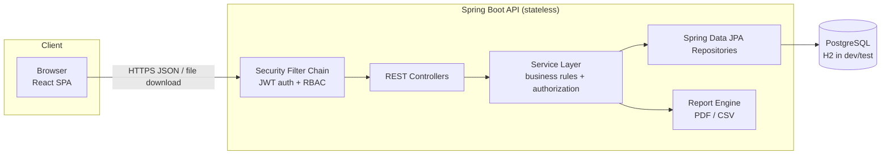
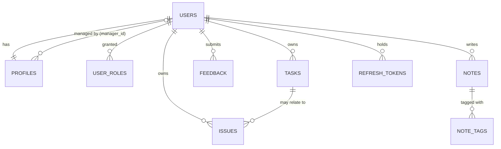

# Onboarding Diary – Requirements Elaboration & Technical Specification

| Item | Value |
|---|---|
| Document status | **APPROVED** (2026-10-03) |
| Version | 1.0 |
| Repository | `codev-workshops/onboarding-diary` |
| Scope | Approved specification. Implementation follows the phases in §7. |

---

## 0. Product Overview

Onboarding Diary is a web app where **new recruits** record their onboarding: tasks done, issues/blockers hit, feedback on the onboarding process, and free-form notes. **Managers** track their assigned recruits through dashboards and reports. **Admins** manage users, roles, and manager assignments.

### 0.1 Goals
- One place for a recruit to log daily onboarding activity.
- Managers see progress and blockers early.
- Reports by date range, downloadable as PDF or CSV.

### 0.2 Out of Scope (v1)
- SSO / OAuth2 social login (email + password only).
- Email or push notifications (listed as a future enhancement).
- File attachments on entries.
- Multi-tenancy (one organisation per deployment).

---

## 1. Core System Architecture & Tech Stack

### 1.1 High-Level Architecture



- **Layered architecture**: Controller → Service → Repository. Controllers only accept/return DTOs; JPA entities never leave the service layer.
- **Stateless API**: JWT access token per request; no server-side HTTP session.
- **SPA**: React app built as static assets. In dev it is served by Vite (with a proxy to the API); in prod by Nginx, or bundled into the Spring Boot jar (decided at implementation time; default: separate Nginx container).

### 1.2 Tech Stack

| Layer | Choice | Notes |
|---|---|---|
| Language (backend) | Java 17 (LTS) | Google Java Style, enforced with Checkstyle + Spotless |
| Framework | Spring Boot 3.x | Web, Validation, Security, Data JPA, Actuator |
| Auth | Spring Security 6 + JWT (`jjwt`) | BCrypt password hashing |
| Persistence | Spring Data JPA / Hibernate | |
| DB migrations | Flyway | Same SQL scripts for H2 and PostgreSQL |
| Database | **H2** (dev/test, file or in-memory), **PostgreSQL 15+** (staging/prod) | Selected with Spring profiles `dev` / `prod` |
| Mapping | MapStruct | Entity ↔ DTO |
| API docs | springdoc-openapi (Swagger UI at `/swagger-ui.html`) | |
| PDF generation | OpenPDF (LGPL/MPL) | Table-based report layout |
| CSV generation | Apache Commons CSV | |
| Build | Maven (wrapper committed) | |
| Testing (backend) | JUnit 5, Mockito, Spring Boot Test, MockMvc, Testcontainers (PostgreSQL) | |
| Frontend | React 18 + TypeScript, Vite | |
| UI kit | MUI (Material UI) v5 | Responsive grid and components |
| Routing | React Router v6 | |
| Server state | TanStack Query | Caching and refetching |
| Forms | React Hook Form + Zod | Client validation matching server rules |
| HTTP | Axios with an interceptor | Attaches token, refreshes on 401 |
| Charts | Recharts | Dashboard progress charts |
| Testing (frontend) | Vitest + React Testing Library; Playwright for E2E | |
| Lint/format (frontend) | ESLint + Prettier | |
| Containers | Docker + docker-compose (api, web, postgres) | |
| CI | GitHub Actions: build, test, lint on every PR | |

### 1.3 Repository Layout (proposed monorepo)

```
onboarding-diary/
├── backend/                     # Spring Boot (Maven)
│   └── src/main/java/com/codev/onboardingdiary/
│       ├── config/              # security, CORS, OpenAPI
│       ├── auth/                # signup/login/JWT
│       ├── user/                # User, Profile, admin user mgmt
│       ├── task/  issue/  feedback/  note/
│       ├── dashboard/  report/
│       └── common/              # errors, paging, auditing
├── frontend/                    # React + Vite + TS
├── docker-compose.yml
├── .github/workflows/ci.yml
└── requirements_elaboration.md
```

### 1.4 Database Schema

#### 1.4.1 Entity-Relationship Diagram



#### 1.4.2 Tables

Common to all business tables: `created_at TIMESTAMP NOT NULL`, `updated_at TIMESTAMP NOT NULL`, `version INT` (optimistic locking). Primary keys are `BIGINT` identity columns. Enums are stored as `VARCHAR` with `CHECK` constraints.

**users**
| Column | Type | Constraints |
|---|---|---|
| id | BIGINT | PK |
| email | VARCHAR(255) | UNIQUE, NOT NULL, stored lower-case |
| password_hash | VARCHAR(100) | NOT NULL (BCrypt) |
| enabled | BOOLEAN | NOT NULL, default TRUE |
| failed_login_attempts | INT | default 0 |
| locked_until | TIMESTAMP | NULL |
| last_login_at | TIMESTAMP | NULL |

**user_roles**
| Column | Type | Constraints |
|---|---|---|
| user_id | BIGINT | FK → users.id, part of PK |
| role | VARCHAR(20) | `RECRUIT` \| `MANAGER` \| `ADMIN`, part of PK |

> A user can hold more than one role (for example, an admin who is also a manager).

**profiles** (1:1 with users)
| Column | Type | Constraints |
|---|---|---|
| user_id | BIGINT | PK, FK → users.id |
| full_name | VARCHAR(120) | NOT NULL |
| job_title | VARCHAR(120) | NULL. The "role" profile field, e.g. "Backend Engineer". This is separate from the security role. |
| department | VARCHAR(120) | NOT NULL |
| start_date | DATE | NOT NULL |
| manager_id | BIGINT | FK → users.id, NULL. Must reference a user with the MANAGER role. |
| phone | VARCHAR(30) | NULL (optional) |

**tasks**
| Column | Type | Constraints |
|---|---|---|
| id | BIGINT | PK |
| owner_id | BIGINT | FK → users.id, NOT NULL, indexed |
| entry_date | DATE | NOT NULL, indexed |
| title | VARCHAR(150) | NOT NULL |
| description | TEXT | NULL, max 5,000 chars |
| category | VARCHAR(30) | `TRAINING` \| `SETUP` \| `DOCUMENTATION` \| `MEETING` \| `CODING` \| `SHADOWING` \| `ADMINISTRATIVE` \| `OTHER` |
| status | VARCHAR(20) | `TODO` \| `IN_PROGRESS` \| `COMPLETED` \| `BLOCKED` |
| priority | VARCHAR(10) | `LOW` \| `MEDIUM` \| `HIGH` |
| completed_at | TIMESTAMP | NULL. Set automatically when status becomes COMPLETED. |

**issues**
| Column | Type | Constraints |
|---|---|---|
| id | BIGINT | PK |
| owner_id | BIGINT | FK → users.id, NOT NULL, indexed |
| related_task_id | BIGINT | FK → tasks.id, NULL, ON DELETE SET NULL |
| entry_date | DATE | NOT NULL |
| title | VARCHAR(150) | NOT NULL |
| description | TEXT | NULL |
| severity | VARCHAR(10) | `LOW` \| `MEDIUM` \| `HIGH` \| `CRITICAL` |
| status | VARCHAR(20) | `OPEN` \| `IN_PROGRESS` \| `RESOLVED` \| `CLOSED` |
| resolution_notes | TEXT | NULL. Required when status is RESOLVED or CLOSED. |
| resolved_at | TIMESTAMP | NULL. Set automatically. |

**feedback**
| Column | Type | Constraints |
|---|---|---|
| id | BIGINT | PK |
| owner_id | BIGINT | FK → users.id, NOT NULL |
| entry_date | DATE | NOT NULL |
| subject | VARCHAR(150) | NOT NULL |
| type | VARCHAR(20) | `POSITIVE` \| `SUGGESTION` \| `CONCERN` |
| details | TEXT | NOT NULL |

**notes**
| Column | Type | Constraints |
|---|---|---|
| id | BIGINT | PK |
| owner_id | BIGINT | FK → users.id, NOT NULL |
| entry_date | DATE | NOT NULL |
| title | VARCHAR(150) | NOT NULL |
| content | TEXT | NOT NULL, max 20,000 chars (Markdown allowed, rendered sanitised) |
| shared | BOOLEAN | NOT NULL, default FALSE. When TRUE the recruit's manager can read the note (Q2). |

**note_tags**
| Column | Type | Constraints |
|---|---|---|
| note_id | BIGINT | FK → notes.id ON DELETE CASCADE, part of PK |
| tag | VARCHAR(40) | lower-case, part of PK, indexed |

> Max 10 tags per note. Tags are free text (no global tag table in v1).

**refresh_tokens**
| Column | Type | Constraints |
|---|---|---|
| id | BIGINT | PK |
| user_id | BIGINT | FK → users.id |
| token_hash | VARCHAR(100) | UNIQUE (SHA-256 of the token) |
| expires_at | TIMESTAMP | NOT NULL |
| revoked | BOOLEAN | default FALSE |

**audit_log** (admin actions)
| Column | Type | Notes |
|---|---|---|
| id | BIGINT | PK |
| actor_id | BIGINT | FK → users.id |
| action | VARCHAR(50) | e.g. `ROLE_CHANGED`, `USER_DISABLED`, `MANAGER_ASSIGNED`, `REPORT_GENERATED` |
| target_user_id | BIGINT | NULL |
| details | TEXT | JSON string |
| created_at | TIMESTAMP | |

#### 1.4.3 Relationship Rules
- Every recruit has at most one manager (`profiles.manager_id`). A manager can have many recruits.
- Deleting is a **soft disable** for users (`enabled = false`) so that history and reports are kept. Diary entries are hard-deleted by their owner.
- Deleting a task sets `issues.related_task_id` to NULL.

---

## 2. Detailed User Stories

### 2.1 Roles

| Role | Description |
|---|---|
| **New Recruit** (`RECRUIT`) | Default role on self sign-up. Owns and manages their own diary. |
| **Manager** (`MANAGER`) | Assigned by an admin. Read-only access to their assigned recruits' diaries; generates their reports. |
| **Admin** (`ADMIN`) | Manages users, roles, and manager assignments. Can view everything and generate any report. |

### 2.2 Profile Fields

| Field | Required | Editable by user | Editable by admin |
|---|---|---|---|
| Full name | Yes | Yes | Yes |
| Email | Yes | No (v1) | Yes |
| Role (job title, e.g. "QA Engineer") | No | Yes | Yes |
| Department | Yes | Yes | Yes |
| Start date | Yes | Yes (only before first entry is logged) | Yes |
| Manager | No | No | Yes |
| System role(s) | – | No | Yes |

### 2.3 New Recruit Stories

**R-1 Sign up**
*As a new recruit, I want to create an account with email and password so I can start my diary.*
- Given a unique email, a valid password (min 8 chars, at least 1 upper, 1 lower, 1 digit), full name, department, and start date, the account is created with role `RECRUIT` and I am logged in.
- A duplicate email returns "Email already registered" (409).
- Invalid fields show inline messages for each field.

**R-2 Log in / out**
- Valid credentials take me to my Dashboard.
- Invalid credentials show a generic "Invalid email or password" message (no hint about which one is wrong).
- After 5 failed attempts the account is locked for 15 minutes.
- Logging out revokes the refresh token and clears client state.

**R-3 Manage my profile**
- I can view and edit name, job title, department, and start date (start date only while I have no entries).
- I can change my password if I provide the current one.

**R-4 Task log**
- Create a task with date (defaults to today; cannot be in the future), title, description, category, status (default `TODO`), and priority (default `MEDIUM`).
- Edit or delete only my own tasks. Delete asks for confirmation.
- The list is paginated (20 per page), sorted by date descending by default, and filterable by **date range, category, and status** (filters can be combined). Filters are kept in the URL query string.
- Setting status to `COMPLETED` records `completed_at`.

**R-5 Issue log**
- Create an issue with date, title, description, severity, status (default `OPEN`), and optionally a related task.
- Moving an issue to `RESOLVED`/`CLOSED` requires resolution notes.
- Filter by **status and severity** (plus a date range).
- Open `HIGH`/`CRITICAL` issues are highlighted.

**R-6 Feedback notes**
- Submit feedback with date, subject, type (Positive / Suggestion / Concern), and details.
- Edit or delete my own feedback.
- Filter by type and date range.
- Feedback is visible to my manager and to admins.

**R-7 Additional notes**
- Create free-form notes with date, title, content (Markdown), and tags (chips, max 10).
- Search by title/content keyword and filter by tag.
- **Notes are private to me** (managers cannot see them) unless I mark a note as `shared` (Q2).

**R-8 Dashboard**
- Shows summary counts: total tasks, tasks by status, open issues (by severity), feedback by type, notes count.
- Task completion progress: % complete, plus a weekly completed-tasks trend chart.
- Open issues at a glance: top 5 open issues by severity, then by age.
- Recent entries: last 5 items across tasks, issues, feedback, and notes in one timeline, each linking to its detail page.
- Days since start date ("Day 12 of onboarding").

**R-9 Reports**
- Choose a date range (max 1 year), a report type (Tasks, Issues, Feedback, or Combined), and a format (PDF or CSV), then download.
- The report header includes my name, department, start date, date range, and generation timestamp.

### 2.4 Manager Stories

**M-1** *As a manager, I want to see a list of my assigned recruits* with name, department, start date, task completion %, open issue count, and last activity date.
- Only recruits whose `manager_id` = me are listed.

**M-2** View a recruit's dashboard, tasks, issues, and feedback in **read-only** mode with the same filters as the recruit.
- Trying to open a recruit not assigned to me returns 403.

**M-3** Team dashboard: totals across my recruits, a list of recruits with open HIGH/CRITICAL issues, and recruits with no activity in the last 5 working days.

**M-4** Generate reports for one recruit or for all my recruits (combined) by date range and type, in PDF or CSV.

**M-5** I can also keep my own diary (a manager can use the recruit features for themselves).

### 2.5 Admin Stories

**A-1** List, search (name/email/department), and filter (role, enabled) all users, with pagination.
**A-2** Create a user (any role) with a temporary password that must be changed at first login.
**A-3** Edit any profile; assign or unassign a recruit's manager.
**A-4** Grant or revoke roles. An admin cannot remove their own `ADMIN` role, and the last admin cannot be removed.
**A-5** Disable or enable accounts. Disabled users cannot log in; their data stays available for reports.
**A-6** Reset a user's password (sets a temporary password).
**A-7** View the audit log of admin actions and report generation.
**A-8** Generate reports for any user, or org-wide.
**A-9** Bootstrap: on first startup a default admin is seeded from environment variables (`APP_ADMIN_EMAIL`, `APP_ADMIN_PASSWORD`).

---

## 3. REST API Specification

### 3.1 Conventions
- Base path: `/api`. JSON with `camelCase` fields. Dates use ISO-8601 (`2026-10-03`); timestamps are UTC ISO-8601.
- Auth header: `Authorization: Bearer <accessToken>`.
- Pagination: `?page=0&size=20&sort=entryDate,desc`. Responses look like `{ content: [], page, size, totalElements, totalPages }`.
- Errors use RFC 7807 `application/problem+json`:
  ```json
  { "type": "about:blank", "title": "Validation failed", "status": 400,
    "detail": "One or more fields are invalid",
    "errors": [{ "field": "title", "message": "must not be blank" }] }
  ```
- Status codes: 200 OK, 201 Created (with `Location` header), 204 No Content, 400, 401, 403, 404, 409 (conflict, duplicate, or optimistic lock), 423 (locked account), 429 (rate limited).
- For entries the user is not allowed to see, the API returns **404 rather than 403** so it does not reveal that the entry exists.

### 3.2 Authentication — `/api/auth`

| Method | Path | Auth | Body / Params | Response |
|---|---|---|---|---|
| POST | `/api/auth/signup` | Public | `{ email, password, fullName, jobTitle?, department, startDate }` | 201 `{ accessToken, expiresIn, user }`; refresh token set as an httpOnly cookie |
| POST | `/api/auth/login` | Public | `{ email, password }` | 200 `{ accessToken, expiresIn, user }` + refresh cookie |
| POST | `/api/auth/refresh` | Refresh cookie | – | 200 `{ accessToken, expiresIn }` (refresh token is rotated) |
| POST | `/api/auth/logout` | Authenticated | – | 204 (refresh token revoked, cookie cleared) |
| GET | `/api/auth/me` | Authenticated | – | 200 `UserDto` (id, email, roles, profile) |
| PUT | `/api/auth/password` | Authenticated | `{ currentPassword, newPassword }` | 204 |

### 3.3 Profile — `/api/profile`

| Method | Path | Auth | Description |
|---|---|---|---|
| GET | `/api/profile` | Any | Get my profile |
| PUT | `/api/profile` | Any | Update `{ fullName, jobTitle, department, startDate }` |

### 3.4 Task Log — `/api/tasks`

| Method | Path | Description |
|---|---|---|
| GET | `/api/tasks` | List my tasks. Filters: `from`, `to` (date), `category` (multi), `status` (multi), `priority`, `q` (title search), plus paging |
| GET | `/api/tasks/{id}` | Get one task |
| POST | `/api/tasks` | Create task |
| PUT | `/api/tasks/{id}` | Full update (send `version` for optimistic locking) |
| PATCH | `/api/tasks/{id}/status` | Quick status change `{ status }` |
| DELETE | `/api/tasks/{id}` | Delete → 204 |

**TaskRequest**
```json
{ "entryDate": "2026-10-03", "title": "Set up dev laptop",
  "description": "Installed JDK, IntelliJ, Docker", "category": "SETUP",
  "status": "COMPLETED", "priority": "HIGH", "version": 0 }
```
**TaskResponse** = request fields + `id, completedAt, createdAt, updatedAt, version`.

Validation: `title` 1–150 chars; `entryDate` not in the future and not before (start date − 30 days); enum values must be valid.

### 3.5 Issue Log — `/api/issues`

| Method | Path | Description |
|---|---|---|
| GET | `/api/issues` | List my issues. Filters: `status` (multi), `severity` (multi), `from`, `to`, `q`, plus paging |
| GET | `/api/issues/{id}` | Get one issue |
| POST | `/api/issues` | Create issue |
| PUT | `/api/issues/{id}` | Update issue |
| PATCH | `/api/issues/{id}/status` | `{ status, resolutionNotes? }` (notes required for RESOLVED/CLOSED) |
| DELETE | `/api/issues/{id}` | Delete → 204 |

**IssueRequest**
```json
{ "entryDate": "2026-10-03", "title": "No VPN access",
  "description": "VPN request pending for 3 days", "severity": "HIGH",
  "status": "OPEN", "resolutionNotes": null, "relatedTaskId": 12, "version": 0 }
```

### 3.6 Feedback — `/api/feedback`

| Method | Path | Description |
|---|---|---|
| GET | `/api/feedback` | List mine. Filters: `type` (multi), `from`, `to`, plus paging |
| GET | `/api/feedback/{id}` | Get one |
| POST | `/api/feedback` | `{ entryDate, subject, type, details }` |
| PUT | `/api/feedback/{id}` | Update |
| DELETE | `/api/feedback/{id}` | Delete → 204 |

### 3.7 Notes — `/api/notes`

| Method | Path | Description |
|---|---|---|
| GET | `/api/notes` | List mine. Filters: `tag` (multi), `q`, `from`, `to`, plus paging |
| GET | `/api/notes/{id}` | Get one |
| POST | `/api/notes` | `{ entryDate, title, content, tags: ["git","setup"] }` |
| PUT | `/api/notes/{id}` | Update |
| DELETE | `/api/notes/{id}` | Delete → 204 |
| GET | `/api/notes/tags` | Distinct tags I have used (for autocomplete) |

### 3.8 Dashboard — `/api/dashboard`

| Method | Path | Role | Description |
|---|---|---|---|
| GET | `/api/dashboard/summary` | Any | My summary (see below) |
| GET | `/api/dashboard/recent?limit=5` | Any | Recent entries across all categories |
| GET | `/api/dashboard/team` | MANAGER | Team summary for my recruits |

**DashboardSummary**
```json
{ "daysSinceStart": 12,
  "tasks": { "total": 40, "byStatus": { "TODO": 5, "IN_PROGRESS": 8, "COMPLETED": 25, "BLOCKED": 2 }, "completionPct": 62.5 },
  "issues": { "open": 3, "openBySeverity": { "CRITICAL": 0, "HIGH": 1, "MEDIUM": 2, "LOW": 0 } },
  "feedback": { "total": 6, "byType": { "POSITIVE": 3, "SUGGESTION": 2, "CONCERN": 1 } },
  "notes": { "total": 9 },
  "weeklyCompletedTrend": [{ "weekStart": "2026-09-21", "completed": 7 }],
  "topOpenIssues": [ /* IssueResponse x5 */ ] }
```

### 3.9 Manager Views — `/api/manager`

All endpoints need `MANAGER` (or `ADMIN`) **and** the recruit must be assigned to the caller (admins skip the assignment check).

| Method | Path | Description |
|---|---|---|
| GET | `/api/manager/recruits` | My recruits with stats |
| GET | `/api/manager/recruits/{recruitId}` | Recruit profile and summary |
| GET | `/api/manager/recruits/{recruitId}/dashboard` | Same shape as `/api/dashboard/summary` |
| GET | `/api/manager/recruits/{recruitId}/tasks` | Read-only list (same filters as `/api/tasks`) |
| GET | `/api/manager/recruits/{recruitId}/issues` | Read-only list |
| GET | `/api/manager/recruits/{recruitId}/feedback` | Read-only list |
| GET | `/api/manager/recruits/{recruitId}/notes` | Shared notes only (Q2) |

### 3.10 Reporting Engine — `/api/reports`

| Method | Path | Role | Description |
|---|---|---|---|
| GET | `/api/reports/download` | Any (scoped) | Streams the file |
| GET | `/api/reports/preview` | Any (scoped) | JSON preview of the same data (row counts, first 50 rows) |

**Query parameters**
| Param | Required | Values |
|---|---|---|
| `type` | Yes | `TASKS` \| `ISSUES` \| `FEEDBACK` \| `COMBINED` |
| `format` | Yes | `PDF` \| `CSV` |
| `from`, `to` | Yes | ISO dates, `from <= to`, range up to 366 days |
| `userId` | No | Defaults to the caller. A manager may pass an assigned recruit's id; an admin may pass any id. |
| `scope` | No | `SELF` (default) \| `TEAM` (manager: all my recruits) \| `ALL` (admin only) |

**Response**: `200` with `Content-Type: application/pdf` or `text/csv; charset=UTF-8` and `Content-Disposition: attachment; filename="onboarding-report_<name>_<type>_<from>_<to>.<ext>"`.

**Report content**
- **PDF**: header (org title, recruit name/department/start date, manager, date range, generated-at/by), a summary section (counts as on the dashboard), then one table per category, page numbers in the footer. COMBINED includes all three sections (tasks, issues, feedback). Notes are excluded from reports because they are private.
- **CSV**:
  - Single type: one row per entry, with every field of that type as a column.
  - COMBINED: one file with a `recordType` column (`TASK`/`ISSUE`/`FEEDBACK`) and a union of columns (`date, recordType, title/subject, description/details, category, status, priority, severity, type, resolutionNotes`); columns that don't apply are left empty.
  - TEAM/ALL scope adds `recruitName` and `recruitEmail` columns.
  - UTF-8 with BOM (so Excel opens it correctly), RFC 4180 quoting, and protection against CSV formula injection (cells starting with `= + - @` are prefixed with `'`).
- Every report generation is written to `audit_log`.
- Large reports are streamed (no full in-memory buffering for CSV).

### 3.11 Admin — `/api/admin`

| Method | Path | Description |
|---|---|---|
| GET | `/api/admin/users` | Search/filter users: `q`, `role`, `enabled`, `department`, plus paging |
| GET | `/api/admin/users/{id}` | User detail |
| POST | `/api/admin/users` | Create user `{ email, tempPassword, fullName, jobTitle, department, startDate, roles[], managerId? }` |
| PUT | `/api/admin/users/{id}/profile` | Edit profile |
| PUT | `/api/admin/users/{id}/roles` | `{ roles: ["RECRUIT","MANAGER"] }` |
| PUT | `/api/admin/users/{id}/manager` | `{ managerId }` (null = unassign) |
| PATCH | `/api/admin/users/{id}/status` | `{ enabled: false }` |
| POST | `/api/admin/users/{id}/reset-password` | Returns or sets a temporary password; user must change it at next login |
| GET | `/api/admin/managers` | Users with the MANAGER role (for assignment dropdowns) |
| GET | `/api/admin/audit-log` | Filters: `actorId`, `action`, `from`, `to`, plus paging |

### 3.12 Lookups

| Method | Path | Description |
|---|---|---|
| GET | `/api/lookups` | All enum values (task categories/statuses/priorities, issue severities/statuses, feedback types) so the UI does not hard-code them |

### 3.13 Ops
- `GET /actuator/health` (public) and `/actuator/info`. Other actuator endpoints are restricted to admins.
- OpenAPI spec at `/v3/api-docs`.

---

## 4. UI Flows & Component Mapping

### 4.1 Responsive Layout System
- Breakpoints (MUI): `xs < 600` (mobile), `sm 600–899` (tablet), `md ≥ 900` (desktop), `lg ≥ 1200`.
- **AppShell**: top `AppBar` (logo, page title, user menu). Desktop has a permanent left `Drawer` nav; tablet has a collapsible mini drawer; mobile has a hamburger drawer and a bottom quick-add FAB.
- Lists: desktop uses an MUI `DataGrid`/table with column sorting. Mobile uses a stacked `Card` list with the key fields and a status chip.
- Forms: on desktop they open in a right-side `Drawer` or modal; on mobile as a full-screen dialog.
- Accessibility: WCAG 2.1 AA (labels, keyboard navigation, focus states, colour contrast; status is never shown by colour alone).

### 4.2 Navigation / Route Map

| Route | Page | Roles |
|---|---|---|
| `/login` | LoginPage | Public |
| `/signup` | SignupPage | Public |
| `/` → `/dashboard` | RecruitDashboard | Any |
| `/tasks`, `/tasks/new`, `/tasks/:id` | TaskListPage, TaskFormDrawer | Any |
| `/issues`, `/issues/new`, `/issues/:id` | IssueListPage, IssueFormDrawer | Any |
| `/feedback`, `/feedback/new`, `/feedback/:id` | FeedbackListPage, FeedbackForm | Any |
| `/notes`, `/notes/new`, `/notes/:id` | NotesPage, NoteEditor | Any |
| `/reports` | ReportsPage | Any |
| `/profile` | ProfilePage | Any |
| `/team` | TeamDashboard | MANAGER |
| `/team/:recruitId/*` | RecruitDetail (tabs: Overview, Tasks, Issues, Feedback) | MANAGER |
| `/admin/users`, `/admin/users/:id` | UserManagementPage, UserDetail | ADMIN |
| `/admin/audit` | AuditLogPage | ADMIN |
| `*` | NotFound / Forbidden (403) | – |

Nav items are shown based on role. Routes are guarded by `<ProtectedRoute roles={[...]}/>`, and the API enforces the same rules.

### 4.3 Login Page
- Centred card (full-width on mobile, max 420px on desktop): app logo, email, password (with show/hide toggle), "Log in" button, and a "Create account" link.
- Client validation: email format and required fields. Errors from the server appear in an `Alert` above the form.
- While submitting, the button shows a spinner and is disabled.
- On success, the user goes to the page they originally requested (or `/dashboard`). A user with a temporary password goes to the forced change-password screen.
- **SignupPage**: email, password plus confirm (with strength meter), full name, job title, department (autocomplete), start date (date picker).

### 4.4 Recruit Dashboard

```
Desktop (md+)                                         Mobile (xs)
┌───────────────────────────────────────────────┐    ┌──────────────┐
│ Welcome, Asha · Day 12 of onboarding          │    │ Welcome · D12│
├──────────┬──────────┬──────────┬──────────────┤    ├──────────────┤
│ Tasks 40 │ Open     │ Feedback │ Notes 9      │    │ Stat cards   │
│ 25 done  │ issues 3 │ 6        │              │    │ (2×2 grid)   │
├──────────┴──────────┼──────────┴──────────────┤    ├──────────────┤
│ Task completion     │ Open issues at a glance │    │ Progress     │
│ ◯ 62% donut +       │ ▸ HIGH  No VPN access   │    ├──────────────┤
│ weekly trend bars   │ ▸ MED   Wiki outdated   │    │ Open issues  │
├─────────────────────┴─────────────────────────┤    ├──────────────┤
│ Recent activity (timeline, all categories)    │    │ Recent       │
│ [Task] Set up laptop · Completed · Oct 3      │    │ activity     │
│ [Issue] No VPN access · Open · Oct 2          │    └──────────────┘
├───────────────────────────────────────────────┤      (+) FAB
│ Quick add: [+Task] [+Issue] [+Feedback] [+Note]│
└───────────────────────────────────────────────┘
```

| Component | Data source | Behaviour |
|---|---|---|
| `WelcomeHeader` | `/api/auth/me` | Name, days since start |
| `StatCard` ×4 | `/api/dashboard/summary` | Click → filtered list (e.g. open issues → `/issues?status=OPEN,IN_PROGRESS`) |
| `TaskProgressCard` | summary.tasks, weeklyCompletedTrend | Donut of status split, % complete, bar chart by week |
| `OpenIssuesCard` | summary.topOpenIssues | Severity chips; click → issue detail |
| `RecentActivityList` | `/api/dashboard/recent` | Icon per type, relative date, status chip |
| `QuickAddBar` / `QuickAddFab` | – | Opens the matching create form |
| Loading / empty states | – | Skeleton loaders; empty state with "Log your first task" call to action |

### 4.5 Other Screens (component mapping)

| Screen | Key components |
|---|---|
| Task list | `FilterBar` (DateRangePicker, Category multi-select, Status multi-select, search), `TaskTable`/`TaskCardList`, `StatusChip`, `PriorityChip`, `Pagination`, `ConfirmDeleteDialog` |
| Task form | `TaskForm` (DatePicker, TextField title/description, Select category/status/priority) |
| Issue list/form | `FilterBar` (Status, Severity, date), `SeverityChip`, `ResolutionNotesField` (required when resolving), related-task autocomplete |
| Feedback | `FeedbackList` with type colour (Positive=green, Suggestion=blue, Concern=amber, each with an icon), `FeedbackForm` with a type `ToggleButtonGroup` |
| Notes | Masonry/card grid, `TagChips`, `TagAutocomplete`, `MarkdownEditor` (preview tab), keyword search |
| Reports | `ReportForm` (DateRangePicker with presets: This week / Last 30 days / Since start; Type radio; Format radio; Recruit selector for managers/admins; Scope selector), `PreviewPanel`, `DownloadButton` (blob download with progress) |
| Team dashboard (manager) | `TeamStatCards`, `RecruitTable` (completion bar, open issues, last activity, "inactive" badge), `AtRiskList` |
| Recruit detail (manager) | Tabs reusing the list components in `readOnly` mode |
| Admin users | `UserTable`, `UserFilterBar`, `UserEditDialog` (profile, roles checkboxes, manager select, enable toggle), `ResetPasswordDialog` |
| Audit log | `AuditTable` with filters |
| Global | `AppShell`, `NavDrawer`, `UserMenu`, `ProtectedRoute`, `ErrorBoundary`, `Snackbar` notifications, `ConfirmDialog` |

### 4.6 Key Flows
1. **First-time recruit**: Signup → Dashboard (empty state) → Quick add Task → back to Dashboard (counts update).
2. **Raise and resolve a blocker**: Issues → New (severity HIGH) → appears in "Open issues at a glance" → later set to Resolved with resolution notes → leaves the open list.
3. **Manager review**: Login → Team dashboard → pick a recruit flagged at-risk → Issues tab → Reports → Combined, last 30 days, PDF → download.
4. **Admin onboarding a cohort**: Admin → Users → Create user (RECRUIT, manager = X) → recruit logs in with a temporary password → forced to change password.

---

## 5. Security

### 5.1 Authentication
- Passwords hashed with **BCrypt (strength 12)**. Password policy as in R-1. Plain-text passwords are never logged.
- **Access token**: JWT (HS256, secret ≥ 256-bit from env `APP_JWT_SECRET`), lifetime **15 min**. Claims: `sub` (userId), `email`, `roles`, `iat`, `exp`.
- **Refresh token**: opaque random 256-bit value, stored hashed, lifetime **7 days**, rotated on every use. Sent as an `HttpOnly; Secure; SameSite=Strict` cookie scoped to `/api/auth`. If a token that was already used is presented again, all of that user's tokens are revoked.
- The SPA keeps the access token **in memory only** (not localStorage). On page reload it calls `/api/auth/refresh`.
- Account lockout: 5 failed logins → locked 15 min (423). Login and signup are rate-limited per IP (Bucket4j, e.g. 10 requests/min).
- Disabling a user or changing their roles revokes their refresh tokens.

### 5.2 Role-Based Access Control

Spring Security config (URL level) plus `@PreAuthorize` (method level) plus checks in the service layer that the caller owns the data or manages the recruit.

```java
http.authorizeHttpRequests(auth -> auth
    .requestMatchers("/api/auth/signup", "/api/auth/login", "/api/auth/refresh",
                     "/actuator/health", "/v3/api-docs/**", "/swagger-ui/**").permitAll()
    .requestMatchers("/api/admin/**").hasRole("ADMIN")
    .requestMatchers("/api/manager/**", "/api/dashboard/team").hasAnyRole("MANAGER", "ADMIN")
    .anyRequest().authenticated());
```

```java
@PreAuthorize("hasRole('ADMIN') or @recruitAccess.isManagerOf(authentication, #recruitId)")
public DashboardSummary getRecruitDashboard(Long recruitId) { ... }
```

- **Ownership rule**: every `/api/tasks|issues|feedback|notes/{id}` query is limited to `owner_id = currentUser` at the repository level (`findByIdAndOwnerId`), so one user cannot reach another user's entry by guessing ids (IDOR).
- **Report scoping**: `ReportAccessPolicy` checks the `userId` and `scope` parameters (self, assigned recruit, team, or admin-only `ALL`).

### 5.3 Permission Matrix

| Capability | Recruit | Manager | Admin |
|---|---|---|---|
| Sign up / log in / edit own profile | ✅ | ✅ | ✅ |
| CRUD own tasks, issues, feedback, notes | ✅ | ✅ | ✅ |
| View own dashboard and reports | ✅ | ✅ | ✅ |
| View assigned recruits' tasks/issues/feedback (read-only) | ❌ | ✅ | ✅ (all users) |
| View others' private notes | ❌ | ❌ | ❌ (admins also excluded, Q2) |
| Edit/delete another user's entries | ❌ | ❌ | ❌ |
| Team dashboard | ❌ | ✅ | ✅ |
| Reports for assigned recruits / team | ❌ | ✅ | ✅ |
| Org-wide reports | ❌ | ❌ | ✅ |
| Manage users, roles, manager assignment | ❌ | ❌ | ✅ |
| View audit log | ❌ | ❌ | ✅ |

### 5.4 Other Security Controls
- **Input validation** with Bean Validation on all DTOs. Length limits as in the schema. Markdown is rendered with sanitisation (DOMPurify) to block XSS.
- **SQL injection**: JPA parameter binding only, no string-concatenated queries. Dynamic filters use JPA Specifications.
- **CSRF**: the API uses bearer tokens, so CSRF protection is disabled for it, except for the cookie-based `/api/auth/refresh` and `/api/auth/logout`, which use `SameSite=Strict` plus an `Origin` header check.
- **CORS**: allow-list taken from `APP_CORS_ORIGINS`. Credentials are allowed only for those origins.
- **Security headers**: CSP, `X-Content-Type-Options`, `X-Frame-Options: DENY`, HSTS (prod), `Referrer-Policy`.
- **Secrets** come only from environment variables; none are committed. H2 console is enabled only in the `dev` profile.
- **Error handling**: no stack traces in API responses. A correlation id is added to logs (MDC) and returned as an `X-Request-Id` header.
- **Auditing**: admin actions and report downloads are written to `audit_log`.
- **Dependencies**: OWASP Dependency-Check / Dependabot in CI.

---

## 6. Non-Functional Requirements

| Area | Requirement |
|---|---|
| Performance | p95 < 300 ms for list/CRUD endpoints with 10k entries per user; report generation < 5 s for 1 year of data for one recruit |
| Scalability | Stateless API, so it can scale horizontally behind a load balancer |
| Availability | Health checks for container orchestration |
| Data retention | Entries are kept while the account exists. Disabled accounts are kept for reporting. |
| Browser support | Latest 2 versions of Chrome, Edge, Firefox, and Safari; iOS/Android mobile browsers |
| Time zones | Dates are stored as `DATE` (the user's local calendar date). Timestamps are stored in UTC and shown in the browser's time zone. |
| Testing | Backend: ≥ 80% line coverage on services; MockMvc tests for every endpoint including RBAC negative tests (403/404). Frontend: component tests for forms and dashboard; Playwright E2E for the 4 key flows in §4.6. |
| Code quality | Google Java Style (Checkstyle/Spotless), ESLint + Prettier, CI must pass before merge |
| Observability | Structured JSON logs in prod, Actuator health/metrics |
| Seed data | `dev` profile seeds 1 admin, 1 manager, and 2 recruits with sample entries |

---

## 7. Proposed Implementation Phases (after approval)

| Phase | Deliverable |
|---|---|
| 1 | Monorepo scaffold, CI, Docker Compose, Flyway baseline, auth (signup/login/refresh/me), profile |
| 2 | Task, Issue, Feedback, Notes CRUD and filters (API + UI) |
| 3 | Dashboard (recruit) and lookups |
| 4 | Manager views, team dashboard, admin user management, audit log |
| 5 | Reporting engine (PDF/CSV) and Reports UI |
| 6 | Hardening: rate limiting, security headers, E2E tests, docs |

Each phase is delivered as its own PR.

---

## 8. Resolved Decisions

All open questions were resolved by adopting the proposed defaults.

| # | Question | Decision |
|---|---|---|
| Q1 | Can anyone self-sign-up, or should signup be limited to an allowed email domain or an admin invite? | Open signup as `RECRUIT`, with an optional `APP_ALLOWED_EMAIL_DOMAINS` setting |
| Q2 | Are "Additional Notes" private to the recruit, or visible to their manager? | Private by default; a per-note `shared` flag lets the recruit share it with their manager |
| Q3 | Can managers comment on a recruit's entries? | Not in v1 (read-only) |
| Q4 | Should task categories be a fixed enum or admin-configurable? | Fixed enum in v1 |
| Q5 | Should a recruit become "graduated" (read-only) after a set onboarding period (e.g. 90 days)? | No; the diary stays editable |
| Q6 | Deployment target (Docker on a VM, Kubernetes, cloud PaaS)? | docker-compose for local; prod target decided later |
| Q7 | Should a COMBINED CSV be one file with a `recordType` column, or a ZIP of separate CSVs? | One file with a `recordType` column |
